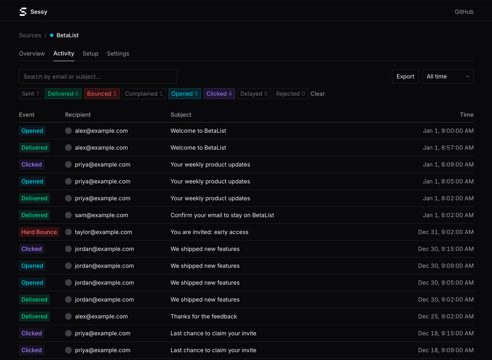

# Sessy

Open-source email observability for AWS SES by [Marc Köhlbrugge](https://x.com/marckohlbrugge).

> **Note:** Sessy is already running in production at [BetaList](https://betalist.com), but it's still in active development. Expect breaking changes, database migrations, and evolving APIs. That said, feel free to start using it!

## What is Sessy?

Amazon SES is a fantastic email service: cost-effective, reliable, and great deliverability. But it's frustratingly difficult to see what's actually happening with your emails.

That's why many people turn to overpriced email services that are often just glorified SES wrappers with a nice UI. You end up paying a lot for something you could do yourself.

Sessy is the open-source alternative. Use raw SES and still get a beautiful interface to see what happens after you hit send: deliveries, bounces, complaints, opens, clicks, and more.



## Running your own Sessy instance

The easiest way to run Sessy is with Docker:

```bash
docker run -p 80:80 \
  -e SECRET_KEY_BASE=$(openssl rand -hex 64) \
  -e DISABLE_SSL=true \
  -v sessy:/rails/storage \
  ghcr.io/marckohlbrugge/sessy:main
```

If you're using Dokku, you can use the following setup script which will launch Sessy on port 5081:
```bash
# sessy
dokku apps:create sessy
# configure ports of sessy
dokku ports:add sessy http:5081:80
# configure volumes of sessy
sudo -u dokku mkdir -p /var/lib/dokku/data/storage/sessy/sessy
dokku storage:mount sessy /var/lib/dokku/data/storage/sessy/sessy:/rails/storage

# Manually fix mounted dir permissions since Sessy uses uid 1000 for security reasons
sudo chown -R 1000:1000 /var/lib/dokku/data/storage/sessy/sessy

# configure environment of sessy
dokku config:set --no-restart sessy SECRET_KEY_BASE="$(openssl rand -hex 64)"
dokku config:set --no-restart sessy DISABLE_SSL="true"
# assign image to sessy
dokku git:from-image sessy ghcr.io/marckohlbrugge/sessy:main
```

See [Docker deployment docs](docs/docker-deployment.md) for full configuration options.

Want to deploy your own modified version? See [Kamal deployment docs](docs/kamal-deployment.md) for deploying from a fork.


## Development

You are welcome to modify Sessy to your liking.

To get started:

```bash
bin/setup
bin/dev
```


## Contributing

We welcome contributions! Since we're still in a very early stage, please keep the following in mind:

- **Typos and obvious bugs:** Feel free to submit a PR directly.
- **Code changes:** Please try to match our existing style.
- **New features:** Please open an issue first to discuss before implementing.

For anything beyond small fixes, please open an issue first so no one wastes their time on something we might not merge.


## License

Sessy is released under the [O'Saasy License](LICENSE.md).


## Inspiration

Sessy was heavily inspired by [Fizzy](https://github.com/basecamp/fizzy) and we're grateful to [37signals](https://37signals.com) for open-sourcing their codebase.
