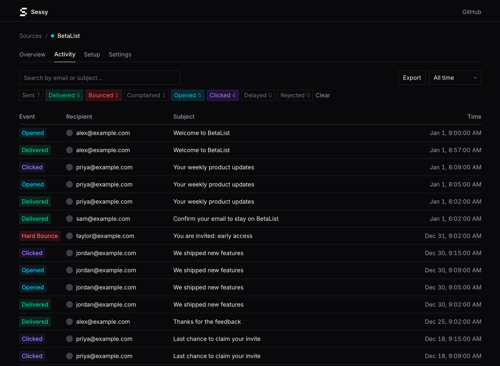

# Sessy

Open-source email observability for AWS SES by [Marc Köhlbrugge](https://x.com/marckohlbrugge).

## What is Sessy?

Amazon SES is a fantastic email service: cost-effective, reliable, and great deliverability. But it's frustratingly difficult to see what's actually happening with your emails.

That's why many people turn to overpriced email services that are often just glorified SES wrappers with a nice UI. You end up paying a lot for something you could do yourself.

Sessy is the open-source alternative. Use raw SES and still get a beautiful interface to see what happens after you hit send: deliveries, bounces, complaints, opens, clicks, and more.



## Running your own Sessy instance

The easiest way to run Sessy is with Docker:

```bash
docker run -p 80:80 \
  -e SECRET_KEY_BASE=$(openssl rand -hex 64) \
  -e DISABLE_SSL=true \
  -v sessy:/rails/storage \
  ghcr.io/marckohlbrugge/sessy:main
```

See [Docker deployment docs](docs/docker-deployment.md) for full configuration options.

Want to deploy your own modified version? See [Kamal deployment docs](docs/kamal-deployment.md) for deploying from a fork.

Using Dokku? See [Dokku deployment docs](docs/dokku-deployment.md).

Need help configuring AWS SES itself? See [AWS SES setup guide](docs/aws-ses-setup.md).

For hardening recommendations, see [SES security and deliverability best practices](docs/ses-security-best-practices.md).

## MCP server for AI agents

Sessy ships an [MCP](https://modelcontextprotocol.io) server at `/mcp`, so AI coding agents (Claude Code, Cursor, Codex) can query your email data: search events, inspect a message's full delivery timeline with bounce diagnostics, and pull aggregate stats. All tools are read-only.

Create an API key on the **API keys** page in the web UI, then follow the connect instructions at `/docs/mcp` on your instance. For example, for Claude Code:

```bash
claude mcp add --transport http sessy https://your-sessy-host/mcp \
  --header "Authorization: Bearer YOUR_API_KEY"
```

Two things worth knowing:

- **Cloudflare / CDN users:** bot protection (managed challenges) blocks MCP clients. Exempt the `/mcp` path from bot protection or agent requests will fail.
- **HTTP Basic auth:** `/mcp` authenticates with API keys only and ignores `HTTP_AUTH_*`. Enabling HTTP Basic later does not revoke previously created API keys — review the API keys page after locking down an install.

## Hosted version

We're working on a managed version of Sessy for those who'd rather not run their own instance.

You'll notice references to it in this codebase: a `saas/` directory, `Gemfile.saas`, and the occasional `Sessy.saas?` check. These power the hosted version and are intentionally kept in this repository for simplicity, rather than maintaining separate repos. None of it affects self-hosting: the default bundle ignores the `saas/` engine entirely, and the test suite verifies the open-source version behaves identically without it.

## Jobs dashboard

Sessy uses [Solid Queue](https://github.com/rails/solid_queue) for background jobs. A web dashboard is available at `/jobs` to monitor queues, retry failed jobs, and view recurring tasks.

## Development

You are welcome to modify Sessy to your liking.

To get started:

```bash
bin/setup
bin/dev
```


## Contributing

We welcome contributions! Since we're still in a very early stage, please keep the following in mind:

- **Typos and obvious bugs:** Feel free to submit a PR directly.
- **Code changes:** Please try to match our existing style.
- **New features:** Please open an issue first to discuss before implementing.
- **Deployment docs:** We keep first-party deployment docs focused on broad, open, self-hosted paths we actively use (for example Docker, Kamal, and Dokku). We generally do not add provider-specific deployment guides to this repository.

For anything beyond small fixes, please open an issue first so no one wastes their time on something we might not merge.


## License

Sessy is released under the [O'Saasy License](LICENSE.md).


## Inspiration

Sessy was heavily inspired by [Fizzy](https://github.com/basecamp/fizzy) and we're grateful to [37signals](https://37signals.com) for open-sourcing their codebase.
