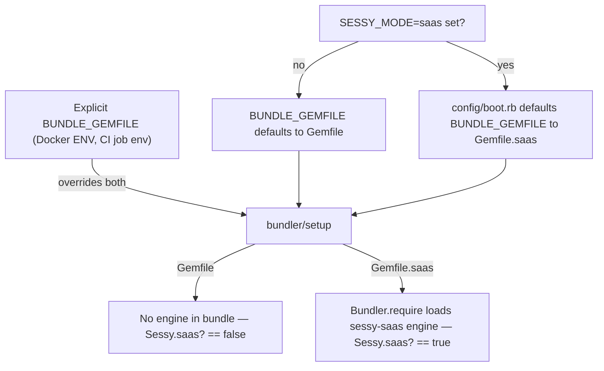
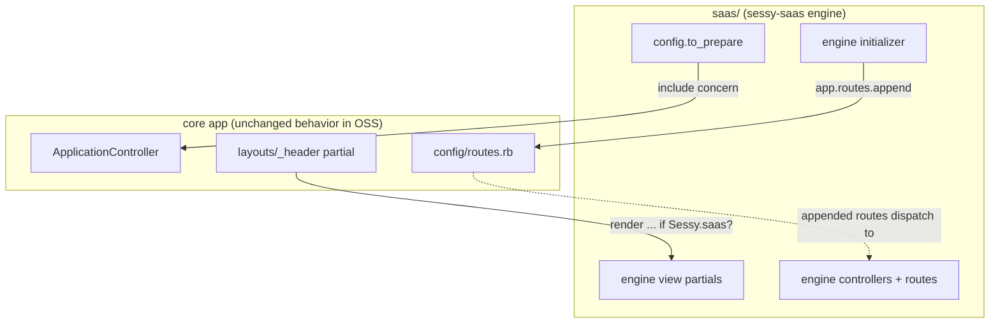

# SaaS Engine Foundation - Plan

## Goal Capsule

- **Objective:** Establish the Fizzy-style OSS/SaaS boundary in Sessy — a vendored `saas/` Rails engine layered on via `Gemfile.saas`, opt-in through one env toggle, with zero behavior change for OSS users — proven by one small hosted-only behavior wired through the controller, route, and view seams.
- **Authority:** This plan's Product Contract and Key Technical Decisions govern scope. Repo conventions (`AGENTS.md`, rubocop-rails-omakase, DHH-style concerns) govern style. User preferences override both.
- **Stop conditions:** Stop and surface if implementation requires an engine database migration, a change to `config/database.yml`, or touching the untracked working-tree files (`config/deploy.sqlite.yml`, `.kamal/secrets.sqlite`, `.migration-backup/`, `wip.svg`) — each contradicts a decision below.
- **Execution profile:** Standard feature branch (`marc/` prefix); commit/push/PR only with explicit user approval per user's global rules.

---

## Product Contract

### Summary

Add a `saas/` directory containing a `sessy-saas` Rails engine, loaded only when bundling with a new `Gemfile.saas`. `SESSY_MODE=saas` is the single developer-facing toggle; `Sessy.saas?` reports engine presence at runtime. The engine demonstrates its three extension seams (concern injection, appended routes, guarded view partials) with one migration-free hosted-only behavior. CI gains a SaaS leg, lockfile sync is automated, and the single Dockerfile learns to build either edition.

### Problem Frame

Sessy's open-source repo is its marketing channel; monetization will come from a hosted version with conveniences (managed setup, later billing/accounts). Basecamp's Fizzy solved the identical problem and its PR history (reviewed 2026-07-17) shows both the winning pattern — a vendored in-repo engine — and the detours to skip (separate private repo, single Gemfile with conditional groups). Nothing hosted-specific exists in Sessy's code today; the hosted instance at app.sessy.do is just the OSS app deployed with Postgres and HTTP Basic auth via a gitignored Kamal config. Before any hosted feature or billing work can start, the boundary itself must exist — and it must not complicate the OSS codebase that contributors and self-hosters touch.

### Requirements

**Mode and packaging**

- R1. A fresh OSS clone behaves exactly as today: `bin/setup`, `bin/dev`, `bin/ci`, tests, and the public Docker image load no SaaS code and change no behavior.
- R2. SaaS mode is opt-in via `SESSY_MODE=saas`, which routes bundling to `Gemfile.saas`; that gemfile layers the base `Gemfile` plus the vendored `sessy-saas` path gem.
- R3. `Sessy.saas?` is true iff the engine is actually loaded, so no half-enabled state is reachable (engine loaded but flag false, or flag true but engine absent).

**Extension seams**

- R4. The engine extends the core app only through: `config.to_prepare` concern injection, routes appended by the engine's initializer, and engine-provided view partials rendered behind `if Sessy.saas?` guards. The core app carries no other SaaS logic.
- R5. One hosted-only proof behavior exercises all three seams end-to-end and requires no database migration.

**Contributor workflow and CI**

- R6. CI runs the existing OSS matrix (SQLite + PostgreSQL) plus one SaaS leg (PostgreSQL) that runs the core suite and the engine's tests. The test legs run on fork PRs without secrets; the dependabot lockfile-sync workflow is the one secret-bearing exception and runs only on same-repo branches.
- R7. `Gemfile.saas.lock` stays in sync with `Gemfile.lock` automatically on dependabot PRs, with a CI drift guard whose failure message tells a contributor exactly what to run.
- R8. Security scanning covers the engine's code and the SaaS lockfile (brakeman engine paths, bundler-audit against both lockfiles).

**Deployment**

- R9. The single `Dockerfile` builds either edition via a build argument; the public `publish-image.yml` image remains pure OSS by default.

### Scope Boundaries

**Deferred to Follow-Up Work**

- Accounts, users, and multi-tenancy (Sessy has no account model; `Source` is the top of the ownership graph — this is the next major piece for a hosted product).
- Billing/subscriptions (Fizzy's removed Stripe implementation in basecamp/fizzy PRs #2050/#2175, deleted in #2712, is the reference when this starts).
- Hosted product features: managed SNS setup, alerts, MCP.
- Engine database migrations and the `saas`-database build-out — direction recorded in Key Technical Decisions; implementation deferred until the first hosted feature needs a table.
- Additional engine seams real features will need — importmap-delivered engine JS/CSS, engine-contributed recurring jobs, and the data seam above. R4's v1 enumeration is expected to grow when the first stateful hosted feature lands.
- Wiring the dormant `GitWorktree.db_suffix` mechanism (required by `config/database.yml` but referenced by neither adapter YAML).

**Outside this product's identity**

- Private/closed-source hosted code. The engine is public in this repo (user-confirmed); the O'Saasy license (`LICENSE.md`, already in place) is the guard against competing hosts. If genuinely secret code is ever needed, it enters as a private *gem dependency of the engine*, not a private repo split — Fizzy reversed its separate-repo split after three weeks (PR #2170: "extra paperwork, careful coordination, constant friction").

---

## Planning Contract

### Key Technical Decisions

- **Vendored in-repo engine, not a separate repo or conditional Gemfile groups.** Fizzy tried both alternatives: the separate private repo was reversed in three weeks (#2170), and bundler groups were rejected because toggling modes dirties `Gemfile.lock` and bundler still resolves unreachable gems (#1697 review discussion). The end state — path gem in the public repo, separate lockfile — is the proven shape.
- **Mode truth is engine presence; the env var is only a bootstrap convenience.** `Sessy.saas?` returns whether `Sessy::Saas` is defined (memoized with the `defined?(@saas)` pattern, since the common OSS answer is `false`). `SESSY_MODE=saas` is consumed only in pre-boot entry points where engine presence is unknowable — `config/boot.rb`'s `BUNDLE_GEMFILE` defaulting, `bin/setup`'s matching export, and the `config/ci.rb` step gate — so a stray env var on a self-hosted OSS bundle cannot flip runtime behavior (flow analysis critical gap: two independent toggles create half-on states in both directions). The name is namespaced (`SESSY_MODE`), never a generic `SAAS=1`. Engine internals need no mode gating: if the engine is loaded, SaaS mode is on by definition.
- **`lib/sessy.rb` hosts the helper.** It already holds `Sessy.db_adapter` — the repo's existing dual-mode switch and the exact template. Zeitwerk constraint: `module Sessy` is shared with `Sessy::Application`; the engine's own code lives under the gem's `saas/lib/sessy/saas/`, keeping the host's `autoload_lib` untouched.
- **Committed `Gemfile.saas.lock` with automated sync.** Dependabot's bundler ecosystem only updates the file literally named `Gemfile`, and CI installs frozen (setup-ruby `bundler-cache`, Bundler 4), so without automation every dependency bump fails the SaaS leg and kills automerge. Mechanism: a companion workflow regenerates `Gemfile.saas.lock` on dependabot PRs (Fizzy precedent: `dependabot-sync-saas-lockfile.yml`), plus a drift-check CI step. Fizzy also needed a manual fix for exactly this drift (#2722) — the automation is not optional.
- **View seam uses `if Sessy.saas?` guards, not partial shadowing.** Rails engines *append* view paths — an engine cannot override a partial the app already has. So the pattern (Fizzy's too) is: core view renders an engine-namespaced partial only when `Sessy.saas?`; the partial file exists only in the engine.
- **Proof behavior is migration-free by requirement.** Any engine migration would leak SaaS tables into the shared dev DB and the committed `db/schema.rb`, polluting every OSS `bin/setup` (flow analysis important gap).
- **One parameterized Dockerfile.** `ARG BUNDLE_GEMFILE=Gemfile` promoted to `ENV`, with `Gemfile*` and `saas/` copied before `bundle install` (a path gem must be present at install). The default build is byte-for-byte OSS-equivalent in behavior; the hosted Kamal build passes the arg. Today's Dockerfile cannot produce a SaaS image at all (flow analysis critical gap).
- **SaaS CI leg is single: PostgreSQL only**, matching the hosted instance (its gitignored deploy config runs Postgres). SQLite×SaaS adds cost without a production analog.
- **Engine gemspec uses a static file glob, not `git ls-files`** — `.dockerignore` excludes `.git/`, so the conventional gemspec idiom breaks inside Docker builds.
- **Engine tables, when they come, go in a separate `saas` database — recorded now, built later.** The first stateful hosted feature (accounts, billing) needs a data seam this foundation deliberately doesn't build. Direction on record so the boundary stays compatible: Fizzy's `SaasRecord` pattern — an abstract engine base class with `connects_to` a dedicated `saas` database whose migrations and schema live under `saas/db/`, keeping core `db/schema.rb` untouched for OSS users. Nothing in this plan constrains or contradicts that path.

### High-Level Technical Design

Mode resolution (boot-time) and the extension seams (runtime):





### Sources and Research

- Fizzy architecture and history: basecamp/fizzy PRs #1697 (the split), #2170 (repatriation), #2712 (billing removal), #2722 (lockfile drift), #2677 (middleware leak → security advisory); current-repo mechanisms (`lib/fizzy.rb`, `Gemfile.saas`, `saas/lib/fizzy/saas/engine.rb`, `bin/bundle-drift`, CI split). Reviewed in depth 2026-07-17.
- Repo grounding: `lib/sessy.rb` (`db_adapter` pattern), `config/database.yml` (ERB mode dispatch), `config/boot.rb` (`BUNDLE_GEMFILE ||=` seam), `.github/workflows/ci.yml` (adapter matrix), `Dockerfile:39` (COPY ordering), `config/ci.rb` (Rails 8.1 CI DSL), `test/helpers/application_helper_test.rb` (`with_env` pattern), `.gitignore` (reserves `/config/deploy.saas.yml` and `/.kamal/secrets.saas` — anchored rules, no collision with tracked `saas/`).

---

## Output Structure

```
Gemfile.saas
Gemfile.saas.lock
saas/
├── sessy-saas.gemspec
├── LICENSE.md
├── README.md
├── lib/
│   └── sessy/
│       ├── saas.rb
│       └── saas/
│           ├── engine.rb
│           └── version.rb
├── app/
│   ├── controllers/sessy/saas/           (proof controller)
│   ├── controllers/concerns/sessy/saas/  (injected concern)
│   └── views/                            (badge partial, proof view)
├── config/
│   └── routes.rb
└── test/
    └── (engine tests, using the host test_helper)
```

The tree is a scope declaration; per-unit `Files` lists are authoritative.

---

## Implementation Units

### U1. Mode helper, Gemfile.saas, and engine skeleton

- **Goal:** SaaS mode exists and is inert-by-default: `Sessy.saas?`, `Gemfile.saas` + lockfile, and a loadable empty engine.
- **Requirements:** R1, R2, R3
- **Dependencies:** none
- **Files:** `lib/sessy.rb`, `config/boot.rb`, `bin/setup`, `Gemfile.saas`, `Gemfile.saas.lock`, `saas/sessy-saas.gemspec`, `saas/lib/sessy/saas.rb`, `saas/lib/sessy/saas/engine.rb`, `saas/lib/sessy/saas/version.rb`, `saas/LICENSE.md`, `saas/README.md`, `test/models/sessy_test.rb`
- **Approach:** `Sessy.saas?` in `lib/sessy.rb` reports `defined?(Sessy::Saas)` presence, memoized with a `defined?(@saas)` guard. `config/boot.rb` picks `Gemfile.saas` in its existing `BUNDLE_GEMFILE ||=` line when `SESSY_MODE=saas` (explicit `BUNDLE_GEMFILE` still wins — Docker and CI set it directly). `bin/setup` invokes `bundle` directly and bypasses boot.rb, so it exports `BUNDLE_GEMFILE` from `SESSY_MODE` the same way — one variable drives every entry point. `Gemfile.saas` does `eval_gemfile "Gemfile"` then `gem "sessy-saas", path: "saas"`. Gemspec: static file glob; license O'Saasy matching root. Engine class `Sessy::Saas::Engine < ::Rails::Engine` with no hooks yet.
- **Patterns to follow:** `Sessy.db_adapter` in `lib/sessy.rb` (memoized env-driven value); Fizzy's `Gemfile.saas` shape.
- **Test scenarios:**
  - Happy path: `Sessy.saas?` returns false in the OSS suite; returns true in the SaaS suite (asserted from the engine's own tests in U2, run via U3's infrastructure).
  - Edge: with `SESSY_MODE=saas` but an explicit `BUNDLE_GEMFILE` pointing at the plain `Gemfile`, boot proceeds in OSS mode and `Sessy.saas?` is false (no half-on state).
  - Edge: memoization — repeated calls return a stable value; the false case does not re-evaluate (guarded by `defined?`).
  - Test expectation for `Gemfile.saas`/gemspec wiring: covered by `bundle check` succeeding in the SaaS CI leg rather than unit tests.
- **Verification:** OSS suite green with zero diff in behavior; `BUNDLE_GEMFILE=Gemfile.saas bundle install` resolves the path gem; `SESSY_MODE=saas bin/rails runner "p Sessy.saas?"` prints true, plain prints false; `SESSY_MODE=saas bin/setup --skip-server` completes against the SaaS bundle.

### U2. Proof behavior through all three seams

- **Goal:** One migration-free hosted-only behavior demonstrates concern injection, appended routes, and guarded views — the controller, route, and view seams future hosted features will share.
- **Requirements:** R4, R5
- **Dependencies:** U1
- **Files:** `saas/lib/sessy/saas/engine.rb`, `saas/app/controllers/concerns/sessy/saas/edition_headers.rb`, `saas/app/controllers/sessy/saas/infos_controller.rb`, `saas/config/routes.rb`, `saas/app/views/sessy/saas/infos/show.html.erb`, `saas/app/views/layouts/_saas_badge.html.erb`, `app/views/layouts/_header.html.erb`, `saas/test/controllers/edition_headers_test.rb`, `saas/test/controllers/infos_test.rb`, `test/integration/oss_mode_test.rb`
- **Approach:** Three seams, one feature ("hosted edition visibility"):
  1. *Concern injection:* engine's `config.to_prepare` includes `Sessy::Saas::EditionHeaders` into `ApplicationController`, adding an `X-Sessy-Edition: hosted` response header — trivially assertable at controller level in both modes.
  2. *Routes:* engine initializer does `app.routes.append { mount Sessy::Saas::Engine ... }` (or appends a named route) exposing a small hosted-info page (engine version, Rails env) — useful for verifying hosted deploys. Appended routes cannot shadow core routes; anything that must win over core would need `prepend` (not needed here — note for future features).
  3. *Guarded view:* `layouts/_header.html.erb` renders the engine's badge partial behind `if Sessy.saas?` — the only core-view change.
  The core-app diff for this unit is exactly one guarded render line; that is the leakage budget working as intended.
- **Patterns to follow:** Fizzy's `saas/lib/fizzy/saas/engine.rb` (`to_prepare` includes, self-mounting initializer); Sessy's nested-concern style (`Event::Filterable`).
- **Test scenarios (engine suite, SaaS mode):**
  - Happy path: any core page response carries `X-Sessy-Edition: hosted`; the info route renders 200 with the engine version; the header partial contains the badge.
  - Integration: the injected concern survives reload (`to_prepare`, not `initializer`) — assert inclusion after `Rails.application.reloader.reload!` or equivalent in a controller test hitting two sequential requests in development-like reloading (if impractical in test env, assert `ApplicationController.include?(Sessy::Saas::EditionHeaders)`).
- **Test scenarios (OSS suite):**
  - Regression guard: responses carry no `X-Sessy-Edition` header; the info route does not resolve (404/RoutingError); rendered header HTML contains no badge. This is the cheap enforcement of R1's "zero behavior change" promise. These tests `skip if Sessy.saas?` so the core suite stays green when the SaaS CI leg runs it.
- **Verification:** both suites green; manually boot each mode and eyeball the header (screenshot per user's debugging rule).

### U3. Test infrastructure for both modes

- **Goal:** The engine has a test home that reuses the host harness, and each mode has a one-command local run.
- **Requirements:** R1, R6
- **Dependencies:** U1, U2
- **Files:** `config/ci.rb`, `test/test_helper.rb` (only if a shared helper needs promoting), `AGENTS.md`
- **Approach:** Engine tests (created in U2, under `saas/test/`) `require "test_helper"` against the host's `test/test_helper.rb` — no dummy app (host-app testing is the Fizzy model). Local commands: `bin/rails test` (OSS), `SESSY_MODE=saas bin/rails test test saas/test` (SaaS, core suite plus engine suite). `config/ci.rb` gains a conditional step gated on `ENV["SESSY_MODE"] == "saas"`: also run `saas/test`, making `SESSY_MODE=saas bin/ci` the full local SaaS pipeline. The gate must be the env var, not `Sessy.saas?` — `bin/ci` runs before `Bundler.require`, so neither the helper nor the engine exists in that process; this is a sanctioned pre-boot consumer of `SESSY_MODE` (see the mode-truth decision). Mode is fixed per process (memoized helper + env at boot): SaaS-mode coverage runs as a separate suite invocation, never as in-process env toggling. Document both commands in `AGENTS.md`, along with the contributor policy: SaaS-leg failures on external PRs are the maintainer's responsibility to fix, not the contributor's.
- **Patterns to follow:** `config/ci.rb`'s existing step list; Fizzy's `append_test_paths`/host-suite-in-saas-mode CI principle (#2029).
- **Test scenarios:** This unit is harness/config; its proof is U2's suites executing in both modes. Test expectation: none beyond that — config wiring is verified by the commands running.
- **Verification:** `bin/ci` (OSS) and `SESSY_MODE=saas bin/ci` both pass locally end-to-end.

### U4. CI workflows: SaaS leg, lockfile sync, scan coverage

- **Goal:** CI proves both modes on every PR (fork-safe), lockfile drift is impossible to merge, and scans cover the engine.
- **Requirements:** R6, R7, R8
- **Dependencies:** U3
- **Files:** `.github/workflows/ci.yml`, `.github/workflows/sync-saas-lockfile.yml` (new), `bin/bundle-drift` (new)
- **Approach:** Add one matrix include to the `test` job: SaaS + PostgreSQL, with job-level `BUNDLE_GEMFILE: Gemfile.saas` and `SESSY_MODE: saas` (setup-ruby's `bundler-cache` keys off the active gemfile's lock). Its steps run the core suite plus `saas/test`. Drift guard: `bin/bundle-drift`, a check-and-repair script — it names the shared gems whose versions diverge between the two lockfiles and repairs with `BUNDLE_GEMFILE=Gemfile.saas bundle lock --update=<those gems>` (plain `bundle lock` is a no-op here: without `--update`, bundler preserves existing valid pins). CI runs it in check mode; its failure message says to run `bin/bundle-drift`. Sync workflow: on dependabot PRs touching `Gemfile.lock`, run `bin/bundle-drift` and push the regenerated lock to the PR branch (Fizzy's `dependabot-sync-saas-lockfile.yml` is the template). The push must authenticate with a fine-grained PAT (contents: write) stored as both an Actions and a Dependabot secret — commits pushed with the default `GITHUB_TOKEN` trigger no workflow runs (required checks would hang and `automerge.yml` would never fire), and dependabot-context runs get a read-only default token. The workflow runs only on same-repo dependabot branches; fork-PR test legs still need no secrets (R6). Scans: `scan_ruby` adds `--add-engines-path saas` to brakeman and `bin/bundler-audit --gemfile-lock Gemfile.saas.lock` as a second audit (bundler-audit selects its lockfile via that flag and ignores `BUNDLE_GEMFILE`).
- **Patterns to follow:** existing `ci.yml` matrix-include shape and Postgres `services:` block; `automerge.yml`'s required-checks dependency.
- **Test scenarios:** CI-config unit — verified by runs, not unit tests:
  - Fork-PR simulation: the SaaS leg needs no secrets (it must not reference any).
  - Drift simulation: bump a gem version in `Gemfile.lock` only; the drift step fails with the documented message; running `bin/bundle-drift` repairs it.
  - Dependabot simulation: a branch touching only `Gemfile`/`Gemfile.lock` gets a synced `Gemfile.saas.lock` commit from the workflow, and CI runs on the synced commit SHA (the PAT push triggers it; a `GITHUB_TOKEN` push would not).
- **Verification:** a PR run shows all four test legs green (SQLite, PostgreSQL, SaaS+PostgreSQL, plus scans/lint); drift and sync behaviors demonstrated as above.

### U5. Dockerfile parameterization and hosted deploy notes

- **Goal:** One Dockerfile builds either edition; the public image stays OSS; the hosted Kamal deploy has documented settings to actually ship the SaaS build.
- **Requirements:** R1, R9
- **Dependencies:** U1
- **Files:** `Dockerfile`, `docs/docker-deployment.md`, `README.md`
- **Approach:** `ARG BUNDLE_GEMFILE=Gemfile` promoted to `ENV BUNDLE_GEMFILE` (so runtime boot, `bootsnap precompile --gemfile`, and `assets:precompile` all follow it); the pre-`bundle install` layer copies `Gemfile Gemfile.lock Gemfile.saas Gemfile.saas.lock vendor` and adds a separate `COPY saas saas/` instruction — multi-source `COPY ... ./` flattens directory contents, which would leave no `saas/` directory at the path the lockfile expects (path gems must exist at install). Default build arg keeps the OSS image and `publish-image.yml` unchanged. Because mode truth is engine presence (U1), no `SESSY_MODE` runtime env is needed in the image. The hosted deploy change — `builder.args.BUNDLE_GEMFILE: Gemfile.saas` in `config/deploy.saas.yml` — lives in a gitignored file, so the plan's deliverable is the documented snippet (in `docs/docker-deployment.md` or a new short `docs/saas-mode.md` section), applied manually by the maintainer.
- **Patterns to follow:** existing Dockerfile stage layout and `bin/docker-entrypoint`; Fizzy's per-mode Docker approach (it uses a separate `saas/Dockerfile`; we deliberately parameterize the one file instead, since our engine has no divergent base image needs).
- **Test scenarios:** Docker/config unit — verified by builds:
  - `docker build .` (no arg) produces an image whose booted container reports `Sessy.saas?` false and serves no `X-Sessy-Edition` header.
  - `docker build --build-arg BUNDLE_GEMFILE=Gemfile.saas .` boots with the engine loaded, serves the header and info route.
- **Verification:** both builds succeed locally and the runtime smoke checks above pass (`docker run` + curl).
- **Execution note:** This is packaging/config; prefer the build-and-smoke verification above over unit coverage.

---

## Verification Contract

| Check | Command | Applies to |
|---|---|---|
| OSS test suite | `bin/rails test` and `bin/rails test:system` | U1, U2, U3 |
| SaaS test suite | `SESSY_MODE=saas bin/rails test test saas/test` | U1, U2, U3 |
| Full local pipeline, both modes | `bin/ci` and `SESSY_MODE=saas bin/ci` | U3, U4 |
| Lint | `bin/rubocop` | all |
| Security | `bin/brakeman --add-engines-path saas`, `bin/bundler-audit`, `bin/bundler-audit --gemfile-lock Gemfile.saas.lock` | U4 |
| Docker smoke | `docker build` with and without `--build-arg BUNDLE_GEMFILE=Gemfile.saas`, boot + curl for `X-Sessy-Edition` | U5 |
| Zero-OSS-change gate | OSS-suite regression tests from U2 (no header, no route, no badge) | U2 |

Quality gates: all four CI legs green on the PR; `db/schema.rb` diffed against main before opening the PR (user's standing rule; also enforces the migration-free decision).

---

## Definition of Done

- All five units implemented and verified per their Verification lines; both `bin/ci` invocations pass locally.
- OSS mode is behavior-identical: U2's regression tests pass and `db/schema.rb` has no diff against main.
- CI on the PR shows the SaaS leg, drift guard, and extended scans green without any secrets.
- Docs updated: `AGENTS.md` (dev commands for both modes), deployment doc snippet for the hosted Kamal config.
- No stray scope: untracked working-tree files (`config/deploy.sqlite.yml`, `.kamal/secrets.sqlite`, `.migration-backup/`, `wip.svg`) untouched and unstaged; no experimental/dead-end code left in the diff.
- Operational follow-ups surfaced to the maintainer (not performed by the implementer): add the SaaS CI leg to branch-protection required checks so `automerge.yml` respects it; create the fine-grained PAT (contents: write) for the lockfile-sync workflow and store it as both an Actions and a Dependabot secret; apply the documented `builder.args` change to the local gitignored `config/deploy.saas.yml` on the next hosted deploy.
