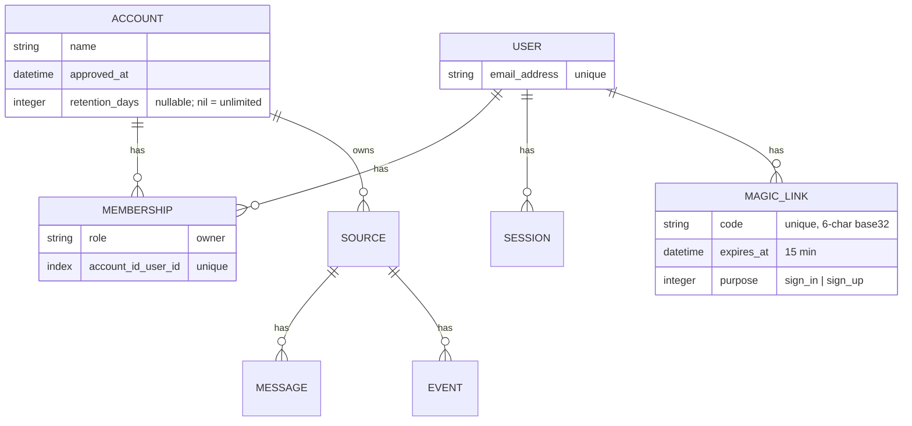
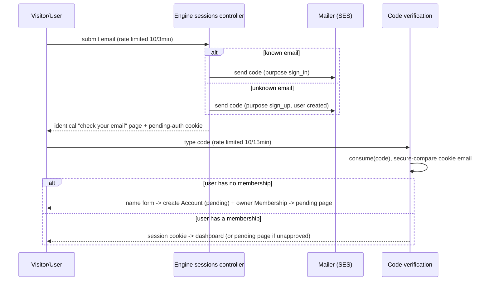

# Hosted Sessy Launch - Plan

## Goal Capsule

- **Objective:** app.sessy.do becomes a multi-tenant product people can sign up for with magic-code auth, gated by manual approval, with 30-day default retention — while self-hosted installs remain exactly the product they are today.
- **Product authority:** this Product Contract. The saas engine boundary (docs/plans/2026-07-17-001-feat-saas-engine-foundation-plan.md, shipped in PR #154) is the architectural substrate; basecamp/fizzy's auth is the implementation reference.
- **Stop conditions:** surface instead of guessing if implementation would require weakening an OSS invariant (R10-R12), an engine-owned migration on a core table, or a behavior AE1 can't pass with.
- **Open blockers:** none. Operational prerequisite outside the repo: a verified SES sending identity for hosted transactional email (see Dependencies).
- **Execution profile:** feature branch (`marc/` prefix); commit/push/PR only with explicit user approval.

---

## Product Contract

*Preservation note: changed from the requirements-only version — R13 amended (migration pins unlimited retention, approval atomic), R15-R16 added (abuse and operational guards), F1/F2 merged-form and typed-code clarifications, AE4 sharpened, AE7-AE8 added. All from flow analysis; no scope change.*

### Summary

Add users, accounts, and memberships to Sessy's core with a single-code-path tenancy design: every install has accounts, but a self-hosted install lives invisibly inside one auto-created instance account with today's UX untouched. The hosted edition activates magic-code signup and login on top, gated by manual account approval, defaulting to 30-day retention. Free early access; no billing.

### Actors

- A1. Marc — operator of the hosted instance; approves accounts and grants retention overrides via console.
- A2. Hosted user — friend or indie dev who signs up at app.sessy.do to watch their SES activity.
- A3. Self-hoster — runs Sessy from the public image or repo; must notice no change.

### Requirements

**Hosted identity and access**

- R1. A visitor can sign up at app.sessy.do with just an email address; completing signup creates a user, an account, and an owner membership.
- R2. Sign-in is by emailed one-time code only; hosted mode has no passwords and no shared HTTP Basic credential.
- R3. The data model supports multiple users per account with roles (owner-only at launch); adding a teammate later must require no schema change.
- R4. One account per user at launch; no account switching UI.

**Approval gate**

- R5. New accounts are pending until Marc approves them (timestamp flag, set via console).
- R6. A pending account can sign in but only sees a pending page: no source creation, no webhook ingest, no data.
- R7. On approval, the user receives an email; there is no rejection flow — unapproved accounts stay pending.

**Retention**

- R8. Hosted accounts default to 30-day retention, resolved per source first, then account; retention enforcement must reach sources that rely on the account default.
- R9. Marc can change an account's retention (raise, lower, or unlimited) via console; self-hosted retention behavior is unchanged (unlimited unless a source sets it).

**Self-hosted invariants**

- R10. A self-hosted install has no login, no signup, no email-sending requirement; optional HTTP Basic works exactly as today.
- R11. Existing self-hosted installs upgrade with a plain migration: their data lands in an auto-created instance account with no operator action and no behavior change.
- R12. Email features are never a setup prerequisite for self-hosting; any future OSS email capability is gradual opt-in.

**Abuse and operational guards**

- R15. Auth endpoints are rate-limited per requester and per target email address (email submission and code verification), and responses for unknown emails are indistinguishable from known ones.
- R16. The `/jobs` dashboard stays behind its own operator credentials, independent of hosted user sessions.

**Migration and launch**

- R13. The existing app.sessy.do data migrates into Marc's account as tenant #1: history preserved, webhook URLs unchanged, retention pinned unlimited, approval set atomically with the data reassignment so ingest never pauses.
- R14. All hosted-only behavior (signup, login, approval, retention defaults) activates through the saas engine; the OSS test suite proves R10-R11.

### Key Flows

- F1. Signup: visitor enters email on the single email form → emailed code → types code in the same browser → names themselves → account created (pending) → pending page → Marc approves in console → approval email → user creates first source.
- F2. Sign-in: existing user enters email on the same form → emailed code → types code → session.
- F3. Self-hosted install: unchanged from today (`docker run ...` → working instance, optional HTTP Basic).
- F4. Launch migration: deploy → migration creates the instance account (approved, unlimited retention) owning existing data → Marc attaches his user and owner membership via a console claim operation.

### Acceptance Examples

- AE1. Fresh OSS install: no login screen, no email config prompted; setting `HTTP_AUTH_*` env vars gates the UI exactly as before.
- AE2. New hosted signup: sees pending page; cannot create a source; a webhook POST to a guessed token ingests nothing.
- AE3. Marc runs the console approval; the user gets an email and can then create sources and receive events.
- AE4. A code is single-use, expires in 15 minutes, and only works in the browser that requested it; hosted responses never accept the old shared Basic credential.
- AE5. A hosted account's events older than 30 days are deleted by the daily job even when no source sets per-source retention, unless Marc changed that account's retention.
- AE6. After launch migration, Marc's existing sources (BetaList, WIP) live in his account with full history and working webhook URLs.
- AE7. Submitting an unknown email produces the same response and page as a known one.
- AE8. A signed-in, approved hosted user without operator credentials cannot open `/jobs`.

### Scope Boundaries

**Deferred for later**

- Billing and plans (Fizzy's removed Stripe implementation is the catalogued reference).
- Teams: invitations, roles beyond owner, account switching — schema supports them; no UI or flows.
- Admin UI: approvals and overrides are console-driven at launch.
- OSS "accounts mode" opt-in toggle — future option, zero known demand.
- Alerts, weekly summaries, MCP, marketing site.
- Session management UI (list/revoke devices); console can destroy session rows if ever needed.

**Outside this product's identity**

- Passwords, in any mode.
- Mandatory login or email configuration for self-hosters — frictionless install is the OSS identity.

### Key Decisions

- Single code path via instance account: accounts exist in both modes; OSS auto-creates one invisible account owning everything. Chosen over dual-path controllers (drift risk) and engine-injected scoping (brittle).
- Emailed one-time code (typed, browser-bound) is the only hosted door — Fizzy's exact scheme, chosen over a clickable link for its anti-phishing/replay properties and because the reference implementation is battle-tested. Cross-device works by reading the code on one device and typing on another.
- Approval is a timestamp, not a state machine; pending forever is the only non-approved state.
- Success signal is informal: a handful of friends/indie devs with webhooks actively flowing.

### Dependencies

- A verified SES sending identity/domain for hosted transactional email (magic codes, approval notices) — operational setup outside the repo, required before launch.
- Distinct `MISSION_CONTROL_USERNAME`/`MISSION_CONTROL_PASSWORD` set on the hosted deploy before the shared `HTTP_AUTH_*` credentials are retired (R16).

### Sources

- Verified against the repo 2026-07-18: no user/account/session models exist (`db/schema.rb` has 4 tables); auth is the optional HTTP Basic concern (`app/controllers/concerns/authentication.rb`) skipped by `WebhooksController`; per-source nullable `retention_days` with a daily `DeleteExpiredDataJob` (`config/recurring.yml`); webhook ingest is per-source tokenized and SNS-verified; the app sends no email today; no tenancy concepts anywhere.
- basecamp/fizzy auth studied in depth 2026-07-18 (clone at 595ebf5): `app/models/magic_link.rb` (+ `magic_link/code.rb`), `app/controllers/concerns/authentication.rb` (+ `authentication/via_magic_link.rb`), `app/controllers/sessions_controller.rb`, `app/controllers/sessions/magic_links_controller.rb`, `app/models/signup.rb`, `app/models/account/multi_tenantable.rb`, `app/models/current.rb`. Explicitly not copied: passkeys, session QR transfer, Queenbee tenant ids, the `AccountSlug` URL-prefix middleware, MySQL/UUID PKs.

---

## Planning Contract

### Key Technical Decisions

- **Copy Fizzy's auth machinery, adapted, not reinvented.** `MagicLink` (6-char base32 code, unique index, 15-minute expiry, destroy-on-consume, recurring cleanup), `MagicLink::Code.sanitize` (upcase, O→0/I→1/L→1), the pending-authentication signed cookie that binds a code to the requesting browser, the fake-magic-link response for unknown emails (anti-enumeration), Rails 8 `rate_limit` (10/3min on email submission, 10/15min on code verification), DB-backed `Session` rows referenced by a signed permanent cookie, and the development-mode code display (flash + response header, with the leak-guard after_action). Multiple outstanding codes per user within the expiry window are allowed, as in Fizzy.
- **Naming: Sessy uses `User` / `Membership` / `Account` where Fizzy uses `Identity` / `User` / `Account`.** Same three-table structure (global credentials record; per-account role record with unique `[account_id, user_id]`; tenant). Conventional names fit a repo with no legacy vocabulary; the plan's Fizzy file references map Identity→User, User→Membership.
- **Placement: schema and models in core, entire auth surface in the engine.** Core gains the tables (accounts, users, sessions, magic_links, memberships, `sources.account_id`) and models — dormant in OSS, no routes, no UI. The engine adds all auth/signup/pending routes via `app.routes.append`, controllers, views, and mailers, and overrides `ApplicationController#authenticate` via `config.to_prepare` (keeping the callback name so `WebhooksController`'s `skip_before_action :authenticate` is untouched). OSS keeps the existing HTTP Basic concern as-is.
- **Session-resolved current account; no URL-prefix middleware.** `Current.account` resolves from the session's user → sole membership (hosted) or the instance account (OSS). Fizzy's `AccountSlug`/`script_name` machinery buys account-addressed URLs we don't need at one-account-per-user; skipping it removes a whole middleware layer. Revisit only when account switching becomes real.
- **Instance account is a lazy runtime singleton; the migration only serves upgraders.** `Account.instance` = memoized `find_or_create_by` on a dedicated flag column (the deterministic discriminator OSS resolution, fixtures, and the U8 claim task all share) — fresh installs run `db:prepare`, which schema-loads and never executes migration bodies, so a migration-created account would not exist on a fresh Docker install (review-verified against `bin/docker-entrypoint` and `bin/setup`). The upgrade migration still creates the instance account inline and backfills `sources.account_id` before NOT NULL (upgraders do run migrations; backfill is extracted into a callable the migration invokes so it stays unit-testable). `Current.account` assignment runs as its own before_action, independent of the HTTP-auth concern's early return.
- **Retention: one nullable `accounts.retention_days` column.** Hosted signup sets 30 on account creation (engine); nil means unlimited (OSS instance account, and Marc's migrated account). Effective retention = `source.retention_days || account.retention_days`. `DeleteExpiredDataJob`/`Source.with_retention_policy` is redesigned to enumerate both per-source overrides and sources whose account has a default — today's `where.not(retention_days: nil)` cannot see the account-default case (flow-analysis critical gap). Console override is just writing `account.retention_days`.
- **`/jobs` keeps its own credential gate.** `config/initializers/mission_control.rb` already reads `MISSION_CONTROL_*` with `HTTP_AUTH_*` fallback; hosted sets distinct `MISSION_CONTROL_*` values. Guard added: in SaaS mode with no Mission Control credentials configured, the mount refuses access rather than falling open once `HTTP_AUTH_*` is retired.
- **Launch migration is structural, plus a one-line ingest kill switch.** The upgrade migration on the hosted DB lands existing sources in the instance account, already approved with nil retention, so ingest never pauses. Pending accounts can't create sources (structural block), and `WebhooksController` additionally checks `source.account.approved?` — one cheap line that makes nulling `approved_at` a real abuse kill switch (AE2 holds in both directions; the review's revocation gap). Marc's claim is a console operation attaching his User + owner Membership to the instance account.
- **Hosted email via `aws-actionmailer-ses` (`:ses_v2`).** Review-verified: aws-sdk-rails 5.x does *not* ship a delivery method — the SES ActionMailer integration lives in the separate `aws-actionmailer-ses` gem. It goes in `Gemfile.saas` only (core bundle untouched, R12), with `bin/bundle-drift`'s `SAAS_ONLY_GEMS` allowlist extended for it and its transitive deps. Delivery method `:ses_v2` (the current API). SES sending credentials reach the deploy the same way other hosted secrets do: Kamal secrets from 1Password (`AWS_ACCESS_KEY_ID`/`AWS_SECRET_ACCESS_KEY` or host IAM role — named in the runbook). `MAILER_FROM_ADDRESS` env, hosted `default_url_options`. OSS delivery config stays untouched.
- **Core mints, engine sends — everywhere.** No core model references a mailer: `User#send_magic_link` and `Account#approve!` in core only create records / set timestamps; the engine decorates them (`config.to_prepare` module prepend) to enqueue the code and approval emails. This one discipline resolves placement for both mail paths (review-flagged contradiction). The approval email is a plain notification directing the user to the normal sign-in form — never an embedded access link. Both new cookies (session, pending-authentication) are `httponly`, `secure` outside dev, `same_site: :lax`. The code parameter is added to `filter_parameters` (the existing `:otp` filter would not catch Fizzy's `code` param name). The dev-mode code display is gated on `Rails.env.development?` specifically, never `SESSY_MODE`, with Fizzy's leak-guard after_action. Table/model names keep Fizzy's `magic_links`/`MagicLink`; prose and UI say "code".

### High-Level Technical Design

Data model (new tables shaded by placement — all in core schema):

Hosted sign-in/signup flow (merged entry; engine-owned):

Completion routing keys on **membership presence, not code purpose**: a User row is created at email submission, so an abandoned signup would otherwise strand that email forever on the sign-in branch with no account to resolve (review-verified shadow path). Any verified user with zero memberships lands on the name form.

Mode resolution: OSS requests authenticate via the existing HTTP Basic concern and `Current.account` = the instance account; hosted requests authenticate via session cookie (engine override of `authenticate`) and `Current.account` = the session user's sole membership's account, with a pending-page gate before any tenant surface.

### Risks and Mitigations

- **Live-data migration on the hosted DB** — the U1 migration runs against production data at deploy. Mitigation: identical migration path is exercised by every OSS upgrade test on both adapters, ingest gating is structural (no pause window), and the runbook mandates a rehearsal against a DB copy before the real deploy (U8).
- **Auth is easy to get subtly wrong** — replay, enumeration, throttling, session fixation. Mitigation: port Fizzy's battle-tested scheme mechanism-for-mechanism (destroy-on-consume, browser binding, fake-link responses, rate limits) rather than designing novel auth; AE4/AE7 encode the properties as tests.
- **Retention sweep touching the wrong data** — the redesigned enumeration is the one place a query bug deletes tenant data. Mitigation: U6's resolution-matrix tests cover every branch including the both-nil no-op; Marc's account is nil-retention by migration, not convention.
- **SES deliverability for auth email** — codes landing in spam block sign-in entirely. Mitigation: verified sending identity is a named launch gate; dev-mode code display keeps development unblocked; deliverability check is a runbook step.
- **Approval bottleneck is Marc** — console-only approval means signups stall if unnoticed. Accepted at friends-and-indies scale; admin UI is explicitly deferred.

---

## Implementation Units

### U1. Accounts table, instance account, and source ownership

- **Goal:** Every install has accounts; existing installs upgrade invisibly (the OSS-invariant-critical unit).
- **Requirements:** R11, R13 (shared migration), R14, AE1, AE6
- **Dependencies:** none
- **Files:** `db/migrate/*` (accounts; instance-account creation + `sources.account_id` backfill + NOT NULL), `app/models/account.rb`, `app/models/source.rb`, `app/models/current.rb`, `test/models/account_test.rb`, `test/fixtures/accounts.yml`, `test/fixtures/sources.yml`
- **Approach:** Accounts: `name`, `approved_at`, `retention_days` (nil default), plus the instance-account flag column. `Account.instance` = memoized `find_or_create_by` on the flag — lazy at runtime, so fresh schema-loaded installs (`db:prepare` never runs migration bodies) self-heal; the migration creates it inline only for the upgrade backfill of `sources.account_id` (extracted into a callable the migration invokes, so the backfill logic is unit-testable) before NOT NULL. `Current` gains `account`; OSS resolution sets `Current.account = Account.instance` in its own before_action (not inside `authenticate`, whose unconfigured-HTTP-auth early return would skip it). `Account#approved?` = `approved_at.present?`. Fixtures gain a default (flagged) account; sources fixtures reference it.
- **Patterns to follow:** Fizzy `app/models/current.rb` (attribute cascade); ONCE-style lazy first-run singleton; repo's nested-concern style.
- **Test scenarios:**
  - Covers AE6/R11: the extracted backfill callable, run against rows created without `account_id` (in-test legacy state), assigns every source to the instance account; account is approved with nil retention.
  - Happy path: deleting the instance account row and calling `Account.instance` recreates it exactly once (lazy self-heal); concurrent-safe via find_or_create.
  - Both adapters: suite green under SQLite and PostgreSQL (CI matrix already runs both).
  - Edge: `Account#approved?` false when `approved_at` nil.
- **Verification:** OSS suite green with zero behavior diff; `db/schema.rb` shows the new tables; manual OSS boot shows identical UI.

### U2. Identity models: User, Membership, Session, MagicLink

- **Goal:** The dormant identity layer — tables and models in core, no routes or UI.
- **Requirements:** R1, R3, R15 (model half)
- **Dependencies:** U1
- **Files:** `db/migrate/*` (users, memberships, sessions, magic_links), `app/models/user.rb`, `app/models/membership.rb`, `app/models/session.rb`, `app/models/magic_link.rb`, `app/models/magic_link/code.rb`, `test/models/magic_link_test.rb`, `test/models/user_test.rb`, `test/fixtures/{users,memberships}.yml`
- **Approach:** Port Fizzy's `MagicLink` + `Code` (generation retry loop, sanitize, `consume` destroy-on-use, `active` scope, purpose enum, `cleanup` for recurring), `Session` (user_id, ip, user_agent), `Membership` (role string default owner, unique `[account_id, user_id]`), `User` (unique email, normalized). Per the core-mints/engine-sends decision: core `User#mint_magic_link(purpose:)` only creates the record; the engine's controllers own delivery (U3's mailer). `MagicLink.cleanup` gets an unconditional entry in `config/recurring.yml`'s production block — the file is flat core config Solid Queue reads directly (no "SaaS block" exists or is needed); cleanup is a free no-op on the always-empty OSS table. The code parameter name is added to `config/initializers/filter_parameter_logging.rb`.
- **Patterns to follow:** Fizzy `app/models/magic_link.rb`, `magic_link/code.rb`, `session.rb`; Identity→User, User→Membership mapping.
- **Test scenarios:**
  - Covers AE4 (model half): consumed code cannot be consumed again; expired code not consumable; `Code.sanitize` maps `O/I/L` and strips non-base32.
  - Happy path: membership uniqueness on `[account_id, user_id]`; role defaults to owner.
  - Edge: code generation retries on collision (unique index holds).
- **Verification:** OSS suite green; models load in OSS with no routes referencing them (regression tests from U7 prove no surface).

### U3. Engine auth surface: merged email form, code verification, sessions

- **Goal:** Hosted sign-in works end to end: one email form, typed code, browser binding, session cookie, sign-out.
- **Requirements:** R2, R15, F1, F2, AE4, AE7
- **Dependencies:** U2
- **Files:** `saas/config/routes.rb`, `saas/app/controllers/sessy/saas/sessions_controller.rb`, `saas/app/controllers/sessy/saas/sessions/codes_controller.rb`, `saas/app/controllers/concerns/sessy/saas/authentication.rb` (session auth + pending-auth cookie), `saas/app/mailers/sessy/saas/code_mailer.rb` (+ views), `saas/app/views/...` (email form, code form, check-your-email), `saas/lib/sessy/saas/engine.rb` (to_prepare override of `authenticate`), `saas/test/controllers/sessions_test.rb`
- **Approach:** Port Fizzy's `SessionsController` + `Sessions::MagicLinksController` + `Authentication`/`ViaMagicLink` concerns: merged create (known email → sign-in code; unknown → create User + sign-up code; both render the identical page — fake-link behavior included), pending-authentication signed cookie bound to the code's email and expiry, `secure_compare` at verification, `rate_limit to: 10, within: 3.minutes` (email, per IP) plus a per-target-email throttle (a second `rate_limit` keyed on the submitted address — per-IP alone can't stop a victim's inbox being spammed or SES reputation burn), and `to: 10, within: 15.minutes` (code), signed permanent session cookie from `Session#signed_id`, sign-out destroys the row. Engine's `to_prepare` swaps `ApplicationController`'s `authenticate` to session auth in hosted mode (same callback name; webhook skip untouched); unauthenticated hosted requests redirect to the email form. Development code display: flash + `X-Magic-Link-Code` header with Fizzy's leak-guard after_action.
- **Patterns to follow:** Fizzy `app/controllers/sessions_controller.rb`, `sessions/magic_links_controller.rb`, `concerns/authentication.rb`, `concerns/authentication/via_magic_link.rb`.
- **Test scenarios (SaaS suite):**
  - Covers F2/AE4: full sign-in round trip via the header-exposed code; code from a different browser (no pending cookie) rejected; second use of the code rejected.
  - Covers AE7: unknown vs known email produce byte-identical response status/template.
  - Error paths: expired code; garbage code; rate limit returns the friendly handler response (test env uses `:null_store`, so either stub `Rails.cache.increment` — Fizzy's own pattern — for handler wiring, or swap in a memory store to prove the thresholds).
  - Covers AE4's Basic-inertness clause: with `HTTP_AUTH_*` set in ENV, a hosted request carrying the matching Basic Authorization header is redirected to sign-in and gets no session — pins the override regardless of method-resolution wiring, and covers the runbook window where the env vars still exist.
  - Integration: signed-out user hitting a tenant page redirects to the email form; sign-out destroys the session row and cookie; both cookies carry httponly/secure/lax attributes.
- **Test scenarios (OSS suite):** auth routes absent (404); `ApplicationController` still uses HTTP Basic concern (AE1 regression).
- **Verification:** hosted dev boot: full sign-in flow in browser (screenshot); OSS boot unchanged.

### U4. Signup completion, pending gate, approval

- **Goal:** Signup creates a pending account; pending users are fully gated; console approval notifies and unlocks.
- **Requirements:** R1, R4, R5, R6, R7, AE2, AE3
- **Dependencies:** U3
- **Files:** `saas/app/models/sessy/saas/signup.rb`, `saas/app/controllers/sessy/saas/signups/completions_controller.rb`, `saas/app/controllers/concerns/sessy/saas/approval_gate.rb`, `saas/app/views/...` (name form, pending page), `saas/app/mailers/sessy/saas/*` (code mailer, approval mailer), `app/models/account.rb` (`approve!`), `saas/test/controllers/signups_test.rb`, `saas/test/models/signup_test.rb`
- **Approach:** Port Fizzy's `Signup` orchestrator shape (ActiveModel, contextual validations, transactional complete): after code verification, any user with zero memberships gets the name form (membership-presence routing, not purpose) → `Account` (pending, hosted default retention from U6) + owner `Membership` in one transaction. `ApprovalGate` concern hooks into `ApplicationController` (opt-out for every current and future hosted route, not opt-in per controller — review P1): approved-account check rendering the pending page, reading `approved_at` live per request. Core `Account#approve!` sets the timestamp only; the engine prepends the approval-email delivery (core-mints/engine-sends). The approval email is a notification pointing at the normal sign-in form. Console one-liner: `Account.find_by!(...).approve!`. Un-approval (nulling the timestamp) re-gates the UI and, with U5's webhook check, stops ingest.
- **Patterns to follow:** Fizzy `app/models/signup.rb` (minus tenant/billing hooks), `signups/completions_controller.rb`.
- **Test scenarios (SaaS suite):**
  - Covers F1/AE2: completed signup → account pending → source creation blocked (controller-level), pending page rendered on every tenant route; sources index unreachable.
  - Covers AE3: `approve!` flips access on the next request (no re-login needed) and enqueues the approval email.
  - Edge: signup transaction rolls back cleanly on failure (no orphan account/membership); duplicate signup for an existing email routes to sign-in semantics, not a second account (R4).
  - Integration: pending account has no sources, so any webhook POST 404s (structural ingest block).
- **Verification:** full signup→pending→approve→create-source flow in hosted dev boot (screenshots of pending page and post-approval).

### U5. Tenancy scoping and hosted account resolution

- **Goal:** Every tenant query flows through `Current.account` in both modes; hosted resolves it from the session.
- **Requirements:** R4, R10, R14, AE1
- **Dependencies:** U1, U3
- **Files:** `app/controllers/concerns/source_scoped.rb`, `app/controllers/sources_controller.rb`, `app/controllers/events_controller.rb`, `app/controllers/messages_controller.rb`, `app/models/current.rb`, `saas/app/controllers/concerns/sessy/saas/account_resolution.rb`, `test/integration/oss_mode_test.rb`, `saas/test/controllers/tenancy_test.rb`
- **Approach:** Core controllers scope through `Current.account.sources` (and events/messages through their source's account) instead of unscoped `Source.find`. OSS: `Current.account = Account.instance`, set by a dedicated before_action independent of the HTTP-auth concern (whose early return would otherwise skip it). Hosted: engine concern resolves `Current.account` from the session user's sole membership. `WebhooksController` stays token-scoped and sessionless, but gains the one-line `source.account.approved?` check (ingest kill switch; 404 on unapproved).
- **Patterns to follow:** Fizzy's explicit association scoping (`Current.user.boards...`), no default_scope; `belongs_to :account, default:` for new sources.
- **Test scenarios:**
  - Covers R4 tenant isolation (SaaS suite): user A cannot reach user B's source/events/messages by id (404, not 403 — no existence leak).
  - OSS suite: all existing controller flows still resolve through the instance account with identical responses (AE1 regression).
  - Integration: webhook POST for account A's source token ingests into account A regardless of any session.
  - Covers AE2 both directions: a webhook POST to a source whose account has `approved_at` nulled returns 404 and ingests nothing.
- **Verification:** both suites green; manual two-account isolation check in hosted dev boot.

### U6. Retention defaults, resolution, and sweep redesign

- **Goal:** 30-day hosted default that the daily job actually enforces; console-adjustable per account.
- **Requirements:** R8, R9, AE5
- **Dependencies:** U1, U4 (edits the signup orchestrator U4 creates)
- **Files:** `app/models/source/retention_policy.rb`, `app/models/account.rb` (retention accessors), `app/jobs/delete_expired_data_job.rb`, `saas/app/models/sessy/saas/signup.rb` (default 30 on create), `test/models/source_retention_policy_test.rb`, `saas/test/models/retention_default_test.rb`
- **Approach:** Effective retention = `source.retention_days || source.account.retention_days` (nil → keep forever). Redesign the sweep enumeration: replace `Source.with_retention_policy` (`where.not(retention_days: nil)`) with a query reaching sources that have either a per-source value or an account default (join/where-exists on accounts.retention_days) — the flow-analysis critical gap. Hosted signup sets `retention_days: 30` on the new account; OSS instance account stays nil. Console override = assigning `account.retention_days`.
- **Patterns to follow:** existing `Source::RetentionPolicy` batch-delete shape; keep deletion batched as today.
- **Test scenarios:**
  - Covers AE5: source with nil retention in an account with 30 → 31-day-old events deleted, 29-day-old kept; per-source 7 overrides account 30 in both directions; nil/nil deletes nothing.
  - Edge: account default added later applies to pre-existing sources on the next run.
  - OSS regression: instance account nil → sweep touches nothing without per-source values (today's behavior).
- **Verification:** job run in test covers all resolution branches; OSS suite green.

### U7. Hosted email delivery and /jobs guard

- **Goal:** Hosted mode can actually send the codes and approval emails; `/jobs` never falls open.
- **Requirements:** R12, R16, AE8, Dependencies
- **Dependencies:** U3 (code mailer), U4 (approval mailer)
- **Files:** `Gemfile.saas` + `Gemfile.saas.lock` (add `aws-actionmailer-ses`), `bin/bundle-drift` (extend `SAAS_ONLY_GEMS`), `saas/lib/sessy/saas/engine.rb` (mailer config), `saas/config/` (delivery settings), `config/initializers/mission_control.rb`, `docs/docker-deployment.md` (hosted env vars), `saas/test/mailer_config_test.rb`, `test/integration/oss_mode_test.rb` (no-delivery regression)
- **Approach:** Add `aws-actionmailer-ses` to `Gemfile.saas` (verified: aws-sdk-rails 5.x ships no delivery method), sync the lock via `bin/bundle-drift` and extend its `SAAS_ONLY_GEMS` allowlist with the gem and its transitive deps so the drift check stays green. Engine configures `delivery_method :ses_v2`, `MAILER_FROM_ADDRESS` env with a sensible default, hosted `default_url_options` from the proxy host; SES sending credentials arrive via Kamal secrets (or host IAM role) per the runbook. OSS mailer config untouched (R12). Mission Control: in SaaS mode, require configured `MISSION_CONTROL_*` credentials — refuse when unset instead of falling back to the retired `HTTP_AUTH_*` chain. Note in verification: a permanently failing send (unverified identity) strands the "check your email" page silently — the runbook's deliverability check is the guard.
- **Patterns to follow:** engine env-config precedent from the foundation (`saas/config/environments/*`); `config/initializers/mission_control.rb`'s existing env chain.
- **Test scenarios:**
  - Covers AE8 (SaaS suite): request to `/jobs` with a valid user session but no Mission Control credentials → denied; with the configured credentials → allowed.
  - SaaS suite: mailer deliveries enqueue with the configured from-address; url_options point at the hosted host.
  - OSS suite: delivery config unchanged (test delivery method in test env; no SES constants referenced).
- **Verification:** hosted dev boot delivers a real code email to a test identity via SES sandbox or shows it via the dev-mode display; `/jobs` checks pass.

### U8. Launch migration, claim operation, and runbook

- **Goal:** app.sessy.do's existing data becomes Marc's approved account with zero ingest gap; the steps are written down.
- **Requirements:** R13, F4, AE6
- **Dependencies:** U1 (the shared migration), U4 (`approve!`, membership creation)
- **Files:** `lib/tasks/saas.rake` or `saas/lib/tasks/claim.rake` (claim task), `docs/plans/` runbook section or `docs/hosted-launch-runbook.md`, `saas/test/models/claim_test.rb`
- **Approach:** The U1 migration lands hosted data in an approved, unlimited-retention instance account during deploy — ingest never pauses. Claim = an idempotent task/console op: create Marc's User (his email), attach owner Membership to the instance account (found via its flag column), optionally rename. Runbook documents: pre-deploy checks (SES identity verified + deliverability test, SES sending credentials in Kamal secrets, `MISSION_CONTROL_*` set), deploy (note: don't create sources during the deploy window — old container can't satisfy the new NOT NULL; ingest unaffected), run claim, verify sources/webhooks, retire `HTTP_AUTH_*` from the hosted env last, and the abuse-response recipe (null `approved_at` → UI gated + ingest 404s via U5's check; escalation: destroy sources/account).
- **Patterns to follow:** the repo's operational-docs style (docs/docker-deployment.md); idempotent task discipline from `bin/bundle-drift`.
- **Test scenarios:**
  - Covers AE6: claim on a populated instance account attaches ownership without touching sources/events; running it twice is a no-op.
  - Edge: claim with an email that already has a user reuses it (no duplicate).
- **Verification:** rehearse the full sequence against a production DB copy locally (runbook step); sources/webhooks verified live post-launch.

---

## Verification Contract

| Check | Command | Applies to |
|---|---|---|
| OSS suite (both DB adapters via CI) | `bin/rails test` + `bin/rails test:system` | all units |
| SaaS suite | `SESSY_MODE=saas bin/rails test test saas/test` | U2-U8 |
| Full local pipelines | `bin/ci` and `SESSY_MODE=saas bin/ci` | pre-PR gate |
| Lint / security | `bin/rubocop`, `bin/brakeman --add-engines-path saas`, both bundler-audits | pre-PR gate |
| OSS zero-change gate | `test/integration/oss_mode_test.rb` extended per U3/U5/U7 | R10-R12 |
| Migration rehearsal | runbook dry-run against a hosted DB copy | U8 |

Quality gates: all CI legs green on the PR; `db/schema.rb` diffed against main contains exactly the new tables/columns; visual verification (screenshots) of sign-in, pending, and post-approval flows in hosted dev boot.

---

## Definition of Done

- All eight units implemented and verified; both `bin/ci` pipelines green locally; CI legs green on the PR.
- OSS invariants proven: fresh-install AE1 walkthrough plus the extended OSS regression suite pass on both adapters.
- Hosted flow demonstrated end to end in dev boot with screenshots: signup → pending → console approve → approval email → first source.
- Runbook written and rehearsed against a DB copy; operational prerequisites (SES identity, `MISSION_CONTROL_*`) documented as launch gates, not code.
- No stray scope: nothing from Deferred (billing, teams UI, admin UI, alerts) present; abandoned experiments removed from the diff.
- Launch itself (deploy + claim + retiring `HTTP_AUTH_*`) is Marc-performed per the runbook, not part of the PR.
