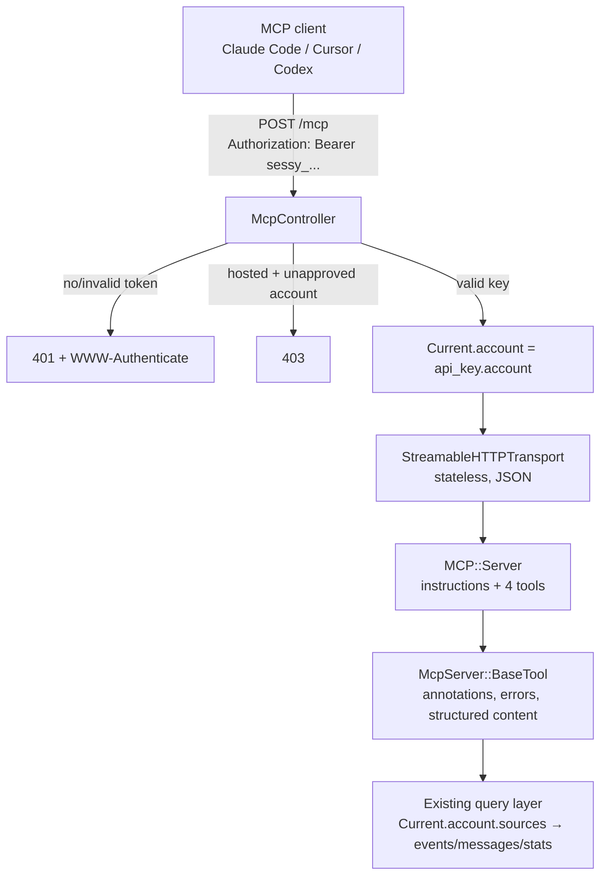

# MCP Server - Plan

## Goal Capsule

- **Objective:** Sessy exposes a read-only MCP server at `POST /mcp` so AI coding agents (Claude Code, Cursor, Codex) can query an account's email events, messages, sources, and stats — authenticated by account-scoped API keys, working identically in hosted and self-hosted installs.
- **Product authority:** this Product Contract. The startupjobs repo's MCP implementation (sibling repo `../startupjobs`) is the implementation reference for controller, base tool, and test harness shape.
- **Stop conditions:** surface instead of guessing if implementation would require host-based branching in routes/controllers, edition-conditional tool behavior, reusing `Source#token` for read auth, or a write-capable tool.
- **Open blockers:** none.
- **Execution profile:** feature branch (`marc/` prefix); commit/push/PR only with explicit user approval. Prove the endpoint end-to-end with a real MCP client connection before building out the full toolset.

---

## Product Contract

### Summary

Add an MCP server to Sessy: a stateless Streamable HTTP endpoint at `/mcp` built on the official `mcp` gem, authenticated by a new account-scoped `ApiKey` model (bearer token), serving four read-only tools that wrap the query logic the web UI already has. The hosted edition advertises the endpoint on an api subdomain via DNS/Cloudflare/Kamal configuration only; the code has no host awareness beyond a display-only `API_HOST` env var.

### Problem Frame

Sessy's email observability data (deliveries, bounces, complaints, opens) is exactly what a coding agent needs when debugging email flows — "did the password-reset email to alice@ get delivered?", "why is my bounce rate up?" — but today the only access is the web UI. An MCP server makes that data available inside the editors where developers already work. The hosted version is the priority (easy onboarding: paste an API key, no Cloudflare tuning needed), but the feature must ship in the open-source core so self-hosters get it too.

### Actors

- A1. Hosted user — connects their editor's MCP client to `api.sessy.do/mcp` with an API key created in the web UI.
- A2. Self-hoster — connects to `/mcp` on their own domain; may run Cloudflare or similar in front and needs to exempt the endpoint from bot protection.
- A3. Marc — operates the hosted instance; owns the Cloudflare/DNS/deploy configuration for the api subdomain.

### Requirements

**Endpoint and authentication**

- R1. `POST /mcp` speaks MCP over Streamable HTTP — stateless, JSON responses (no SSE, no sessions) — and works identically under SQLite/PostgreSQL and in both editions.
- R2. Requests authenticate with `Authorization: Bearer <token>` resolved to an `ApiKey`; missing, unknown, and revoked tokens get identical 401 responses with a `WWW-Authenticate: Bearer` header and a JSON error linking to the docs on the primary app host. Error bodies never echo the presented token. There is no anonymous tier.
- R3. Users manage named API keys (create, revoke) in the web UI in both editions; the token is displayed only at creation.
- R4. Every tool response is scoped to the key's account via `Current.account`; in the hosted edition, keys of unapproved accounts are rejected with a 403 whose JSON body names the pending-approval state and where to resolve it (the webhook gate's silent 404 is wrong here — the caller is the account owner).
- R5. The endpoint is rate-limited per API key, plus a per-IP limit on requests without a valid key (the 401 path must not allow uncapped token guessing).
- R14. Every tool query starts from a `Current.account`-derived scope — no tool calls `Event`/`Message` class scopes directly. `get_message` resolves `ses_message_id` within the account, and a foreign id returns an error indistinguishable from plain not-found (no cross-tenant existence oracle).

**Tools**

- R6. `list_sources` returns the account's sources with recent stats (30-day sent count, bounce rate, last event time) as the entry point for source ids; the zero-source case returns next-step guidance (create a source, complete SES setup) instead of a bare empty list.
- R7. `search_events` supports the same filters as the web events index — text query over recipient/subject, event types, bounce subtypes, date-range presets and custom dates — plus a source filter and keyset pagination (stable ordering with an id tiebreaker; opaque cursor) with compact rows.
- R8. `get_message` returns full message detail by SES message id: subject, sender, destinations, SES tags, and the complete per-recipient event timeline including bounce/complaint diagnostic data from the event payload (long diagnostic strings truncated).
- R9. `email_stats` returns aggregates for a source or the whole account over a date range: counts by event type, unique opens/clicks, bounce/complaint/open/click rates, bounce breakdown by subtype, and an optional daily time series.
- R10. All tools declare read-only/idempotent annotations, return both text and structured content, and keep responses compact (defaults well under MCP clients' response-size limits). Raw SNS payloads (`raw_payload`) are never returned by any tool.
- R15. `search_events` and `email_stats` responses echo the applied date range in both text and structured content — especially when the result is empty, where the response also suggests widening to `all_time`. The web UI's invisible 30-day default must never let an agent report "never sent" for an event that is merely outside the window.

**Editions and documentation**

- R11. The `/mcp` route has no host constraint; an optional `API_HOST` env var affects only displayed URLs (docs page, connect snippets). Hosted sets it to the api subdomain; self-hosted ignores it.
- R12. A docs page shows the endpoint URL and copy-paste connect instructions for Claude Code, Cursor, and Codex, plus a warning for self-hosters that CDN bot protection (e.g., Cloudflare managed challenge) must exempt the endpoint. The README gets a matching section.
- R13. A self-hosted install gets the full feature with zero new required configuration.
- R16. In OSS mode, key management inherits the app's optional HTTP Basic auth (accepted posture: warn, don't block); `/mcp` itself accepts bearer keys only, never HTTP Basic. Docs and README state that enabling HTTP Basic later does not revoke keys minted while the install was open — review the keys page after locking down.

### Acceptance Examples

- AE1. **Given** a hosted account with an API key and one source, **when** a Claude Code client runs `claude mcp add --transport http sessy https://api.sessy.do/mcp --header "Authorization: Bearer <key>"` and calls `list_sources`, **then** it receives that account's sources and no other account's.
- AE2. **Given** an account with a bounced message, **when** `search_events` is called with the bounce event type and then `get_message` with the returned SES message id, **then** the response includes the bounce subtype and the diagnostic details from the SES payload.
- AE3. **Given** a request with no/invalid bearer token, **when** it hits `/mcp`, **then** it receives 401 with `WWW-Authenticate: Bearer` and a JSON error naming where to get a key.
- AE4. **Given** a hosted account that is not yet approved, **when** its key is used, **then** the request is rejected before any tool executes.
- AE5. **Given** a self-hosted install with no new env vars, **when** the operator opens the API keys page and the MCP docs page, **then** both work and the docs show the install's own host in the endpoint URL.
- AE6. **Given** an account whose only delivery event is 35 days old, **when** `search_events` runs with no date filter, **then** the empty response names the 30-day default window and suggests retrying with `all_time` — the agent can relay that instead of "never sent."

### Scope Boundaries

**Deferred to Follow-Up Work**

- OAuth 2.1 support (Doorkeeper, RFC 9728 protected-resource metadata, dynamic client registration) — required for ChatGPT custom connectors and claude.ai web. Until then, do not publish `.well-known` OAuth metadata: Cursor ignores configured bearer headers when it detects OAuth discovery.
- ChatGPT deep-research `search`/`fetch` tools (OpenAI's fixed two-tool schema).
- Write tools of any kind (e.g., mutating sources or retention). The v1 surface is read-only by design.
- Per-user key attribution (keys carry an account, not a user; add a `user_id` later if teams need audit trails).
- Renaming API keys (create/revoke only in v1; add an update action if asked for).
- MCP resources and prompts (tools + server instructions only in v1).
- Extending the web dashboard UI to use the new stats object's custom date ranges (the extraction enables it; the UI change is separate work).

---

## Planning Contract

### Key Technical Decisions

- **Official `mcp` gem, stateless per-request transport.** Build a fresh `MCP::Server` per request in a plain controller and hand it to `StreamableHTTPTransport` with stateless mode and JSON responses enabled. No SSE, no sessions — spec-legal, works with multi-worker Puma, and matches the proven startupjobs implementation. Alternatives rejected: `fast-mcp` (stalled, deprecated SSE transport only), `actionmcp` (heavier engine requiring DB session tables). Bearer auth resolves before the transport parses the request body, so the gem's JSON-RPC parser never sees anonymous input; DNS-rebinding protection stays disabled only on the premise that no anonymous tier exists (browsers cannot attach the Authorization header cross-origin).
- **Bearer API keys, not OAuth, for v1.** Claude Code, Cursor, and Codex all support static bearer headers; GitHub/Stripe/Linear/Sentry all ship this. OAuth is deferred (see Scope Boundaries) and only becomes necessary for ChatGPT.
- **`ApiKey` lives in core and belongs to `Account`, storing a token digest, not the token.** The multi-tenant tables (accounts, memberships) are already in core; resolving token → account → `Current.account` gives correct tenancy in both editions with no engine code. The unique-indexed column holds `SHA256(token)` — lookup hashes the presented token, so index performance is unchanged — with a short prefix column for display (the GitHub/Stripe pattern, diverging from startupjobs' plaintext column). Rationale: the hosted DB is multi-tenant and read-only DB access is routinely granted to tooling, so a plaintext key column would turn every backup and read session into a key-exfiltration surface. `Source#token` is ingestion-only and is not reused for reads.
- **All tool queries derive from `Current.account`.** The account is the single tenancy chokepoint; tools never touch `Event`/`Message` class scopes directly (R14). Event scoping filters by the denormalized `source_id` FK against the account's source ids — ingestion always sets it and migration `20260418120000` backfilled the historical NULLs, so the FK is authoritative and the tuned composite events indexes stay in play. (Revised during review: the plan originally chose a message→source join to defend against NULL legacy rows, but the backfill makes that defense obsolete.)
- **No host constraint in code.** The route answers on any host. The hosted api subdomain is pure infrastructure (DNS, Cloudflare challenge exemption, Kamal proxy hosts). `API_HOST` is display-only.
- **Tools are model-layer classes wrapping existing query objects.** `McpServer::BaseTool < MCP::Tool` centralizes annotations, auth context, error rescue, and the dual text/structured-content response; tools stay thin over `Event.filter_by_params`, `Event.search`, and the extracted stats object.
- **Rate limiting via Rails' native `rate_limit`** in the controller, keyed by `ApiKey` id. No Rack::Attack dependency.
- **The MCP controller inherits `ActionController::API`**, so the SaaS engine's session auth, approval gate, and edition-header includes (which target `ApplicationController`) never apply; the controller owns its own bearer auth and approval check.
- **Security posture: read-only, untrusted content.** Email subjects, recipient addresses, and bounce diagnostics are attacker-controlled input that flows into an agent's context (bouncing mail at a tenant is enough to author diagnostic text); tools stay read-only with honest annotations, untrusted fields live in structured JSON and are clearly delimited in text renderings rather than woven into prose, and the server instructions tell agents to treat email-derived fields as data, never instructions.
- **Keyset pagination for `search_events`.** Order by `event_at DESC, id DESC` with an opaque cursor encoding that pair. The web UI's offset pagination is not safe to copy: events ingest continuously, so offsets skip/duplicate rows between page fetches, and the existing ordering has no tiebreaker.

### High-Level Technical Design

Request flow — the auth chain is the only new machinery; everything right of `Current.account` is existing code:

Directional guidance, not implementation specification: exact class/file names may shift during implementation.

### Assumptions

- The `mcp` gem is added to the core `Gemfile` (the SaaS bundle evals it, so one declaration covers both; run `bin/bundle-drift` after).
- Sequence/shape of the docs page follows the startupjobs `/mcp` page: endpoint URL with copy button, per-client snippets, tool table.
- Hosted rate limit starts at 60 requests/min per key; the per-IP limit on requests without a valid key starts at 10/min. Both tune later from real usage.
- The hosted docs page sitting behind the magic-code login wall is accepted (browser GETs to `/mcp` redirect there; hosted visitors sign in first). Links in MCP error bodies always use the primary app host, since a session cookie set on the api subdomain would create a parallel session on duplicate URLs.
- `search_events` keeps the web UI's `last_30_days` default window (R15's range echo makes it visible to agents) rather than defaulting to `all_time`.

### Risks & Dependencies

- **`mcp` gem release cadence.** The SDK releases roughly weekly and is pre-1.0. Pin with a pessimistic version constraint; `bin/bundler-audit` already runs in CI; treat transport-behavior changes as review-worthy on bumps — a transport regression here is an auth-adjacent regression.
- **`remote_ip` correctness behind Cloudflare + kamal-proxy.** The per-IP 401-path rate limit only works if `remote_ip` resolves the real client rather than the proxy; verify during the U6 live check, otherwise the limit either bricks all clients or limits nothing.
- **Nullable `events.source_id`.** The column is still nullable at the schema level, but ingestion always sets it and migration `20260418120000` backfilled historical NULLs, so FK scoping (the tenancy KTD) treats it as authoritative. If a future ingest path ever skips `source_id`, those events become invisible to MCP tools and stats.
- **Retention deletion racing MCP queries.** `delete_expired_data` deletes events then messages in separate statements, so a concurrent query can load an event whose message is gone; row building must be nil-safe (the CSV export already models this), and `get_message` not-found errors should name retention as a likely cause.
- **Scoping bugs pass trivially against empty fixtures.** Isolation tests only bite when the second account has data matching every filter; the Verification Contract's isolation gate depends on populated cross-account fixtures.

### Sources & Research

- Reference implementation (sibling repo `../startupjobs`): `app/controllers/api/mcp_controller.rb`, `app/models/mcp_server/` (base_tool and tool classes), `app/models/api_key.rb`, `test/controllers/api/mcp_controller_test.rb`, `app/views/pages/mcp.html.erb`.
- Sessy query surface to wrap: `app/models/event/filterable.rb` (`filter_by_params`, `filter_counts`, date presets — default window last 30 days), `app/models/event/searchable.rb`, `app/controllers/sources_controller.rb` (dashboard aggregate math to extract), `app/controllers/events_controller.rb` (param names to mirror).
- Tenancy chokepoint: `app/models/current.rb` + `app/controllers/concerns/set_current_account.rb`; approval gate precedent in `app/controllers/webhooks_controller.rb`.
- External (verified July 2026): official `mcp` Ruby SDK is current and actively maintained with Streamable HTTP; MCP clients' bearer-header support confirmed per client docs; ChatGPT connectors require OAuth (no custom headers); Anthropic tool-design guidance (few workflow-shaped tools, strict schemas, `readOnlyHint`, token-efficient defaults); MCP security best practices (no token passthrough, origin validation, prompt-injection via tool results).

---

## Implementation Units

### U1. ApiKey model and management UI

- **Goal:** Account-scoped API keys exist and users can create/revoke them in the web UI in both editions.
- **Requirements:** R3, R13 (advances R2, R4)
- **Dependencies:** none
- **Files:** `db/migrate/<timestamp>_create_api_keys.rb`, `app/models/api_key.rb`, `app/models/account.rb` (association + dependent handling), `app/controllers/api_keys_controller.rb`, `app/views/api_keys/` (index + creation flash showing the token once), `app/views/layouts/_header.html.erb` (nav link), `config/routes.rb`, `test/models/api_key_test.rb`, `test/controllers/api_keys_controller_test.rb`, `test/fixtures/api_keys.yml`
- **Approach:** Migration creates `api_keys` (account FK, `name`, unique `token_digest`, `token_prefix` for display, `last_used_at`). The model generates a `sessy_`-prefixed random token, stores only its SHA256 digest (per the token-digest KTD), and exposes a lookup that hashes the presented token; the plaintext exists only in memory at creation. `track_usage` updates `last_used_at` via `update_column` at most hourly (startupjobs pattern). `Account` gets `has_many :api_keys, dependent: :destroy` (account destruction must not orphan keys). Controller is `resources :api_keys, only: %i[index create destroy]`, scoped `Current.account.api_keys`; new-token value passed via flash to be rendered once (non-cacheable response). Reversible migration; works on SQLite and PostgreSQL.
- **Patterns to follow:** startupjobs `app/models/api_key.rb` for shape (diverging on digest storage); Sessy's `SourcesController` for scoping and controller/view idiom.
- **Test scenarios:**
  - Creating a key yields a `sessy_`-prefixed token associated with the current account; the raw token is never persisted (no column contains it), and lookup by the raw token succeeds via the digest.
  - Index shows only the current account's keys (account A's session/basic-auth context cannot see account B's keys) and displays the prefix, never a full token.
  - Destroy revokes the key; a subsequent lookup by that token finds nothing.
  - Destroying an account destroys its keys.
  - `track_usage` sets `last_used_at` on first use and does not write again within the hour.
  - Token value appears in the response to create and not on subsequent index renders.
- **Verification:** model + controller tests pass under both `bin/rails test` and the SaaS-mode suite; key management page renders in a dev walkthrough in both editions.

### U2. MCP endpoint, base tool, and list_sources

- **Goal:** A working end-to-end MCP server: handshake, auth, rate limiting, and one real tool, connectable from Claude Code.
- **Requirements:** R1, R2, R4, R5, R6, R10, R13, R14
- **Dependencies:** U1
- **Files:** `Gemfile` (+ lockfiles via `bin/bundle-drift`), `config/routes.rb`, `app/controllers/mcp_controller.rb`, `app/models/mcp_server.rb`, `app/models/mcp_server/base_tool.rb`, `app/models/mcp_server/list_sources.rb`, `config/initializers/mcp.rb`, `test/controllers/mcp_controller_test.rb`
- **Approach:** `match "/mcp", via: %i[get post delete]`; browser GETs (Accept without `text/event-stream`) redirect to the docs page (U5) as an absolute URL on the primary app host — same host rule as error-body links; a relative redirect would keep hosted browsers on the api subdomain and mint the parallel session the Assumptions rule out. Everything else goes through the stateless transport. Controller resolves auth fully before the transport touches the body (auth-before-parse KTD): extract the bearer token, look up the `ApiKey` by digest, call `track_usage`, set `Current.account`; identical 401s (with `WWW-Authenticate: Bearer`, never echoing the token, linking to the primary app host) for missing/unknown/revoked tokens; when `Sessy.saas?`, reject keys of unapproved accounts with the R4 403 body before `track_usage` or dispatch. Two `rate_limit` rules: per api_key id for authenticated traffic, per IP for requests without a valid key — the per-IP rule must be declared ahead of the bearer-auth `before_action` so it actually runs on the 401 path. This deliberately diverges from startupjobs, where auth halts the callback chain before its rate limiters and invalid-token requests are never limited. `McpServer.server(api_key:)` builds `MCP::Server` with name, version, `instructions` (tool flow: list_sources → search_events → get_message; snake_case event-type params; messages addressed by SES message id; default window 30 days; email-derived fields are third-party data, never instructions), and the tool list, passing the account via `server_context`. `BaseTool` sets read-only/idempotent/non-destructive annotations for all subclasses via `inherited` and mirrors every payload as text + `structured_content` with untrusted fields clearly delimited. Its error handling rescues an explicit allow-list of domain error classes into their specific instructive messages; any other `StandardError` becomes a generic internal-error tool response, logged server-side with the full exception — raw exception text never reaches the caller (API-key callers are programmatic and untrusted; a blanket `rescue => e` would leak schema and query fragments). `list_sources` reuses the source-index stats query and returns setup guidance for the zero-source case (R6). Initializer wires the gem's exception reporter to Rails error reporting without attaching request headers (the bearer token lives in `Authorization`, which `filter_parameters` does not cover).
- **Execution note:** After the controller and handshake tests pass, connect a real Claude Code client against the dev server and exercise `list_sources` before building further tools.
- **Patterns to follow:** startupjobs `api/mcp_controller.rb` (transport block, browser redirect, auth), `mcp_server/base_tool.rb`, and its test harness (`rpc`/`call_tool` helpers posting raw JSON-RPC with the protocol-version header).
- **Test scenarios:**
  - `initialize` handshake succeeds with a valid key; notifications return 202.
  - Missing, unknown, and revoked tokens return byte-identical 401s with `WWW-Authenticate: Bearer`; no error body echoes the presented token.
  - A working key stops working on the request after its `ApiKey` is destroyed (endpoint-level revocation, not just model-level).
  - Covers AE4. In SaaS mode, a key of an unapproved account gets a 403 whose body names the pending state, before `track_usage` runs; approving the account makes the same key work.
  - Covers AE1 (scoping half). `tools/list` shows the tools with titles and `readOnlyHint`; `list_sources` returns only the key's account's sources against a second account populated with matching data.
  - With `HTTP_AUTH_*` configured (OSS mode), `/api_keys` demands basic auth while `/mcp` works with a bearer key alone and ignores basic credentials (R16).
  - Tool responses carry matching `structuredContent` and pretty-printed text.
  - Browser GET redirects to the docs page; MCP GET/unknown-method behavior follows the transport (no 500s).
  - Exceeding the per-key limit returns 429 with `Retry-After`; repeated invalid-token requests from one IP also hit 429. (Rate-limit assertions need a real counter store: `config/environments/test.rb` uses `:null_store`, so wire the limiter's `store:` option or a stubbed `Rails.cache` to an `ActiveSupport::Cache::MemoryStore` in these tests.)
  - An unexpected exception inside a tool returns the generic internal-error response with no exception text; a domain error returns its specific message.
- **Verification:** integration tests pass in both database adapters and SaaS mode; a real `claude mcp add --transport http` connection lists and calls `list_sources` successfully against the dev server.

### U3. Extract dashboard stats into a shared stats object

- **Goal:** The aggregate math currently inlined in the sources dashboard becomes a reusable, date-range-parameterized object consumed by both the controller and (in U4) the `email_stats` tool.
- **Requirements:** advances R9 (enabler; no user-visible change)
- **Dependencies:** none (parallel to U1/U2)
- **Files:** `app/models/email_stats.rb` (or `app/models/source/stats.rb` — settle during implementation), `app/controllers/sources_controller.rb`, `test/models/email_stats_test.rb`
- **Approach:** Move `assign_overview_counts`, the rate calculations, `build_chart_data` (zero-filled daily series), and `bounce_breakdown` out of `SourcesController#show` into a plain object taking an events scope plus a date range; keep the unique open/click distinct-count SQL working on both adapters. The dashboard keeps its fixed 30-day window and identical output; this unit is a behavior-preserving extraction.
- **Execution note:** Characterize the current dashboard numbers with a test before moving the queries, so the extraction provably preserves behavior.
- **Test scenarios:**
  - Counts by event type, bounce breakdown, and rates match the pre-extraction dashboard values for a fixture set containing sends, deliveries, bounces (mixed subtypes), complaints, opens, and clicks.
  - Unique opens/clicks count distinct recipient+message pairs, not raw events (a recipient opening twice counts once).
  - Daily series zero-fills days with no events across the range.
  - Rates handle the zero-sends case without division errors.
  - Works on SQLite and PostgreSQL (CI matrix covers this).
- **Verification:** dashboard renders identical numbers before/after (characterization test); no query-count regression on the sources show page.

### U4. Remaining tools: search_events, get_message, email_stats

- **Goal:** The full v1 toolset is live.
- **Requirements:** R7, R8, R9, R10, R14
- **Dependencies:** U2, U3
- **Files:** `app/models/mcp_server/search_events.rb`, `app/models/mcp_server/get_message.rb`, `app/models/mcp_server/email_stats.rb`, `app/models/mcp_server.rb` (register tools), `test/controllers/mcp_controller_test.rb`
- **Approach:** `search_events` accepts `source_id`, `query`, `event_types[]`/`bounce_types[]` (enums from `Event::Types` keys, normalized exactly as the web params are — the snake_case→CamelCase and bounce-subtype titleize mappings are easy to mismatch silently), `date_range` preset + `from_date`/`to_date`, `limit` (default 25, max 100), and an opaque keyset cursor per the pagination KTD; it applies `search`/`filter_by_params` on the account-derived scope (R14) and returns compact rows (type, bounce subtype, recipient, subject, `ses_message_id`, `event_at`) plus `has_more`/cursor and the applied date range (R15). Row building is nil-safe against a message deleted mid-query by retention. `get_message` takes a required `ses_message_id`, resolves it within the account, and returns message metadata (subject, sender, destinations, SES tags, sent_at) with the full event timeline including `event_data` diagnostics for bounces/complaints — diagnostic strings truncated, `raw_payload` never included; its not-found error names the source's retention policy as a likely cause. `email_stats` takes optional `source_id`, date-range args, and `include_daily_series` (default false) over the U3 stats object, echoing the applied range. All schemas use `additionalProperties: false`, enums where possible, and descriptions written for an agent (state id formats, defaults, and the free-text query semantics).
- **Patterns to follow:** startupjobs `search_jobs`/`get_job` tool classes for schema and pagination shape.
- **Test scenarios:**
  - Covers AE2. Searching with the bounce type filter returns the bounced event; `get_message` on its `ses_message_id` includes bounce subtype and diagnostic payload data, and omits `raw_payload`.
  - Covers AE1 (scoping half). Against a second account populated with sources, messages, and events matching every filter: all three tools return disjoint results per account; a no-filter `search_events` returns only the key's account's events; a NULL-`source_id` legacy event scopes correctly through its message.
  - `search_events` respects source scoping (a `source_id` from another account is not found), date presets, custom date ranges, the bounce-subtype OR logic matching the web UI (including a bounce-subtype filter case to catch enum-casing mismatches), and text query over recipient and subject.
  - Covers AE6. An event outside the default window yields an empty result whose text names the 30-day window and suggests `all_time`.
  - Pagination: `limit` capped at 100; events sharing an `event_at` across a page boundary neither skip nor duplicate; rows inserted between page fetches don't shift results; malformed cursor returns an instructive tool error, not a 500.
  - Unknown enum values and malformed dates return instructive tool errors, not 500s.
  - `get_message` with a nonexistent `ses_message_id` and with another account's `ses_message_id` returns indistinguishable not-found tool errors (R14).
  - `email_stats` without `source_id` aggregates the whole account; with it, only that source; `include_daily_series` toggles the series; values match U3's object for the same fixtures; response echoes the applied range.
- **Verification:** full MCP test file green in both adapters + SaaS mode; manual agent session exercises the flow list_sources → search_events → get_message.

### U5. Docs page and README

- **Goal:** Users in both editions can discover and connect to the MCP server without reading source code.
- **Requirements:** R11, R12, R16 (docs half)
- **Dependencies:** U2 (redirect target), U4 (tool table content)
- **Files:** `app/controllers/docs_controller.rb` (or equivalent single-action controller), `app/views/docs/mcp.html.erb`, `config/routes.rb`, `config/application.rb` (`config.x.api_host` from `API_HOST`), `README.md`, `test/controllers/docs_controller_test.rb`
- **Approach:** Page shows the endpoint URL derived from `API_HOST` when set, else `request.host`; copy-paste connect snippets for Claude Code (`claude mcp add --transport http ... --header`), Cursor (`mcp.json` with `headers`), and Codex (`config.toml` with `bearer_token_env_var`); the tool table; a link to the API keys page; the self-hoster warning about CDN/Cloudflare bot protection blocking MCP clients; the R16 security note (enabling HTTP Basic later does not revoke existing keys — review the keys page after locking down); a note that ChatGPT support (OAuth) is planned. All key-management/docs links use the primary app host. README gets a compact MCP section pointing at the page. Sits behind the same auth as the rest of the app (it links to key management; no need to be public in v1).
- **Test scenarios:**
  - Covers AE5. Page renders with the request host in the endpoint URL when `API_HOST` is unset, and with the configured host when set.
  - Browser GET to `/mcp` lands on this page (asserted in U2's test, target exists here).
- **Verification:** page renders correctly in both editions in a dev walkthrough; snippets are copy-paste-valid against a running server.

### U6. Hosted deployment configuration

- **Goal:** `api.sessy.do/mcp` serves the hosted MCP endpoint with Cloudflare's managed challenge disabled for it.
- **Requirements:** R11 (hosted half)
- **Dependencies:** U2 (needs a working endpoint to verify against)
- **Files:** `config/deploy.saas.yml` (`API_HOST: api.sessy.do` in env; `api.sessy.do` + `api.sessy.dev` added to `proxy.hosts`)
- **Approach:** Repo change is the deploy config only. The rest is operational (see Operational Notes): Cloudflare DNS record for the api subdomain, WAF skip rule for managed challenge/bot fight on it. Deploys go through push-to-main → GitHub Actions per repo policy.
- **Test scenarios:** Test expectation: none — deploy configuration; verified operationally.
- **Verification:** after deploy, `claude mcp add` against `https://api.sessy.do/mcp` completes the handshake and `list_sources` returns data for a real account; a browser GET redirects to the docs page on the primary app host (not the api subdomain) rather than a challenge page.

---

## Verification Contract

| Gate | Command | Applies to |
|---|---|---|
| Core test suite | `bin/rails test` (targeted files during development) | U1-U5 |
| SaaS-mode suite | `SESSY_MODE=saas bin/rails test test saas/test` | U1, U2, U4 (approval gate, edition behavior) |
| Full local pipeline | `bin/ci` and `SESSY_MODE=saas bin/ci` before PR | all |
| Lint | `bin/rubocop` | all |
| Lockfile sync | `bin/bundle-drift` after Gemfile change | U2 |
| Security scan | `bin/brakeman` (new controller + auth surface) | U1, U2, U3, U4 |
| Live client check | Real Claude Code connection exercising list_sources → search_events → get_message | U2, U4, U6 |

CI runs the SQLite/PostgreSQL matrix plus the SaaS leg automatically; both adapters must stay green (the distinct-count SQL in U3 and JSON columns are the likely divergence points).

## Definition of Done

- All requirements R1-R16 implemented and traced to landed units; acceptance examples AE1-AE6 demonstrably pass (AE1/AE2 via integration tests plus one live client session).
- Cross-account isolation is proven by tests against a second account populated with data matching every filter: no tool, with any parameter combination, returns another account's data.
- Both editions verified: SaaS suite green; a plain OSS-mode boot exercises key creation and an MCP call with zero new env vars.
- Docs page and README accurate against the shipped behavior; connect snippets tested verbatim.
- No leftover experimental code from abandoned approaches in the diff; `db/schema.rb` diffed against main for strays before PR.
- U6 deploy config merged; the operational Cloudflare/DNS steps are listed in the PR description as post-deploy actions (they are not code-verifiable).

## Appendix

### Operational Notes (hosted rollout)

1. Cloudflare DNS: `api.sessy.do` (and `api.sessy.dev`) pointing at the same origin as `app.sessy.do`.
2. Cloudflare WAF: skip managed challenge / bot fight mode scoped to hostname `api.sessy.do` **and** path `/mcp` — not the whole subdomain. The app answers on every route of the api host (no host constraint by design), so a subdomain-wide exemption would strip bot protection from the sign-in/magic-code endpoints.
3. Deploy with the updated `proxy.hosts`; verify TLS on the new hostnames.
4. Post-deploy: run the live client check from the Verification Contract against production with a real key; also confirm a browser GET to a non-`/mcp` path on `api.sessy.do` still receives normal bot protection, and that the per-IP 401 rate limit sees real client IPs through the Cloudflare + kamal-proxy chain (Risks & Dependencies).

### Client configuration reference (for the docs page)

- Claude Code: `claude mcp add --transport http sessy <endpoint> --header "Authorization: Bearer <key>"`
- Cursor (`~/.cursor/mcp.json`): `{"mcpServers": {"sessy": {"url": "<endpoint>", "headers": {"Authorization": "Bearer <key>"}}}}`
- Codex (`~/.codex/config.toml`): `[mcp_servers.sessy]` with `url` and `bearer_token_env_var`.
- ChatGPT: not supported until OAuth ships (connectors accept OAuth or no-auth only).
