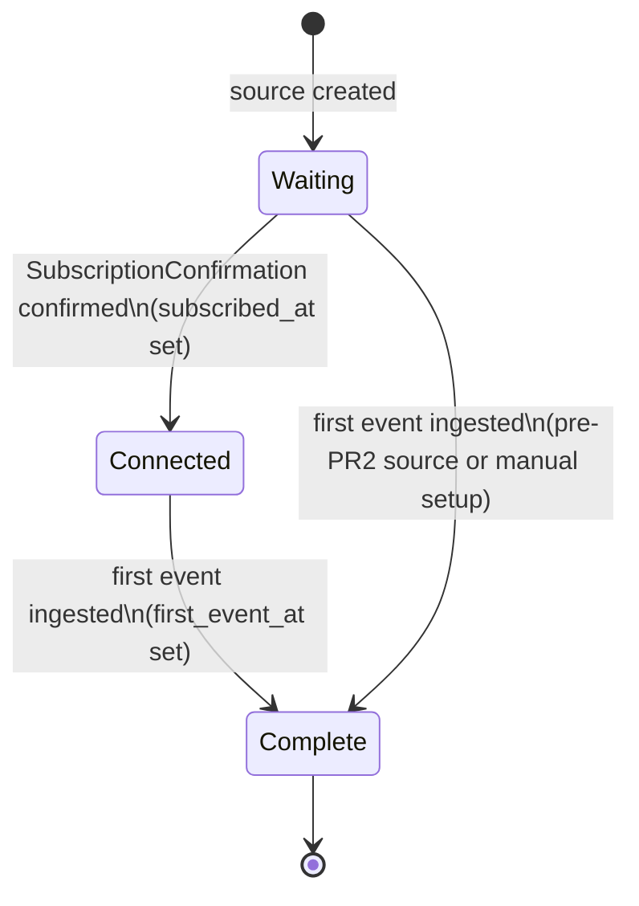
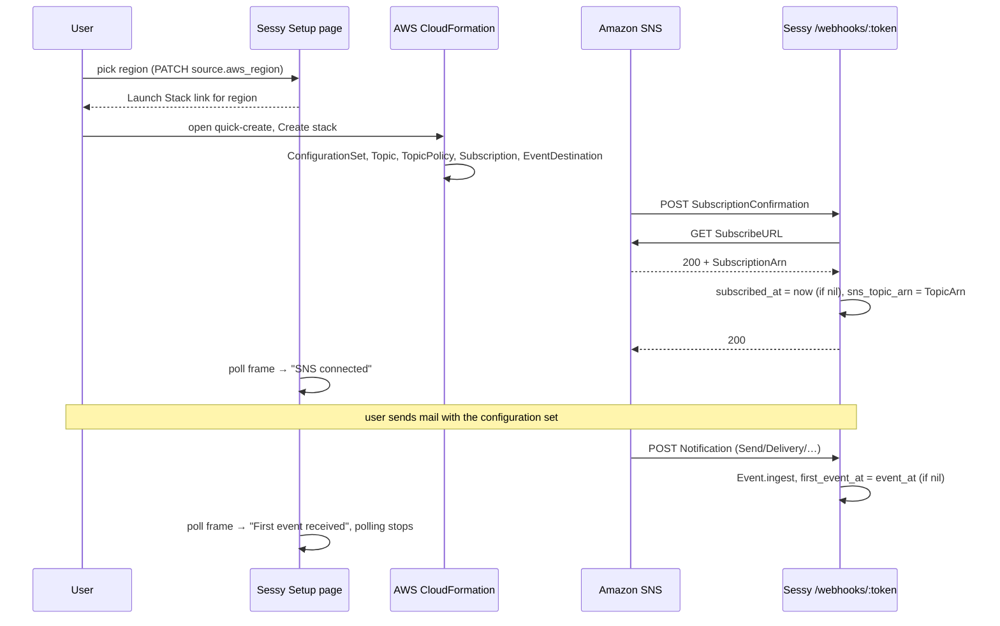

# Hosted Activation - Plan

## Goal Capsule

- **Objective:** Get hosted Sessy signups from "signed up" to "first SES event received" with auto-approval, a one-click AWS setup, visible progress, a pre-created first source the user lands on immediately, and one nudge email for accounts that stall.
- **Authority:** Requirements (R-IDs) win on product behavior. Key Technical Decisions (KTD-IDs) win on mechanism. Units override neither.
- **Execution profile:** Five independently shippable PRs, one per phase below. Each PR must be green on both SQLite and PostgreSQL CI legs and on the SaaS leg.
- **Stop conditions:** Stop and surface if the CloudFormation template cannot be validated in a real AWS account, if the SNS confirmation rewrite changes behavior for existing confirmed sources, or if any change would email an account that already has events flowing.
- **Tail ownership:** The Operator (A3) publishes the template to S3 and runs the first nudge preview in production console before enabling the recurring command; the implementer hands over the validated template, its SHA-256, and the preview query.

---

## Product Contract

### Summary

Replace the four-step AWS console tour on the Setup page with a CloudFormation Launch Stack button, show live "SNS connected → first event" status on that page, approve hosted signups automatically and land them on a pre-created source's Setup page, and email accounts once if they have not received an event two days after signup. Billing (the Stripe trial gate that replaces manual approval as abuse control) and a cross-account IAM role stay out.

### Problem Frame

Hosted Sessy has 30 real signups since July 2026 (31 non-instance accounts including an internal MCP health-check account). 15 never created a source; 11 created a source but never received an event; 4 have received events, and 2 of those are active this week. Nearly all logged in once on signup day. The two accounts that completed AWS setup stayed active, which points at setup friction rather than product value; this is the working hypothesis, not established fact, because today nothing records where the 11 source-but-no-event accounts stopped (SNS confirmations leave no trace, so "never wired SNS" and "wired SNS but never switched their sending code to the configuration set" look identical). R7 starts producing that data; the Definition of Done commits to reading it.

The current Setup page (`app/views/setups/show.html.erb`) asks the user to create a configuration set, an SNS topic, an HTTPS subscription and an event destination by hand in the AWS console, then gives no feedback: SNS confirmation is fire-and-forget in `WebhooksController#confirm_subscription` and nothing records that the first event arrived. Signup itself also wastes the moment of peak intent: the account lands pending behind manual approval, the user sees only the pending page, and the approval email arrives hours later telling them to sign in again and go create a source. Manual approval was the launch-time abuse control; the user has decided to replace it with auto-approval now and a Stripe checkout with a free trial soon.

### Requirements

**Launch Stack (core app; benefits self-hosters too)**

- R1. The Setup page offers a "Launch Stack" link that opens the user's AWS CloudFormation console with a pre-filled quick-create form for the source's region.
- R2. The user picks the SES region on the Setup page before launching; the choice is remembered per source and also fills the region placeholders in the CLI snippets.
- R3. The stack provisions everything SES needs to publish events for the source to Sessy: a configuration set (or attaches to an existing one the user names), an SNS topic with a policy that lets SES publish, an HTTPS subscription to the source's webhook URL, and an event destination for all event types Sessy ingests.
- R4. The manual console steps remain available on the Setup page as a collapsed fallback.
- R5. Step 5 ("use the configuration set when sending") stays and adds the SES CLI command that makes the configuration set the default for a verified identity, so no code change is needed.
- R6. The template is versioned in the repository and published to a Sessy-owned public S3 bucket; the template URL is configurable so self-hosters can point at their own copy.

**Setup status (core app)**

- R7. Sessy records when the SNS subscription for a source is successfully confirmed and when the source's first event is ingested.
- R8. The Setup page shows the current setup state — waiting for AWS, SNS connected, first event received — and updates without a manual page reload while the user is on the page.
- R9. A failed subscription confirmation is reported to SNS as a failure so SNS retries, instead of being acknowledged as success.
- R10. Sources that already had events before this ships are shown as complete, including when retention has since deleted their events.
- R11. The Overview empty state ("Ready to receive events") is driven by the recorded first event, not by whether messages currently exist.

**Signup landing (hosted only)**

- R12. Completing a hosted signup creates an approved account with a first source named "Production", and the signup redirect lands the user on that source's Setup page immediately, while they are still there.
- R13. The welcome email (sent at signup, replacing the approval email) links directly to that source's Setup page, and signing in from that link later lands the user there.
- R14. Welcome email copy describes the Launch Stack path instead of manual source creation.
- R14a. The operator still gets a per-signup notification, and `approved_at` keeps working as the suspension switch (nulling it gates the UI and 404s the webhook), so abuse can be stopped by hand until the Stripe trial gate ships.

**Nudge email (hosted only)**

- R15. An approved account whose sources have received no event two days after approval (which, after R12, is signup) gets one email pointing at its next setup step (the source's Setup page, or source creation when the account has no source) and inviting a reply for help.
- R16. Each account receives the nudge at most once, ever.
- R17. The email copy matches the account's stall point: no source, source without SNS confirmation, or SNS confirmed without events.
- R18. When the nudge ships, the first scheduled run covers all currently stalled accounts; no separate backfill task is required.
- R19. Self-hosted installs never send nudges and carry no nudge code path that can run.

### Actors

- A1. **Hosted signup** — a user who created an account on app.sessy.do (approved automatically at signup once U5 ships).
- A2. **Self-hoster** — an OSS operator running Sessy on their own infrastructure. Gets R1–R11; never sees R12–R19.
- A3. **Operator** — Marc; publishes the template, watches the first nudge run.

### Key Flows

- F1. Hosted signup reaches first event
  - **Trigger:** User completes signup (`Sessy::Saas::Signup#complete`); the account is approved in the same step.
  - **Actors:** A1
  - **Steps:** Signup redirect lands on the Setup page for the auto-created "Production" source (welcome email with the same link goes out in parallel for the return visit) → pick region → Launch Stack → CloudFormation creates resources → SNS posts `SubscriptionConfirmation` → Sessy confirms and records it → status shows "SNS connected" → user sends with the configuration set → first event ingested → status shows "First event received".
  - **Covered by:** R1, R2, R3, R7, R8, R12, R13
- F2. Stalled account is nudged
  - **Trigger:** Daily recurring run.
  - **Actors:** A1, A3
  - **Steps:** Select approved accounts with `approved_at` older than two days, no nudge sent, no source with a first event → claim each account by stamping `setup_nudge_sent_at` → pick copy variant per account → email all account users.
  - **Covered by:** R15, R16, R17, R18

### Acceptance Examples

- AE1. **Covers R7, R9.** Given a source with no `subscribed_at`, when SNS posts a `SubscriptionConfirmation` whose `SubscribeURL` returns HTTP 200 with a `SubscriptionArn`, then Sessy responds 200 and `subscribed_at` is set once; a later duplicate confirmation does not change it.
- AE2. **Covers R9.** Given the same source, when the `SubscribeURL` GET returns HTTP 400 or times out, then Sessy responds 5xx and `subscribed_at` stays nil.
- AE3. **Covers R10.** Given a source created before this ships with `messages_count` 3 and events present, when the migration runs, then `first_event_at` is the earliest `event_at` and the Setup page shows "First event received". Given a source with `messages_count` above 0 but no surviving events (not a state retention produces today, since it deletes messages and events together, but cheap to cover), `first_event_at` falls back to `created_at`. A source whose messages and events were both deleted by retention (`messages_count` back at 0) cannot be recovered by the migration and is stamped by hand per U3.
- AE4. **Covers R15, R16, R18.** Given accounts approved 1, 3 and 30 days ago with no events, when the nudge runs for the first time, then the 3- and 30-day accounts are emailed and stamped and the 1-day account is not; a second run the next day emails only the now-2-day-old account.
- AE5. **Covers R13.** Given a welcome email linking to `/sources/:id/setup`, when the signed-out user follows it and completes the magic-code sign-in, then they land on that Setup page, not the sources index.

### Scope Boundaries

- Billing, plans, and payment gates. The planned Stripe checkout with a free trial is the abuse control that replaces manual approval; it is the next piece of work after this plan, not part of it. U5 keeps `approved_at` and `ApprovalGate` intact so the trial gate can reuse the same "gated account sees one page, webhook 404s" shape.
- Cross-account IAM role / STS access into customer AWS accounts (in-app diagnostics, auto-attaching destinations). Deliberately deferred until the Launch Stack path proves out, measured by the cohort readout in the Definition of Done.
- Admitting webhooks for unapproved accounts. Not needed: with auto-approval (U5) no new account is ever pending, and a nulled `approved_at` now means "suspended", where the 404 is the point.
- Multi-account users: `Current.account` stays the first membership; deep links into another account's source 404 as today.
- Changing the OSS first-run experience beyond the Setup page itself.

#### Deferred to Follow-Up Work

- Handle `UnsubscribeConfirmation` to mark a source disconnected after a stack is deleted.
- Pin `Notification` ingestion to the recorded `sns_topic_arn` so a third party holding a webhook token cannot feed a source from their own topic.
- Enable `config.hosts` in production (host header is unvalidated today).
- Scope `webhooks.sns_message_id` dedupe by source (a topic subscribed to two Sessy webhook URLs currently drops the second delivery silently).
- A rake task to create a "Production" source for pre-existing approved accounts with zero sources (the nudge reaches them without it; see R17).
- Drip sequence beyond the single nudge.
- `docs/aws-ses-setup.md` rewrite around Launch Stack beyond a short pointer (U2 adds the pointer only).

---

## Planning Contract

### Key Technical Decisions

- KTD1. **CloudFormation quick-create link, no AWS credentials in Sessy** (session-settled: user-approved — chosen over a cross-account IAM role and pasted access keys: keeps the "no AWS credentials shared with Sessy" promise on the Setup page true and needs no server-side AWS SDK calls). Governs R1, R3, R6.
- KTD2. **Template committed under `config/cloudformation/sessy-ses.yml`, published to a versioned key in a public S3 bucket, URL read from `config.x.cloudformation_template_url`** with a Sessy-bucket default. CloudFormation requires `templateURL` to be an S3 URL (GitHub raw URLs are rejected), and one bucket serves every stack region. The template runs inside customers' AWS accounts, so the bucket is a supply-chain surface: a versioned key (`/v1/…`) is only a convention unless the bucket also has versioning and a policy denying `PutObject` on existing keys (S3's enforce-conditional-writes policy: deny `s3:PutObject` when `s3:if-none-match` is absent, via `Null: { "s3:if-none-match": "true" }`), and Block Public Access permits object reads only. The bucket controls are the real tamper guard against overwrite; the repo test that pins the SHA-256 of the committed template only reminds the implementer to publish under a new key when the template changes. A separate network check in U1 (skipped when offline) fetches the published URL and compares its digest to the same constant, which is the only check that would notice a swapped object after an AWS-account compromise. Follows the `config.x.app_host` / `ENV` pattern in `config/application.rb`. Governs R6.
- KTD3. **Region is persisted on the source (`sources.aws_region`, nullable) and validated server-side against the SES region list** via a new `SetupsController#update` (`PATCH /sources/:id/setup`), chosen over a client-only dropdown and over reusing `SourcesController#update`, which redirects to Overview and would bounce the user off the page they are working on. Persisting lets the CLI snippets, the Launch Stack link, and later the status summary all use one value, and survives reloads. The region is interpolated into the console hostname, so `inclusion` validation is a security control, not only UX: the URL helper returns nil for any value outside the list. The Launch Stack link is disabled until a region is chosen; the hosted app's own `AWS_REGION` is unrelated (that is where Sessy sends mail, not where the customer's SES lives). Governs R2.
- KTD4. **Template resources and parameters.** Parameters: `WebhookUrl` (`NoEcho: true` if U1's sandbox run confirms quick-create still prefills it; the URL carries the source token and is otherwise visible via `DescribeStacks`), `ConfigurationSetName`, `ExistingConfigurationSetName` (default empty), `TopicName`. Condition `CreateConfigSet` on `ExistingConfigurationSetName == ""`. Resources: `AWS::SES::ConfigurationSet` (conditional), `AWS::SNS::Topic`, `AWS::SNS::TopicPolicy` allowing `ses.amazonaws.com` to `sns:Publish` with `AWS:SourceAccount` and `AWS:SourceArn` (`arn:${Partition}:ses:${Region}:${AccountId}:configuration-set/<resolved name>`) conditions, `AWS::SNS::Subscription` (`Protocol: https`, `Endpoint: !Ref WebhookUrl`), `AWS::SES::ConfigurationSetEventDestination` with an explicit `DependsOn: TopicPolicy` (SES verifies at create time that it may publish to the topic; `!Ref Topic` orders the destination after the topic but not after the policy, so without `DependsOn` the stack intermittently rolls back with `InvalidSNSDestination`), `Enabled: true`, all ten `MatchingEventTypes` (`SEND, REJECT, BOUNCE, COMPLAINT, DELIVERY, OPEN, CLICK, RENDERING_FAILURE, DELIVERY_DELAY, SUBSCRIPTION`) and `SnsDestination: { TopicARN: !Ref Topic }` — note the `TopicARN` casing. No IAM resources, so the console shows no capabilities checkbox; the repo test enforces this. Governs R3.
- KTD5. **Resource naming.** Stack name `sessy-<slug>-<source.id>` where `slug` is `name.parameterize` with underscores mapped to hyphens and truncated so the whole stack name fits CloudFormation's `[a-zA-Z][-a-zA-Z0-9]*`, max 128. Configuration set and topic names reuse `Source#config_set_name` / `#sns_topic_name` (64- and 256-character limits respectively), with a `source-<id>` fallback when the slug is empty (non-Latin names). Configuration set names are what users paste into their code, so they stay readable; the stack name carries the id to avoid `AlreadyExists` when two sources share a name. Every `param_*` value and the `templateURL` are percent-encoded individually. Governs R1, R3.
- KTD6. **`subscribed_at` and `sns_topic_arn` are set in `WebhooksController#confirm_subscription` only after a 2xx response containing `SubscriptionArn`; any other outcome renders 5xx.** Today `Net::HTTP.get` discards the status and always answers 200, so an expired or failed confirmation is indistinguishable from success and SNS never retries. Before the outbound GET, the `SubscribeURL` must be `https` on an `sns.<region>.amazonaws.com` host, else 400 with no request — the SNS signature already covers `SubscribeURL` in production, but verification is bypassed under `Rails.env.local?`, and the allowlist costs nothing. `subscribed_at` is a single conditional `UPDATE … WHERE subscribed_at IS NULL` rather than a read-then-write on the loaded model, so concurrent or redelivered confirmations cannot move the timestamp. `sns_topic_arn` is the opposite: it is set unconditionally on every successful confirmation and a warn-level log line records any change from a non-nil value. Recording the latest topic is what makes the summary useful, since anyone holding the token could subscribe the webhook to a topic of their own; a first-wins stamp would hide exactly the case it exists for (customer sets up first, token leaks later) and would pin a deleted topic's ARN after a legitimate delete-and-relaunch. Governs R7, R9.
- KTD7. **`first_event_at` is stamped in `Event::SnsIngestible.ingest` on every ingest while the column is nil (whether events were created or found), before the webhook is marked processed, and backfilled in the migration with one portable correlated-subquery `UPDATE`** (`COALESCE(MIN(events.event_at), sources.created_at)` for sources with `messages_count > 0` or surviving messages/events, guarded by `first_event_at IS NULL`). Stamping on find as well as create matters because a crash between event creation and the stamp leaves the webhook unprocessed; the SNS retry then finds the events instead of creating them. Status must never be derived from live event presence because `Source::RetentionPolicy#delete_expired_data` deletes expired events **and messages** and decrements `messages_count`, so a hosted customer quiet for longer than their retention window looks identical to one who never sent; the backfill cannot recover those and U3 stamps them by hand. `MIN(event_at)` per source is index-backed (`index_events_on_source_id_and_event_at_and_event_type`), so the backfill is milliseconds even against millions of events. `first_event_at.present?` implies connected for sources confirmed before `subscribed_at` existed. Governs R7, R10, R11.
- KTD8. **Live status via a Turbo Frame reloaded by a small Stimulus `poll` controller**, chosen over Turbo Streams / Solid Cable broadcasts. The app has no channels or `broadcasts_to` today; polling one frame every few seconds while the page is visible, stopping once the state is complete, is the smallest change and works identically in OSS and hosted. Governs R8.
- KTD9. **Accounts are approved at signup: `Sessy::Saas::Signup#complete` creates the account with `approved_at: Time.current` and the first source inside the same transaction**, chosen over keeping manual approval (session-settled: user-approved — "attention peaks on signup day" was the adversarial reviewer's P1, and the operator's abuse control moves to a Stripe trial gate in follow-up work). Core `Account#approve!` and the engine's `AccountApproval` prepend stay as they are; `Signup#complete` does not call `approve!` because the welcome email must be enqueued after the transaction commits (the existing comment on `AdminMailer` delivery explains why), so it enqueues `ApprovalMailer.welcome` itself. `ApprovalGate`, `PendingsController`, `Admin::ApprovalsController`, and the webhook 404 remain as the suspension mechanism (null `approved_at` by hand); the pending page copy changes from "approved by hand" to "this account is paused". `AdminMailer.new_signup` becomes an FYI ("New signup, auto-approved") whose link opens the admin account page where the operator can un-approve. The `saas:notify_pending` rake task and its test are deleted (nothing is pending any more), and any leftover pending accounts with users are approved once by hand in the console as part of the U5 deploy. Governs R12, R13, R14a.
- KTD10. **`CodesController#after_sign_in_path` consumes `session[:return_to_after_authenticating]` as a same-origin path only, via `url_from`** (not `redirect_to … allow_other_host: false`, which raises instead of falling back) (set by `Sessy::Saas::Authentication#request_authentication` but never read today) before falling back to `root_path`. `request_authentication` stores `request.url`, whose host comes from an unvalidated `Host` header because `config.hosts` is off in production; turning that value into a redirect target is an open-redirect shape, so the stored value becomes `request.fullpath` and the redirect refuses other hosts. This is what makes the welcome-email deep link land on Setup on the return visit (the signup redirect itself needs no return_to: the user is already signed in). Governs R13.
- KTD11. **Nudge scheduling: a `command:` entry in core `config/recurring.yml` that early-returns unless `Sessy.saas?`**, calling `Sessy::Saas::SetupNudge.deliver_due`. Mirrors the `MagicLink.cleanup` command entry and the launch plan's rule that `recurring.yml` stays a flat core file; the engine class is never referenced when the engine is not loaded. Governs R15, R19.
- KTD12. **Nudge eligibility is per account, keyed on `accounts.approved_at <= 2.days.ago`, `accounts.setup_nudge_sent_at IS NULL`, `instance = false`, and no source with `first_event_at`.** Per account rather than per source so multi-source accounts get one email. Age from `approved_at`: for new accounts that equals signup time (KTD9); for the existing cohort it is when they were actually let in, which is when their attention clock started. Because eligibility has no upper age bound, the first scheduled run reaches every existing stalled account (R18). Recipients: all `account.users`. **Claim before enqueue:** each account is first stamped with an atomic `UPDATE … WHERE setup_nudge_sent_at IS NULL`, and mail is enqueued only when that affected one row. Solid Queue lives in a separate database, so enqueue and stamp can never share a transaction, and the command runs inside Puma where a Kamal deploy can kill it mid-loop; with R16 demanding at-most-once, a lost email is the acceptable failure and a doubled one is not. Governs R15, R16, R18.
- KTD13. **One mailer, three copy variants** selected from account state: no sources → "create a source"; sources but none with `subscribed_at` → "launch the stack"; `subscribed_at` but no `first_event_at` → "send with the configuration set / check SES sandbox". Governs R17.

### High-Level Technical Design

Setup state machine per source (drives the status strip and the nudge copy):

Launch Stack sequence:

### Assumptions

- The public S3 bucket name and object key are chosen at implementation time; the default URL in `config.x.cloudformation_template_url` is updated to match.
- Whether the event destination created by CloudFormation includes original email headers in payloads is unverified. The existing Setup page claims this can only be enabled in the console. The implementer confirms in a sandbox account during U1 and keeps or removes the note accordingly.
- SNS retries a `SubscriptionConfirmation` delivery on a 5xx like any other HTTP delivery (default policy: 3 retries). If it does not, the strip stays at "Waiting for AWS" and the user relaunches or resubscribes; no worse than today.

### Sequencing

Five PRs, dependency-ordered. PR2 has no dependency and should land first: every day without the `first_event_at` stamp widens the retention blind spot (KTD7). PR4 can be developed in parallel but merges after PR1 so the Setup page a fresh signup lands on already leads with Launch Stack.

| PR | Units | Depends on |
|---|---|---|
| PR1 Launch Stack | U1, U2 | — |
| PR2 Setup recording | U3 | — (land first) |
| PR3 Status strip | U4 | PR1 (Setup page structure, `aws_region`), PR2 (columns) |
| PR4 Auto-approve + signup landing | U5 | — (merge after PR1) |
| PR5 Nudge | U6 | PR2 (`subscribed_at`, `first_event_at`) and the U3 step 1c review |

### System-Wide Impact

- **Data lifecycle:** four new nullable columns on `sources` (`aws_region`, `subscribed_at`, `sns_topic_arn`, `first_event_at`) and one on `accounts` (`setup_nudge_sent_at`). None hold PII, none are touched by retention, and all follow account deletion via the existing `dependent: :destroy` chain. `first_event_at` backfill runs once in the migration on both adapters during `db:prepare` at container boot (`bin/docker-entrypoint`), before Puma starts.
- **Webhook contract:** `POST /webhooks/:token` starts returning 5xx on failed confirmations (was always 200) and 400 for a `SubscribeURL` outside SNS hosts. Notification handling is unchanged. The endpoint stays unauthenticated beyond the token plus SNS signature; no rate limit is added because a signed message is required.
- **Sign-in redirect:** `return_to_after_authenticating` becomes a live redirect target for hosted sign-in, constrained to same-origin paths.
- **Approval semantics:** `approved_at` changes meaning from "operator let this account in" to "this account is not suspended". No schema change; `ApprovalGate`, the pending page, the admin page and the webhook 404 keep working with the inverted default. The Stripe trial gate later plugs into the same seam.
- **OSS/hosted seam:** R1–R11 are core; R12–R19 live in `saas/`. Core gains one `recurring.yml` command line guarded by `Sessy.saas?`; the engine class it names is never evaluated when the engine is not loaded.
- **External artifact:** the S3-hosted template is a public contract; changes require a new versioned key.

### Risks & Dependencies

| Risk | Mitigation |
|---|---|
| CloudFormation rolls back with `AlreadyExists` when the user already has a config set or topic with the suggested name | `ExistingConfigurationSetName` parameter; stack name carries source id; Setup page explains the fallback |
| Wrong region chosen (identities live elsewhere) | Region is a required explicit choice; step 5 copy says the configuration set must be in the region you send from |
| Self-hosted instance not reachable over public HTTPS | Unchanged from today; status strip now makes the failure visible instead of silent |
| Nudging a real customer | KTD7 backfill; `SetupNudge.eligible_accounts` preview in production console before enabling the recurring command |
| Real customer whose messages and events aged out of retention is invisible to the backfill | U3 steps 1b/1c: production review before PR2, hand-stamp after PR2 and before PR5; self-healing for new traffic once U3 is live, so PR2 lands first |
| Deploy overlaps the daily nudge run and kills it mid-loop | Claim-then-enqueue ordering (KTD12); schedule away from deploy hours |
| Rolling back PR2 after confirmations start returning 5xx | Roll back by redeploying the previous image only; never `db:rollback` in production — the columns are additive and nullable, old code runs fine against them, and hand-stamped values are irrecoverable |
| Template drift or tampering between repo and S3 | Versioned key, bucket versioning and no-overwrite policy (KTD2); the repo SHA-256 test only reminds to republish after edits; publishing steps documented in `docs/hosted-launch-runbook.md` |
| Third party subscribes a leaked webhook token to their own topic and the strip shows "SNS connected" | Latest confirmed `sns_topic_arn` recorded, shown in the status summary, and logged on change (KTD6); topic pinning deferred |
| Auto-approval removes the only abuse control before the Stripe trial gate exists (free hosted storage/ingest for anyone with an email address) | Per-signup `AdminMailer.new_signup` FYI keeps the operator informed; nulling `approved_at` from the admin page suspends UI and ingest immediately; 30-day retention bounds storage per account; Stripe checkout with free trial is the committed follow-up |
| Stack fails for a reason other than `AlreadyExists` (e.g. `InvalidSNSDestination` race, sandbox account limits) and Sessy only sees "waiting" | `DependsOn: TopicPolicy` removes the known race (KTD4); `:waiting` copy tells the user to check the stack's Events tab in the console if it has not connected within a few minutes; the cohort readout in the DoD measures how often region-set accounts never reach `subscribed_at` |

### Sources & Research

- `app/controllers/webhooks_controller.rb` — `confirm_subscription` discards HTTP status and always answers 200.
- `app/models/event/sns_ingestible.rb` — idempotent `create_or_find_by!`; natural home for the first-event stamp.
- `app/models/source.rb` — `config_set_name`, `sns_topic_name`, `overview_stats`.
- `saas/app/controllers/sessy/saas/sessions/codes_controller.rb` — `after_sign_in_path` ignores `return_to_after_authenticating`.
- `saas/app/models/sessy/saas/signup.rb`, `saas/app/controllers/sessy/saas/signups/completions_controller.rb` (redirects to `root_path`, which `ApprovalGate` turns into the pending page), `saas/app/models/concerns/sessy/saas/account_approval.rb`, `saas/app/mailers/sessy/saas/admin_mailer.rb`, `saas/app/views/sessy/saas/approval_mailer/approved.{html,text}.erb`, `saas/lib/tasks/notify_pending.rake`.
- `config/recurring.yml` — `MagicLink.cleanup` command-entry precedent.
- `docs/plans/2026-07-18-001-feat-hosted-sessy-launch-plan.md` — F1/AE3 assume manual first-source creation; R6 says unapproved accounts 404 webhooks.
- AWS docs: [quick-create links](https://docs.aws.amazon.com/AWSCloudFormation/latest/UserGuide/cfn-console-create-stacks-quick-create-links.html), [`AWS::SES::ConfigurationSetEventDestination`](https://docs.aws.amazon.com/AWSCloudFormation/latest/TemplateReference/aws-resource-ses-configurationseteventdestination.html), [SNS event destination topic policy](https://docs.aws.amazon.com/ses/latest/dg/event-publishing-add-event-destination-sns.html), [`put-email-identity-configuration-set-attributes`](https://docs.aws.amazon.com/cli/latest/reference/sesv2/put-email-identity-configuration-set-attributes.html), [SES endpoints and regions](https://docs.aws.amazon.com/general/latest/gr/ses.html).
- Prior art: Datadog's quick-create README (single versioned template in one bucket, `param_` prefill).

---

## Implementation Units

### U1. CloudFormation template and publishing

- **Goal:** A validated, versioned template that provisions the SES→SNS→webhook chain for one source, plus the config that tells the app where it is hosted.
- **Requirements:** R3, R6
- **Dependencies:** none
- **Files:**
  - `config/cloudformation/sessy-ses.yml` (new)
  - `config/application.rb` (`config.x.cloudformation_template_url`)
  - `docs/hosted-launch-runbook.md` (publishing steps)
  - `test/cloudformation_template_test.rb` (new)
- **Approach:**
  1. Write the template per KTD4 and KTD5's parameter names. Add `Outputs` for topic ARN and configuration set name.
  2. Add `config.x.cloudformation_template_url = ENV.fetch("CLOUDFORMATION_TEMPLATE_URL", "<sessy bucket>/v1/sessy-ses.yml")`.
  3. Document: `aws cloudformation validate-template --template-body file://config/cloudformation/sessy-ses.yml`, one-time bucket setup (versioning on, bucket policy denying `PutObject` to existing keys, Block Public Access allowing object reads only), upload to the versioned key, record the object's SHA-256 as a constant in `test/cloudformation_template_test.rb` (the runbook links to it rather than duplicating it), and the rule that any change ships under a new key (KTD2).
  4. Create a stack in a sandbox account once; record whether payloads include original headers (see Assumptions), whether quick-create prefills a `NoEcho` parameter (KTD4), whether the quick-create link survives the AWS console sign-in redirect when opened from a signed-out browser, and whether SNS retries a `SubscriptionConfirmation` that received a 5xx.
- **Execution note:** Prefer smoke verification against a real AWS account over unit coverage for the template itself; the Ruby test only guards structure.
- **Patterns to follow:** `config.x.app_host` in `config/application.rb`; runbook style in `docs/hosted-launch-runbook.md`.
- **Test scenarios:**
  - Template parses as YAML and declares exactly the parameters `WebhookUrl`, `ConfigurationSetName`, `ExistingConfigurationSetName`, `TopicName`.
  - Event destination lists all ten event types, uses `SnsDestination.TopicARN`, and declares `DependsOn` on the topic policy resource.
  - Template declares no `AWS::IAM::*` resources.
  - SHA-256 of the repo template matches the digest recorded for the current published key.
  - Published object at the default template URL has the pinned SHA-256 (network check; `skip` when the fetch fails or `CI` is unset).
  - `config.x.cloudformation_template_url` falls back to the default when the env var is unset and honors it when set.
- **Verification:** `validate-template` succeeds; a stack created from the S3 URL in a sandbox reaches `CREATE_COMPLETE`, and a `SubscriptionConfirmation` reaches a locally tunneled Sessy.

### U2. Region picker and Launch Stack on the Setup page

- **Goal:** The Setup page leads with region + Launch Stack; manual steps collapse; step 5 gains the default-configuration-set hint.
- **Requirements:** R1, R2, R4, R5
- **Dependencies:** U1
- **Files:**
  - `db/migrate/…_add_aws_region_to_sources.rb` (new)
  - `app/models/source.rb` (`SES_REGIONS`, `launch_stack_url`-style helper or a `Source::LaunchStack` concern, name fallback per KTD5)
  - `app/controllers/setups_controller.rb` (`update`), `config/routes.rb` (`resource :setup, only: [:show, :update]`)
  - `app/views/setups/show.html.erb`
  - `app/views/setups/_launch_stack.html.erb` (new)
  - `app/helpers/sources_helper.rb`
  - `docs/aws-ses-setup.md` (short "or use Launch Stack" pointer)
  - `app/models/mcp_server/base_tool.rb` (`setup_payload`, so `get_source_setup` leads with Launch Stack too)
  - `test/models/source_launch_stack_test.rb` (new), `test/controllers/setups_controller_test.rb` (new), `test/controllers/mcp_controller_test.rb`
- **Approach:**
  1. Migration: `add_column :sources, :aws_region, :string`.
  2. Region `<select>` inside a form that PATCHes `source_setup_path` on change using the existing `debounced-submit` Stimulus controller (`data-action="change->debounced-submit#submit"`, no `input` target declared). `SetupsController#update` permits only `aws_region`, redirects back to `source_setup_path` on success and re-renders the Setup page on an invalid region. Options: a blank "Choose the region you send from" placeholder, then the 27 SES commercial regions labelled "<AWS display name> (<code>)" in the order of the SES endpoints table.
  3. Build the quick-create URL per KTD4/KTD5: `https://<region>.console.aws.amazon.com/cloudformation/home?region=<region>#/stacks/create/review?templateURL=<encoded>&stackName=…&param_WebhookUrl=…&param_ConfigurationSetName=…&param_TopicName=…&param_ExistingConfigurationSetName=`. The link opens in a new tab with `rel="noopener noreferrer"`. When `aws_region` is nil, render a non-link element with `aria-disabled` and explanatory text instead of an anchor.
  4. Replace `<region>` literals in CLI snippets with `aws_region` when present.
  5. Wrap steps 1–4 in a native disclosure (`
`) titled "Set up manually instead"; keep step 5 and the verify section open; add the `put-email-identity-configuration-set-attributes` command with a one-line explanation. Rewrite the page intro ("Takes about 5 minutes…") around the one-click path.
  6. In `McpServer::BaseTool#setup_payload`, prepend a step "Pick the SES region on `setup_url`, then open the Launch Stack link" (including the quick-create URL when `aws_region` is set) ahead of the manual steps, so agents describe the same flow the page shows.
  6. Note under the button: if CloudFormation reports the configuration set already exists, rerun with the existing name in `ExistingConfigurationSetName`.
  7. Trust copy next to the button: the template creates no IAM resources, Sessy receives no AWS credentials, the topic policy only lets SES publish for this account and configuration set, and the template is readable at its S3 URL. State that the webhook URL contains a secret token and should not be shared.
- **Patterns to follow:** `SourceScoped`; `debounced-submit` usage on the events filter form in `app/views/events/index.html.erb`; permitted params style in `SourcesController#source_params`.
- **Test scenarios:**
  - Launch URL for a source named "BetaList" in `eu-west-1` contains the region host, the encoded template URL, `stackName=sessy-betalist-<id>`, and the webhook URL as `param_WebhookUrl`.
  - Source named "日本語" yields `source-<id>` derived names and no empty segments.
  - Source named "prod_east" yields a stack name without underscores; a 200-character name yields a stack name of at most 128 characters that still ends in `-<id>`.
  - Setup page with `aws_region` nil renders the select and a disabled Launch Stack control; with a region set renders the enabled link and region-filled CLI snippets.
  - `PATCH /sources/:id/setup` with `aws_region: "us-east-1"` persists and redirects to the Setup page with the Launch Stack link enabled; an unknown region is rejected (validation `inclusion`, allow nil) and re-renders Setup; the URL helper returns nil for a source whose stored region is not in the list; other attributes in the payload are ignored.
  - Manual steps render inside a collapsed disclosure; step 5 includes the `put-email-identity-configuration-set-attributes` command.
  - Cross-account access: another account's source Setup page still 404s (existing SourceScoped behavior unchanged).
- **Verification:** Page renders in both OSS and `SESSY_MODE=saas`; clicking the link in a browser opens the AWS quick-create form with fields pre-filled.

### U3. Record subscription confirmation and first event

- **Goal:** Persist `subscribed_at`, `sns_topic_arn` and `first_event_at`, harden confirmation, backfill existing sources.
- **Requirements:** R7, R9, R10
- **Dependencies:** none (own PR; lands before PR1)
- **Files:**
  - `db/migrate/…_add_setup_status_to_sources.rb` (new; columns + backfill)
  - `app/controllers/webhooks_controller.rb`
  - `app/models/event/sns_ingestible.rb`
  - `app/models/source.rb` (or `app/models/source/setup_status.rb` concern: `setup_status` → `:waiting | :connected | :complete`)
  - `app/models/source/first_event_backfill.rb` (new; the backfill `UPDATE` shared by the migration and tests)
  - `app/models/sns_subscription_confirmation.rb` (new; host allowlist + confirmation GET with a swappable `fetcher` for tests)
  - `test/controllers/webhooks_controller_test.rb` (new)
  - `test/models/event_sns_ingestible_test.rb` (new or extend existing ingest tests)
  - `test/models/source_setup_status_test.rb` (new)
- **Approach:**
  1. Migration adds `subscribed_at`, `first_event_at` (`datetime`, nullable) and `sns_topic_arn` (`string`, nullable), then backfills `first_event_at` per KTD7 by calling `Source::FirstEventBackfill.run`, a module method holding the single correlated-subquery `UPDATE` (portable to SQLite and PostgreSQL; no `UPDATE … FROM`). Keeping the SQL outside the migration is what lets the AE3 scenarios run under `bin/rails test` on both adapters, since the test schema already has the column. `down` only removes the columns.
  1b. Before deploying PR2: run the backfill's `SELECT` equivalent in the production console and compare the resulting "no first event" list against the known cohort (as of 2026-09-29 the four hosted accounts with events still hold their messages, so the list should match).
  1c. After PR2 is deployed and before PR5 ships: hand-stamp `first_event_at` for any real customer whose data aged out of retention. Keep the nudge (U6) undeployed until this review is done.
  2. Rewrite `confirm_subscription` per KTD6: reject a `SubscribeURL` that is not `https` on an `sns.<region>.amazonaws.com` host with 400 before any request; otherwise `Net::HTTP.start(host, 443, use_ssl: true, open_timeout: 2, read_timeout: 5) { |http| http.get(path) }` (the `get_response` class method takes no timeouts), success = `Net::HTTPSuccess` and body includes `SubscriptionArn`; on success set `subscribed_at` where still nil, set `sns_topic_arn` from the message's `TopicArn` unconditionally (warn-log when it changes from a non-nil value), and `head :ok`; otherwise log and `head :service_unavailable`. Log the `SubscribeURL` host and `TopicArn` only, not the full URL with its one-time `Token`.
  3. In `ingest`, after the per-recipient `create_or_find_by!` loop and before `Webhook.process` marks the webhook processed, issue the conditional `UPDATE` that sets `first_event_at` to the event's `event_at` where the column is nil (KTD7) — on every ingest, not only when events were newly created.
  4. `Source#setup_status`: `:complete` if `first_event_at`, else `:connected` if `subscribed_at`, else `:waiting`.
- **Execution note:** Start with failing controller tests for the confirmation success/failure paths — the webhook controller has no tests today and this is the behavior change with external consequences.
- **Patterns to follow:** `Rails.env.local?` signature bypass already present in `WebhooksController` for tests; idempotent `create_or_find_by!` in `Event::SnsIngestible`; `update_counters` migration style in `db/migrate` for backfills.
- **Test scenarios:**
  - Covers AE1. Confirmation with stubbed 200 + `SubscriptionArn` body sets `subscribed_at` once and returns 200; second confirmation leaves the timestamp unchanged.
  - Covers AE2. Stubbed 400, 500, and `Net::OpenTimeout` each leave `subscribed_at` nil and return 5xx.
  - A `SubscribeURL` on a non-SNS host (`https://example.com/…`), with `http` scheme, or whose host merely contains the SNS suffix (`https://sns.us-east-1.amazonaws.com.evil.example/…`) returns 400 and performs no outbound request.
  - Successful confirmation records the message's `TopicArn` in `sns_topic_arn`; a later confirmation from a different topic replaces it, leaves `subscribed_at` unchanged, and logs the change.
  - Confirmation for an unapproved account still returns 404 and does not set `subscribed_at`.
  - First `Notification` for a source sets `first_event_at` to the event timestamp; a second notification does not change it; re-delivery of the same `MessageId` (idempotent path) does not change it.
  - Re-delivery of an unprocessed webhook whose events already exist (simulating a crash before the stamp) sets a nil `first_event_at`.
  - Two concurrent ingests for the same source leave `first_event_at` equal to the earlier stamp, not the later one.
  - Covers AE3. `Source::FirstEventBackfill.run`: source with `messages_count: 2` and no events → `first_event_at = created_at`; with events → `MIN(event_at)`; with `messages_count: 0` and no messages or events → nil; with `messages_count: 0` but surviving events → `MIN(event_at)`; a source with `first_event_at` already set is untouched on re-run.
  - `setup_status` returns `:waiting`, `:connected`, `:complete` for the three column combinations, and `:complete` when only `first_event_at` is set.
- **Verification:** `bin/rails test` green on SQLite and PostgreSQL; `bin/rails db:migrate` on a copy of production data leaves the instance account's sources and the four active hosted sources at `:complete`.

### U4. Live status strip on the Setup page

- **Goal:** Users see setup progress update without reloading, and the Overview empty state uses the recorded status.
- **Requirements:** R8, R11
- **Dependencies:** U2 (PR1), U3 (PR2)
- **Files:**
  - `app/views/setups/show.html.erb`
  - `app/views/setups/_status.html.erb` (new; Turbo Frame)
  - `app/controllers/setups_controller.rb` (respond to frame requests)
  - `app/javascript/controllers/poll_controller.js` (new)
  - `app/javascript/controllers/index.js`
  - `app/views/sources/show.html.erb` (empty state condition)
  - `test/controllers/setups_controller_test.rb`, `test/system/setup_status_test.rb` (new; OSS-only per existing system test gating)
- **Approach:**
  1. `_status` renders three steps with the current one highlighted, timestamps when known, `aria-live="polite"`, text labels (not colour-only). Wrap in `turbo_frame_tag "setup_status"`. Each state carries one line of guidance: `:waiting` says "Click Launch Stack above, then create the stack in the AWS console. This updates automatically. If the stack finished but this hasn't changed after a few minutes, check the stack's Events tab for errors."; `:connected` says "SNS is connected. Send an email through the `<config_set_name>` configuration set to finish."; `:complete` renders the summary from step 3.
  2. The frame is rendered inline with `src: source_setup_path(@source)` (Turbo's `FrameElement#reload()` only re-fetches an existing `src`, so an inline frame without one is a no-op). `poll` controller reloads the frame every 5s while `document.visibilityState == "visible"`, stops when the frame carries `data-setup-status="complete"`, and pauses after ~30 minutes to protect abandoned tabs. When paused, the strip shows "Stopped checking. Reload to check again." with a reload link; a `visibilitychange` back to visible restarts polling and the 30-minute budget.
  3. When `:complete`, the strip becomes a one-line summary and the Launch Stack section collapses; step 5 stays visible. The summary renders only fields that are present (region, `subscribed_at`, `first_event_at`, `sns_topic_arn` are all nullable for backfilled and manually configured sources), so a source with only `first_event_at` reads "Receiving events since <date>".
  4. `sources/show.html.erb`: the empty state keys off `first_event_at.nil?` instead of `messages.none?`, with state-aware copy: `:waiting` → "Finish setup to start receiving events" linking to Setup; `:connected` → "SNS connected. Send an email through `<config_set_name>` to see it here."
- **Patterns to follow:** `overview_chart_controller.js` for Stimulus structure; existing empty-state markup in `sources/show.html.erb`.
- **Test scenarios:**
  - Setup page for a `:waiting` source renders the strip with "Waiting for AWS" active and a `data-setup-status="waiting"` frame.
  - Frame request (`Turbo-Frame` header) returns only the `_status` partial.
  - `:complete` source renders the summary, collapsed Launch Stack section, and no polling attribute.
  - `:complete` source with only `first_event_at` set (backfilled; `aws_region`, `subscribed_at`, `sns_topic_arn` nil) renders "Receiving events since …" and no blank labels.
  - `:connected` source renders guidance naming its `config_set_name`.
  - Overview page for a source with `first_event_at` set and zero messages does not show the empty state; with `first_event_at` nil it does.
  - System test (OSS): visit Setup, set `subscribed_at` in the DB, assert "SNS connected" appears within the poll interval without navigation.
- **Verification:** Manual check in dev by POSTing a sample `SubscriptionConfirmation` and `Notification` to the webhook (signature bypass in local env) while the Setup page is open.

### U5. Auto-created first source and Setup deep link at hosted signup

- **Goal:** Hosted signup produces an approved account with a "Production" source, drops the user straight onto its Setup page, and sends a welcome email with the same link for the return visit.
- **Requirements:** R12, R13, R14, R14a
- **Dependencies:** none (merge after PR1 so the Setup page the user lands on already has Launch Stack)
- **Files:**
  - `saas/app/models/sessy/saas/signup.rb`
  - `saas/app/controllers/sessy/saas/signups/completions_controller.rb` (redirect target)
  - `saas/app/controllers/sessy/saas/sessions/codes_controller.rb`
  - `saas/app/controllers/concerns/sessy/saas/authentication.rb` (`request_authentication` stores the path)
  - `saas/app/mailers/sessy/saas/approval_mailer.rb` (`approved` → `welcome`), `saas/app/models/concerns/sessy/saas/account_approval.rb` (calls `welcome`; still fires for a by-hand re-approval)
  - `saas/app/views/sessy/saas/approval_mailer/welcome.html.erb`, `welcome.text.erb` (renamed from `approved.*`)
  - `saas/app/mailers/sessy/saas/admin_mailer.rb`, `saas/app/views/sessy/saas/admin_mailer/new_signup.html.erb`, `new_signup.text.erb` (FYI copy; link to the admin account page)
  - `saas/app/views/sessy/saas/pendings/show.html.erb` ("paused" copy)
  - `saas/lib/tasks/notify_pending.rake`, `saas/test/tasks/notify_pending_test.rb` (deleted)
  - `docs/hosted-launch-runbook.md` ("Approving accounts" section becomes "Suspending accounts"; one-off console step approving leftover pending accounts), `docs/docker-deployment.md` (`ADMIN_EMAIL` description)
  - `saas/test/models/signup_test.rb`, `saas/test/controllers/signups_test.rb`, `saas/test/controllers/sessions/codes_controller_test.rb`, `saas/test/mailers/approval_mailer_test.rb`, `saas/test/mailers/admin_mailer_test.rb`, `saas/test/controllers/admin_approvals_test.rb`
  - `docs/plans/2026-07-18-001-feat-hosted-sessy-launch-plan.md` is not edited; note the F1 change in this plan only.
- **Approach:**
  1. In `Signup#complete`'s transaction: `Account.create!(name:, retention_days:, approved_at: Time.current)`, the owner membership, then `account.sources.create!(name: "Production")` (KTD9). After the transaction, enqueue `AdminMailer.new_signup` (as today) and `ApprovalMailer.welcome(account)`.
  2. `CompletionsController#create` redirects to `source_setup_path(account.sources.first)` instead of `root_path`.
  3. `request_authentication` stores `request.fullpath` instead of `request.url`; `after_sign_in_path` consumes it through `url_from` (which returns nil for other hosts and protocol-relative values) and falls back to `root_path` (KTD10). Keep the membership-less branch first.
  4. Rename `ApprovalMailer.approved` to `welcome`; subject "Welcome to Sessy"; link `source_setup_url(account.sources.first)` when a source exists, else `new_session_url`; steps: pick region → Launch Stack → send with the configuration set; keep the "reply to this email" line. `AccountApproval#approve!` calls `welcome` so a suspended-then-restored account gets the same email.
  5. `AdminMailer.new_signup`: subject "New Sessy signup (auto-approved): <name>", body shows name, email, and a link to `admin_approval_url` where the existing page shows status and the operator can un-approve; drop the "pending until you approve" copy. The signed token can stay (it still scopes the page).
  6. Pending page copy: "This account is paused. Reply to the welcome email or write to <support address> if you think that's a mistake."
  7. Delete `saas:notify_pending` and its test; update the runbook and `docker-deployment.md`.
  8. Deploy step (Operator): `Account.where(approved_at: nil, instance: false).joins(:users).distinct.find_each(&:approve!)` once in the production console, so no real pending account is left behind under the new policy; accounts with no users were abandoned mid-signup and stay as they are.
- **Patterns to follow:** `Sessy::Saas::Signup` transaction shape and its "after the transaction" mailer comment; `ActionMailer::Base.default_url_options` host set in `saas/lib/sessy/saas/engine.rb`; `assert_enqueued_email_with` in existing saas controller tests.
- **Test scenarios:**
  - `Signup#complete` creates an approved account (`approved_at` present) with exactly one source named "Production", with the account's colour default, and enqueues both `AdminMailer.new_signup` and `ApprovalMailer.welcome`.
  - `Signup#complete` with an invalid name creates neither account nor source and enqueues nothing.
  - `POST /signup/complete` with a valid name redirects to the new source's Setup page; the follow-up `GET` renders Setup (not the pending page).
  - Covers AE5. `GET /sources/:id/setup` signed out stores the return URL; entering a valid code redirects to that URL.
  - Valid code with no stored return URL redirects to `root_path`; a membership-less user still goes to `new_signup_completion_path` regardless of stored URL.
  - A stored return value pointing at another host (`https://evil.example/…`) or protocol-relative (`//evil.example/x`) falls back to `root_path`.
  - Setup page for a suspended account (`approved_at` nulled) redirects to the pending page, which shows the "paused" copy; its webhook returns 404 (existing gate; regression guard).
  - Welcome email body contains the Setup URL of the account's first source and mentions Launch Stack; an account with no sources (pre-existing) falls back to `new_session_url`.
  - `Account#approve!` on a suspended account enqueues `welcome`; on an already-approved account it enqueues nothing.
  - `AdminMailer.new_signup` subject says auto-approved and the body links to the admin account page.
- **Verification:** `SESSY_MODE=saas bin/rails test test saas/test` green; `bin/rails test` (OSS) unaffected; after deploy, a fresh signup on app.sessy.do lands on Setup without touching the admin inbox.

### U6. Setup nudge email

- **Goal:** One email per stalled hosted account, two days after approval (signup, for accounts created after U5), with copy matched to where they stopped.
- **Requirements:** R15, R16, R17, R18, R19
- **Dependencies:** U3 (PR2) and its step 1c production review
- **Files:**
  - `db/migrate/…_add_setup_nudge_sent_at_to_accounts.rb` (new)
  - `saas/app/models/sessy/saas/setup_nudge.rb` (new; `eligible_accounts`, `deliver_due`, `variant_for(account)`)
  - `saas/app/mailers/sessy/saas/setup_nudge_mailer.rb` (new)
  - `saas/app/views/sessy/saas/setup_nudge_mailer/nudge.html.erb`, `nudge.text.erb` (new)
  - `config/recurring.yml` (command entry, production block)
  - `docs/hosted-launch-runbook.md` (preview-before-enable step)
  - `saas/test/models/setup_nudge_test.rb`, `saas/test/mailers/setup_nudge_mailer_test.rb` (new)
- **Approach:**
  1. Migration: `add_column :accounts, :setup_nudge_sent_at, :datetime`.
  2. `SetupNudge.eligible_accounts` per KTD12 as a single relation (`where(instance: false, setup_nudge_sent_at: nil).where(approved_at: ..2.days.ago).where.not(id: Source.where.not(first_event_at: nil).select(:account_id))`).
  3. `deliver_due`: for each eligible account, claim it with the atomic conditional `UPDATE` (KTD12); if one row was affected, pick the variant (KTD13) and enqueue one mail with all `account.users` addresses on `to:` (one job per account keeps the crash window to a single enqueue).
  4. Mailer: from `MAILER_FROM_ADDRESS`, reply-to the operator (`ADMIN_EMAIL`), link to `source_setup_url` of the account's oldest source for the variants with a source and `new_source_url` for the no-source variant.
  5. `recurring.yml`: `setup_nudge: { command: "Sessy.saas? && Sessy::Saas::SetupNudge.deliver_due", schedule: "every day at 10am" }` (UTC, chosen because deploys usually happen in the European afternoon).
  6. Runbook: run `Sessy::Saas::SetupNudge.eligible_accounts.pluck(:name)` in the production console before the first scheduled run to confirm the cohort matches expectations.
- **Patterns to follow:** `Sessy::Saas::Claim` for a plain module with a class-method entry point; `AdminMailer` env guards; `MagicLink.cleanup` command entry. (`notify_pending.rake` was the closest precedent but PR4 deletes it; read it in git history if useful.)
- **Test scenarios:**
  - Covers AE4. Accounts approved 1, 3, 30 days ago with no events: first `deliver_due` enqueues mail for the 3- and 30-day accounts and stamps them; the 1-day account is untouched; rerun the next day emails only the newly eligible account.
  - Account with one source that has `first_event_at` is not eligible even if a second source has none.
  - Instance account is never eligible; unapproved account is never eligible.
  - Variant selection: no sources → create-source copy; sources with nil `subscribed_at` → launch-stack copy with Setup URL; `subscribed_at` set → send-with-configuration-set copy.
  - Account with two users enqueues one mail addressed to both and is stamped once.
  - Already-stamped account is skipped.
  - When enqueue raises after the claim succeeded, the account stays stamped and no second run emails it (at-most-once).
  - Two `deliver_due` runs executing concurrently email each eligible account once.
  - OSS: `Sessy.saas?` false makes the recurring command a no-op (assert the command string evaluates without raising when the engine is absent).
- **Verification:** `SESSY_MODE=saas bin/rails test saas/test` green; in production console, `eligible_accounts` lists the expected ~27 stalled accounts and excludes the four with events before the schedule is enabled.

---

## Verification Contract

| Check | Command | Applies to |
|---|---|---|
| Core suite (SQLite) | `bin/rails test` | U1, U2, U3, U4 |
| Core suite (PostgreSQL) | `DATABASE_ADAPTER=postgresql bin/rails test` | U2, U3 (migration backfill) |
| SaaS suite | `SESSY_MODE=saas bin/rails test test saas/test` | U5, U6, plus U2–U4 regressions |
| System tests | `bin/rails test:system` | U4 |
| Lint / security | `bin/rubocop`, `bin/brakeman` | all |
| Template validity | `aws cloudformation validate-template --template-body file://config/cloudformation/sessy-ses.yml` | U1 |
| Bundle drift | `bin/bundle-drift` | any PR touching the Gemfile (none expected) |
| Full local pipeline | `bin/ci` and `SESSY_MODE=saas bin/ci` | before each PR |

---

## Definition of Done

**Global**

- All five PRs merged with green SQLite, PostgreSQL, and SaaS CI legs.
- Template published to the versioned S3 key and `config.x.cloudformation_template_url` default points at it.
- A stack launched from production app.sessy.do reaches `CREATE_COMPLETE` and the Setup page shows "SNS connected" without a reload.
- First nudge cohort previewed in production console before the recurring command is deployed.
- No experimental or abandoned code left in the diff; manual-step copy on the Setup page, in the welcome email, in the runbook, and in the MCP `get_source_setup` payload agree with the shipped flow; nothing left says accounts are approved by hand.
- **Cohort readout (makes the deferral falsifiable):** after the next 20 hosted signups, report the funnel `aws_region` set → `subscribed_at` set → `first_event_at` set against the 2-of-30 baseline. Revisit the cross-account IAM role if fewer than half of the accounts that set a region reach `subscribed_at` (stack or confirmation failures Sessy cannot see); revisit the nudge copy and step 5 if most reach `subscribed_at` but not `first_event_at` (sending-code change is the stall).

**Per unit**

| Unit | Done when |
|---|---|
| U1 | Template validates, sandbox stack succeeds, header-inclusion assumption resolved and reflected in U2 copy, `test/cloudformation_template_test.rb` green |
| U2 | Region persisted, Launch Stack link opens pre-filled quick-create form, manual steps collapsed, tests green |
| U3 | Confirmation failures return 5xx, `subscribed_at`/`first_event_at` set once, `sns_topic_arn` tracks the latest confirmed topic, backfill verified against production-shaped data |
| U4 | Strip updates live in dev, stops on complete, Overview empty state uses `first_event_at` |
| U5 | New hosted signup is approved on the spot, has a "Production" source, and is redirected to its Setup page; welcome-email link lands on Setup after sign-in; leftover pending accounts approved in production; `notify_pending` gone |
| U6 | `eligible_accounts` matches the expected cohort; one email per account addressed to all its users; OSS command is a no-op |
