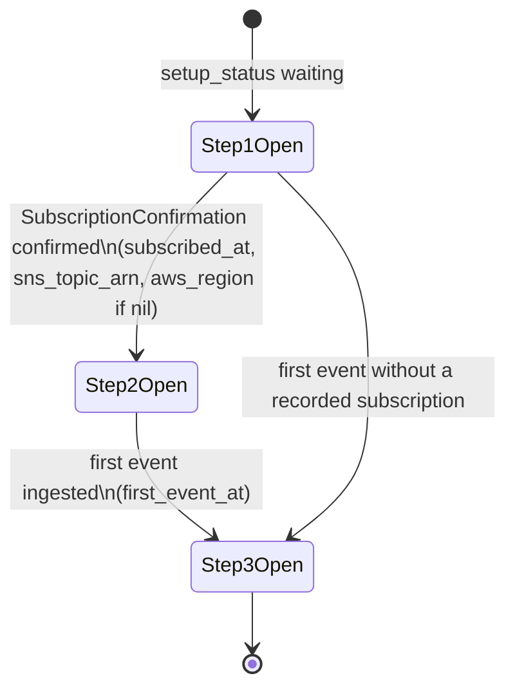
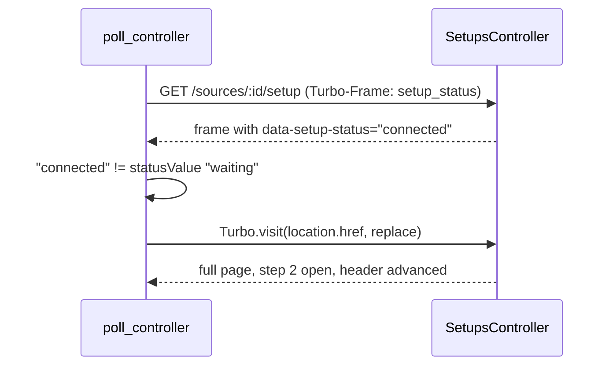

# Setup Wizard - Plan

## Goal Capsule

- **Objective:** Turn the per-source Setup page into a one-step-at-a-time flow with a visible progress header, make the SES region optional for Launch Stack, and fill the region in from the confirmed SNS topic so most users never have to know it.
- **Authority:** Requirements (R-IDs) win on product behavior. Key Technical Decisions (KTD-IDs) win on mechanism. Units override neither. `session-settled:` KTDs are closed and must not be re-opened by implementation or review.
- **Execution profile:** One PR against `main`, green on the SQLite, PostgreSQL and SaaS CI legs.
- **Stop conditions:** Stop and surface if the region-less quick-create URL form turns out to be rejected by the CloudFormation console in a way that can be verified locally, or if any change would overwrite a region a user chose by hand.
- **Tail ownership:** The Operator opens the region-less Launch Stack link against a real AWS console once (login is unavailable at implementation time); the implementer lists it as a manual verification item in the PR body.

---

## Product Contract

### Summary

The Setup page becomes a checklist of three steps: connect SES, send an email through the configuration set, receive events. Only the current step is open. Finished steps shrink to one line with a "Show" affordance. Upcoming steps are listed but muted. A compact progress header at the top shows the same three steps with done, current and upcoming states. Launch Stack works before any region is chosen: the link opens the CloudFormation console in the user's last-used region, and the region picker moves under the button as an override with a short hint on where to find the region. When SNS confirms the subscription, Sessy reads the region from the topic ARN and stores it if none was chosen. Existing sources with a topic ARN and no region are backfilled once. Manual CLI setup stays available, collapsed inside the connect step.

### Problem Frame

A fresh hosted signup lands on the Setup page and sees everything at once: a region picker that blocks the Launch Stack button, trust copy, a status strip, and three code samples for a later step. The product owner, going through signup himself, could not tell where to start and did not know which SES region his app uses. The region gate is the first wall, and it is a question most people cannot answer from memory even though AWS already knows the answer: the console remembers the last region, and the SNS topic ARN that arrives on confirmation carries it. The prior plan (`docs/plans/2026-09-29-001-feat-hosted-activation-plan.md`) produced the page's building blocks — region picker, Launch Stack, live status strip; this plan rearranges them into a guided flow and removes the gate.

### Requirements

**Step-by-step flow**

- R1. The Setup page shows three steps in order: connect SES to Sessy, send an email through the configuration set, receiving events.
- R2. Exactly one step is open at a time: the current step, derived from the source's recorded setup state (`setup_status`).
- R3. A finished step collapses to a one-line summary of what was recorded (connected when, region, topic; first event when) and can be re-opened with a "Show" affordance without changing state.
- R4. Upcoming steps are listed with their titles only, visually muted.
- R5. A progress header above the steps lists the three steps with done, current and upcoming states, each labelled in text and exposed to assistive technology (`aria-current="step"`, screen-reader prefixes). It replaces the separate three-item status strip.
- R6. When the setup state changes while the page is open (waiting → connected → complete), the open step advances without the user reloading or navigating, within the existing poll interval.
- R7. Manual CLI setup stays available inside the connect step, collapsed by default.

**Region**

- R8. Launch Stack is a working link on a fresh source with no region chosen; it opens the CloudFormation quick-create review page in the AWS console's last-used region.
- R9. When a known SES region is stored, Launch Stack opens the console in that region.
- R10. The region picker sits under the Launch Stack button as an override, introduced as "Not opening in the right region? Pick it here", and remains the source of the region in the CLI snippets.
- R11. Under the picker, one or two sentences tell the user where to find their region: the `AWS_REGION` environment variable or the `region:` passed to the SES client in their app, the SMTP endpoint hostname (`email-smtp.eu-west-1.amazonaws.com` → `eu-west-1`), or the region shown in the SES console's top bar or URL.
- R12. When SNS confirms a subscription and the source has no region, Sessy stores the region from the topic ARN if it is a known SES region. A region the user chose is never overwritten. A malformed ARN or an unknown region changes nothing.
- R13. Existing sources with a topic ARN and no region are backfilled once with the same rule when the change deploys.
- R14. The MCP `get_source_setup` payload always carries a `launch_stack_url` and describes the region as optional.
- R15. Copy that tells users to pick a region before Launch Stack (welcome email, nudge email, setup guide, MCP steps) is updated so the region is presented as optional.

### Actors

- A1. **Hosted signup** — lands on the Setup page of the auto-created "Production" source right after signing up.
- A2. **Self-hoster** — sees the same page; gets R1–R15 except the hosted mailer copy in R15.
- A3. **Operator** — verifies the region-less quick-create link against a real AWS console after merge.

### Key Flows

- F1. Fresh source to first event
  - **Trigger:** User opens the Setup page of a source with no region, no subscription, no events.
  - **Actors:** A1, A2
  - **Steps:** Header shows step 1 current → step 1 open with Launch Stack → user clicks Launch Stack, console opens in last-used region, user creates the stack → SNS posts `SubscriptionConfirmation` → Sessy confirms, stores `subscribed_at`, `sns_topic_arn`, and `aws_region` from the ARN → poll notices the state change and re-renders the page → step 1 collapses to "Connected … · <region>", step 2 opens with code samples → user sends → first event ingested → page re-renders → step 2 collapses, step 3 shows "Receiving events since …" with a link to Activity.
  - **Covered by:** R1–R6, R8, R12
- F2. Region override
  - **Trigger:** User clicks Launch Stack, sees the wrong region on the review page.
  - **Actors:** A1, A2
  - **Steps:** Back on Setup, reads the hint under "Not opening in the right region?", picks the region → page re-renders with step 1 still open → Launch Stack now carries the regional console host → CLI snippets show the region.
  - **Covered by:** R9, R10, R11

### Acceptance Examples

- AE1. **Covers R2, R8.** Given a source with `aws_region` nil and `setup_status` `:waiting`, when the Setup page renders, then step 1 is the only open step, its Launch Stack is an anchor to `https://console.aws.amazon.com/cloudformation/home#/stacks/create/review?…`, and the region `<select>` is present with no option selected.
- AE2. **Covers R9, R10.** Given the same source, when the user picks `eu-west-1`, then the page re-renders with step 1 still open, Launch Stack points at `https://eu-west-1.console.aws.amazon.com/cloudformation/home?region=eu-west-1#/…`, and the CLI snippets read `--region eu-west-1`.
- AE3. **Covers R3, R6.** Given the Setup page open on a `:waiting` source, when `subscribed_at` is set in the database, then within the poll interval step 1 shows as done in the header and collapses to a one-line summary, step 2 is open, and `current_path` is unchanged.
- AE4. **Covers R12.** Given a source with `aws_region` nil, when a confirmation arrives with `TopicArn` `arn:aws:sns:eu-west-1:000000000000:betalist-ses-events`, then `aws_region` becomes `eu-west-1`. Given `aws_region` already `us-east-1`, the same confirmation leaves it `us-east-1`. Given `TopicArn` `arn:aws:sns:mars-north-1:000000000000:t` or `garbage`, `aws_region` stays nil and the confirmation still succeeds.
- AE5. **Covers R13.** Given sources (a) ARN in `eu-west-1`, region nil; (b) ARN in `eu-west-1`, region `us-east-1`; (c) malformed ARN, region nil; (d) no ARN; when the backfill runs twice, then only (a) changes, to `eu-west-1`.
- AE6. **Covers R14.** Given a source without a region, `get_source_setup` returns a string `launch_stack_url` on the region-less console host; with `eu-west-1` set it returns the regional host.

### Scope Boundaries

- IAM-role based connection (Sessy reading the customer's AWS account) — later iteration.
- Email address obfuscation in the UI — a Cloudflare setting the Operator controls, not code.
- Separate pages per step, client-side routing, or a wizard framework — server-rendered disclosure is enough.
- A "skipped" state for the region; the region is an optional override with no state of its own.
- Changing the CloudFormation template or its published S3 key.

---

## Planning Contract

### Key Technical Decisions

- KTD1. **Disclosure is server-rendered from `source.setup_status`, with `source.aws_region` shaping the connect step's content** (session-settled: user-directed — chosen over a client-only JS accordion: the page must read the same on first paint, after a reload, and after a state change, so the server render owns which step is open). The current step is the only open one. Done steps render as native `
` whose `
` is the one-line summary (R3). Upcoming steps render as a muted heading. `setup_status` already exists (`app/models/source/setup_status.rb`); no new state is introduced. Governs R2, R3, R4.
- KTD2. **Three steps, region nested inside step 1 as an override, not a step of its own.** Steps: 1 Connect SES to Sessy (done when `subscribed_at` or `first_event_at`), 2 Send an email through the Configuration Set (done when `first_event_at`), 3 Receiving events (the terminal state; open when `:complete`). A separate "Region" step was considered and rejected: it would either gate Launch Stack behind a collapsed step 2 (re-creating the wall KTD4 removes) or need a "skipped" flag with its own column. The override sits directly under the Launch Stack button because the user only learns the region is wrong after clicking it. Governs R1, R10.
- KTD3. **Progress header is one `<ol>` with done/current/upcoming states; the old status strip's list is removed and its live line moves into the open step** (session-settled: user-directed — chosen over keeping the strip and adding a header: two progress indicators for the same three states would contradict each other visually). The header reuses the strip's state markup (checkmark, pulsing dot, hollow square; `sr-only` "Done:", "Current step:", "Next:"; `aria-current="step"`). Governs R5.
- KTD4. **Region is optional for Launch Stack: `Source#launch_stack_url` returns the region-less console URL when no known region is stored, the regional URL otherwise, and never nil** (session-settled: user-approved — chosen over keeping the region as a hard gate: the AWS console opens in the user's last-used region, which for someone who just set up SES is almost always right, and the quick-create review page shows the region before Create). Region-less form: `https://console.aws.amazon.com/cloudformation/home#/stacks/create/review?<query>`. The inclusion validation still keeps unknown values out of the database; an unknown stored value (only reachable by raw SQL) takes the region-less branch, so nothing outside `SES_REGIONS` is ever interpolated into a hostname. `McpServer::BaseTool::SETUP_SCHEMA.launch_stack_url` becomes `type: "string"`. The region-less URL cannot be verified against AWS during implementation; it is a manual verification item for the Operator. Governs R8, R9, R14.
- KTD5. **Infer the region from the SNS topic ARN on confirmation, nil-only, with a one-time Ruby backfill shared by migration and tests** (session-settled: user-approved — chosen over asking the user or leaving the region empty forever: the ARN `arn:aws:sns:<region>:<account>:<topic>` is already stored as `sns_topic_arn`, so AWS tells us the answer). Parsing lives in one place, `Source.region_from_topic_arn(arn)`: split on `:`, require `arn` and `sns` in positions 1 and 3, return position 4 only when it is a `SES_REGIONS` key; anything else returns nil. `record_subscription_confirmed` adds `aws_region = COALESCE(aws_region, ?)` to its single `UPDATE`, so a user-chosen region is never overwritten and the write stays one statement. The backfill is `Source::AwsRegionBackfill.run`: iterate sources with `aws_region IS NULL AND sns_topic_arn IS NOT NULL`, apply the same parser, write with `where(id:, aws_region: nil).update_all`. It is Ruby rather than SQL (unlike `Source::FirstEventBackfill`) because string splitting differs between SQLite and PostgreSQL, the parser must have one owner, and the table has tens of rows. Governs R12, R13.
- KTD6. **Region hint copy** (session-settled: user-directed — chosen over a bare picker: the product owner could not answer the question and most users cannot either). Two sentences under the picker: where the region is in the app's config (`AWS_REGION` or the SES client's `region:`), in the SMTP endpoint hostname (`email-smtp.eu-west-1.amazonaws.com` → `eu-west-1`), and in the SES console's top bar or URL. Governs R11.
- KTD7. **Live advancement: the small polled Turbo Frame stays, and `poll_controller.js` issues `Turbo.visit(location.href, { action: "replace" })` when the polled status differs from the status the page was rendered with.** Chosen over wrapping the whole step list in the polled frame: a 5-second reload of the full list would reset the "Set up manually instead" `
` and the region `<select>` while the user works with them, and would re-send the code samples every tick. Chosen over Turbo Streams or Solid Cable: the app has no channels, and the poll already exists. The frame content carries `data-setup-status`; the controller stores the initial status in a Stimulus value and compares on `turbo:frame-load`. A replace visit to the same URL is a Turbo 8 page refresh; the server re-renders the whole page from state (KTD1), so the frame, the header and the steps always agree. The `done` target is no longer needed: a `:complete` page renders the frame without a controller, and a live transition into `:complete` is caught by the status comparison before the visit. Governs R6.
- KTD8. **Copy that mentions picking the region first is updated in the same PR**: `saas/app/views/sessy/saas/approval_mailer/welcome.{html,text}.erb`, `saas/app/views/sessy/saas/setup_nudge_mailer/nudge.{html,text}.erb`, `docs/aws-ses-setup.md` shortcut note, and the first MCP `steps` entry. The hosted mailers are part of this repository's SaaS engine and their tests only assert "Launch Stack" is mentioned. Governs R15.

### High-Level Technical Design

Page composition, top to bottom: intro (two sentences) → progress header (`_progress`) → step 1 (`_step` with the Launch Stack body: button, region override, hint, trust copy, manual `
`, live frame when current) → step 2 (code samples, default-configuration-set command, verify copy, live frame when current) → step 3 (summary, link to Activity). The live frame (`_status`) renders inside whichever step is current.

Live transition:

### Assumptions

- The region-less quick-create URL (`https://console.aws.amazon.com/cloudformation/home#/stacks/create/review?…`) is accepted by the console and lands in the last-used region. It follows the console's documented global host pattern but cannot be exercised during implementation; the Operator verifies it after merge.
- `turbo-rails` 2.0.23 (Turbo 8) treats a `replace` visit to the current URL as a page refresh. No morphing meta tags are added; the default replace render scrolls to the top, where the progress header is.

### Sequencing

One PR. Model and migration first (tests red first), then views and controller, then JavaScript, then system tests.

### System-Wide Impact

- **Data lifecycle:** no new columns. `sources.aws_region` gains a second writer (confirmation) that only fills nil. The backfill runs once in a data migration at `db:prepare`.
- **Webhook contract:** unchanged responses; the confirmation `UPDATE` gains one column.
- **MCP contract:** `launch_stack_url` changes from nullable to always-string. Scanners that read the schema see a narrower type; no caller breaks.
- **OSS/hosted seam:** page changes are core; mailer copy changes are in `saas/`.

### Risks & Dependencies

| Risk | Mitigation |
|---|---|
| Region-less console URL does not open quick-create | Manual verification item for the Operator; fallback is picking the region (R10), which produces the already-verified regional URL |
| User chose a region, then launched the stack in another one | Inference never overwrites; the step 1 summary shows the region the ARN carries only when it was inferred, so a mismatch is visible in the summary line |
| Full-page re-render on transition interrupts the user | It fires only at a state change the user is waiting for; the region form keeps focus via `data-turbo-permanent` as today |
| Done-step `
` lets a user relaunch a stack on a connected source | Harmless: the stack name carries the source id and CloudFormation reports `AlreadyExists` |

### Sources & Research

- `app/views/setups/show.html.erb`, `_launch_stack.html.erb`, `_status.html.erb` — current page; the strip's state markup is reused for the header.
- `app/javascript/controllers/poll_controller.js` — frame reload loop, `done` target, budget and paused notice.
- `app/models/source/launch_stack.rb` — `SES_REGIONS`, validation, `launch_stack_url`.
- `app/models/source/setup_status.rb` — `record_subscription_confirmed` single `UPDATE`.
- `app/models/source/first_event_backfill.rb`, `db/migrate/20261001110000_add_setup_status_to_sources.rb` — backfill-in-module precedent.
- `test/system/setup_status_test.rb` — forcing the poll deadline through `window.Stimulus`.
- AWS: quick-create links accept the console's global host; the console redirects to the last-used region when none is given.

---

## Implementation Units

### U1. Region-less Launch Stack URL and ARN region inference

- **Goal:** `launch_stack_url` never returns nil; the region is parsed from topic ARNs and stored on confirmation when unset; existing sources are backfilled.
- **Requirements:** R8, R9, R12, R13, R14
- **Dependencies:** none
- **Files:**
  - `app/models/source/launch_stack.rb` (`launch_stack_url`, `region_from_topic_arn` class method, header comment)
  - `app/models/source/setup_status.rb` (`record_subscription_confirmed`)
  - `app/models/source/aws_region_backfill.rb` (new)
  - `db/migrate/20261002120000_infer_aws_region_from_sns_topic_arn.rb` (new; `up` runs the backfill, `down` is a no-op)
  - `app/models/mcp_server/base_tool.rb` (`SETUP_SCHEMA`, `setup_payload` steps)
  - `test/models/source_launch_stack_test.rb`, `test/models/source_setup_status_test.rb`, `test/controllers/webhooks_controller_test.rb`, `test/controllers/mcp_controller_test.rb`
- **Approach:**
  1. Per KTD4, branch on `aws_region_known?` for the host and `region=` param only; the query is built once.
  2. Per KTD5, add `region_from_topic_arn` in `class_methods`, extend the `UPDATE` in `record_subscription_confirmed`, add the backfill module and the data migration. `db/schema.rb` changes only in its version line.
  3. Per KTD4/KTD8, make `launch_stack_url` a plain `string` in `SETUP_SCHEMA`, reword both descriptions, and reword the first `steps` entry so the region is optional.
- **Execution note:** Write the failing model tests first; the webhook controller test for inference is the behavior change with external consequences.
- **Patterns to follow:** `Source::FirstEventBackfill` module shape; `update_all` with a SQL fragment in `record_subscription_confirmed`.
- **Test scenarios:**
  - Covers AE6. `launch_stack_url` without a region starts with `https://console.aws.amazon.com/cloudformation/home#/stacks/create/review?` and carries the same query parameters as the regional form; with `eu-west-1` it starts with the regional host and `region=eu-west-1`.
  - A region outside the list written with `update_all` yields the region-less URL and the value never appears in the URL.
  - `region_from_topic_arn` returns `eu-west-1` for `arn:aws:sns:eu-west-1:000000000000:t`; nil for `arn:aws:sqs:eu-west-1:0:t`, `arn:aws:sns:mars-north-1:0:t`, `garbage`, `""`, and nil.
  - Covers AE4. `record_subscription_confirmed` sets `aws_region` when nil; leaves a chosen region alone; leaves nil on a malformed ARN; `subscribed_at` and `sns_topic_arn` behave as before.
  - Webhook: a successful confirmation on a source without a region stores the ARN's region; on a source with a region, keeps it.
  - Covers AE5. `Source::AwsRegionBackfill.run` on the four source shapes; a second run changes nothing.
  - MCP: `get_source_setup` without a region returns a string `launch_stack_url` on `console.aws.amazon.com` with the encoded webhook URL; with a region, the regional host. The first step no longer requires picking a region.
- **Verification:** `bin/rails test test/models test/controllers` green on SQLite and PostgreSQL; `SESSY_MODE=saas bin/rails test test saas/test` green.

### U2. Step-by-step Setup page

- **Goal:** The page renders the progress header and three steps from `setup_status`, with the region override and hint inside step 1.
- **Requirements:** R1–R5, R7, R10, R11, R15
- **Dependencies:** U1
- **Files:**
  - `app/views/setups/show.html.erb` (rewrite as header + three steps)
  - `app/views/setups/_progress.html.erb` (new; header list)
  - `app/views/setups/_step.html.erb` (new; one step: open `<section>`, done `
`, or muted heading)
  - `app/views/setups/_launch_stack.html.erb` (always a link; region-less copy; region override and hint; trust copy)
  - `app/views/setups/_status.html.erb` (frame keeps `data-setup-status`; content becomes the live line for the current step; no `<ol>`)
  - `app/helpers/sources_helper.rb` (`setup_steps(source)` returning title + state per step, or equivalent)
  - `saas/app/views/sessy/saas/approval_mailer/welcome.{html,text}.erb`, `saas/app/views/sessy/saas/setup_nudge_mailer/nudge.{html,text}.erb`, `docs/aws-ses-setup.md` (copy per KTD8)
  - `test/controllers/setups_controller_test.rb`
- **Approach:**
  1. Compute the step states once (helper or small view-model): step 1 done when `status != :waiting`; step 2 done when `status == :complete`; the current step is the first not done, or step 3 when complete.
  2. Render per KTD1/KTD2/KTD3. Done summaries: step 1 "Connected <time ago> · <region name> (<code>)" plus the topic ARN in `<code>`; step 2 "First event received <date>". Step 3 open body: "Receiving events since <date>", link to Activity, CLI checks.
  3. Step 1 body: Launch Stack link; copy "Opens the CloudFormation console in <region name>" when known, otherwise "Opens the CloudFormation console in the AWS region you used last. The review page shows the region at the top — check it is the one you send email from, then click Create stack."; trust copy; region override form (same `PATCH`, `debounced-submit`, `turbo_permanent`) headed "Not opening in the right region? Pick it here" with the KTD6 hint; manual `
`; the `_status` frame.
  4. Step 2 body: the three code samples and the default-configuration-set command (unchanged), followed by the verify copy; the `_status` frame when current.
  5. `_status`: `turbo_frame_tag "setup_status"` with `data: { controller: "poll", poll_url_value:, poll_status_value: status }` unless complete; inner `div[data-setup-status]` with `aria-live="polite"` and the per-state line (waiting: "Waiting for AWS — this updates automatically once the stack is created. If the stack finished but this hasn't changed after a few minutes, check the stack's Events tab."; connected: "Waiting for the first event — this updates automatically."; complete: "Receiving events since …"), plus the paused notice.
- **Patterns to follow:** existing state markup in `_status.html.erb`; `details`/`summary` usage already on the page; `local_time`/`local_time_ago` helpers.
- **Test scenarios:**
  - Covers AE1. Waiting source without a region: header has three `li`, the first `aria-current="step"`; exactly one open step section; step 1 contains `a[href^='https://console.aws.amazon.com/cloudformation/']` "Launch Stack"; no `[aria-disabled]` Launch Stack; the select is present inside step 1; hint text mentions `AWS_REGION` and `email-smtp.`; manual steps are inside a `details`; code samples are not inside the open step (step 2 is muted, no `pre` rendered for it).
  - Covers AE2. Waiting source with `eu-west-1`: Launch Stack href on the regional host; `--region eu-west-1` in the manual snippets; step 1 still open.
  - `PATCH` with a region redirects back and the next render shows the regional link; an unknown region re-renders with the error and `422`; other attributes are ignored (existing).
  - Connected source: header second `li` current; step 1 is a `details` whose `summary` contains "Connected" and the region when known and the topic ARN; step 2 is open with `pre` code samples; the frame carries `data-setup-status="connected"` and `data-poll-status-value="connected"`.
  - Complete source: header all done; steps 1 and 2 are `details`; step 3 open with "Receiving events since"; frame has no `data-controller`, `src`, or poll url.
  - Backfilled complete source (only `first_event_at`): step 1 summary reads "Connected" without region or topic fragments and no dangling separators.
  - Frame request returns only the frame: no `h2`, no `select`, no `details`.
  - Cross-account `GET`/`PATCH` still 404 (existing).
  - SaaS: `saas/test/controllers/signups_test.rb` still finds a Launch Stack anchor after signup.
- **Verification:** `bin/rails test test/controllers/setups_controller_test.rb` green on both adapters; page renders in `SESSY_MODE=saas`.

### U3. Live advancement in `poll_controller.js`

- **Goal:** A state change observed by the poll re-renders the page so the open step advances without user action.
- **Requirements:** R6
- **Dependencies:** U2
- **Files:**
  - `app/javascript/controllers/poll_controller.js`
  - `test/system/setup_status_test.rb`, `test/system/source_setup_test.rb`
- **Approach:**
  1. Per KTD7: add a `status` value; listen for `turbo:frame-load` on the element; on load, read `[data-setup-status]` inside the frame; if it differs from `statusValue`, `stop()` and `Turbo.visit(location.href, { action: "replace" })`. Import `Turbo` from `@hotwired/turbo-rails`.
  2. Remove the `done` target and `doneTargetConnected`; `start()` no longer checks it (a complete page has no controller).
  3. Keep the budget, paused notice and `restart` as they are.
- **Patterns to follow:** existing controller; `window.Stimulus.getControllerForElementAndIdentifier` in `test/system/setup_status_test.rb` for forcing the deadline.
- **Test scenarios:**
  - Covers AE3. Visit a waiting source; set `subscribed_at` and `sns_topic_arn` in the DB; within 10 s the header's second item is current, step 1 is a collapsed `details` whose summary names the region inferred from the ARN, step 2 shows a code sample; `current_path` unchanged.
  - Connected source; set `first_event_at`; within 10 s step 3 shows "Receiving events since" and `turbo-frame#setup_status` has no `data-controller`.
  - Paused budget: force the deadline to 0, see "Stopped checking"; set `subscribed_at`; nothing advances until "Reload" is clicked, then step 2 opens.
  - Fresh source: only step 1 open, Launch Stack href on `console.aws.amazon.com`, select present; pick `eu-west-1`: Launch Stack href on `eu-west-1.console.aws.amazon.com`, `--region eu-west-1` in snippets after opening the manual `details`, select keeps focus, step 1 still the open step.
  - Screenshots of each state saved outside the repository for the PR body (`/tmp/wizard-<state>.png`).
- **Verification:** `bin/rails test:system` green.

---

## Verification Contract

| Check | Command | Applies to |
|---|---|---|
| Core suite (SQLite) | `bin/rails test` | U1, U2 |
| Core suite (PostgreSQL) | `DATABASE_ADAPTER=postgresql POSTGRES_USER=marc bin/rails db:prepare && DATABASE_ADAPTER=postgresql POSTGRES_USER=marc bin/rails test` | U1 (backfill), U2 |
| SaaS suite | `SESSY_MODE=saas bin/rails test test saas/test` | U1 (MCP), U2 (mailer copy, signup landing) |
| System tests | `bin/rails test:system` | U3 |
| Lint | `bin/rubocop` | all |
| Schema hygiene | `git diff db/` shows only the `db/schema.rb` version line | U1 |
| Manual (Operator) | Open the region-less Launch Stack link from a fresh source; confirm the quick-create review page opens in the last-used region | U1 |

---

## Definition of Done

**Global**

- Single PR green on SQLite, PostgreSQL and SaaS CI legs.
- A fresh source shows one open step with a working Launch Stack and no region required.
- A confirmed subscription fills the region from the ARN; existing sources are backfilled.
- No code path still says the region must be picked before Launch Stack.
- No experimental or abandoned code in the diff; `db/cable_schema.rb`, `db/cache_schema.rb`, `db/queue_schema.rb` untouched.
- PR body lists the region-less quick-create URL as a manual verification item.

**Per unit**

| Unit | Done when |
|---|---|
| U1 | Model, webhook, MCP and backfill tests green on both adapters; migration adds no columns |
| U2 | Controller tests for waiting/connected/complete/backfilled render the expected open step, header and summaries; SaaS signup test green |
| U3 | System tests prove waiting→connected and connected→complete advance the open step without navigation; screenshots captured |
