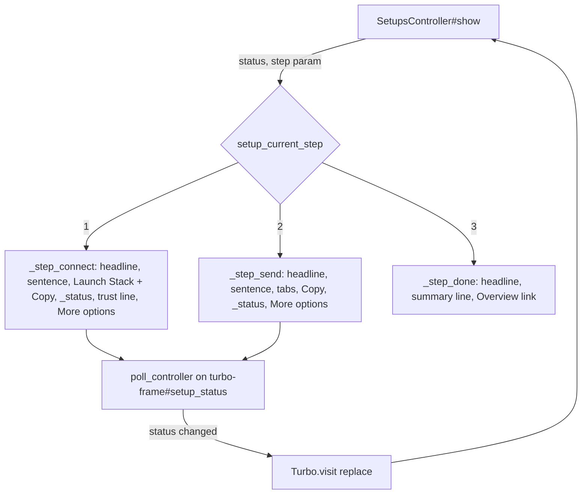

# Setup Flow - Plan

## Goal Capsule

- **Objective:** Turn the per-source Setup page from a stacked checklist into a calm, one-screen-per-step flow in a narrow column, with a pill progress indicator, one disclosure per step for everything secondary, and a copyable AI-agent prompt on the two active steps.
- **Authority:** Requirements (R-IDs) win on product behavior. Key Technical Decisions (KTD-IDs) win on mechanism. Units override neither. `session-settled:` KTDs are closed and must not be re-opened by implementation or review.
- **Execution profile:** One PR against `main`, green on the SQLite, PostgreSQL and SaaS CI legs plus the system suite.
- **Stop conditions:** Stop and surface if keeping the polled `setup_status` frame inside a single rendered step turns out to break live advancement, or if any change would alter what `Source#setup_status` reports.
- **Tail ownership:** The product owner looks at the screenshots in the PR body; the implementer records every copy judgment call in the PR.

---

## Product Contract

### Summary

The Setup page keeps the app chrome (top nav, breadcrumb, source tabs) and renders the setup content in a narrow centered column. A row of three pill segments and a "Step N of 3" label replace the labelled checklist header. Only the current step is rendered: step 1 asks the user to connect SES with Launch Stack, step 2 asks for a test email with one code sample at a time, step 3 confirms with a one-line summary and a link to Overview. Each active step shows a headline, one sentence, its primary action, a live status line, and a single "More options" disclosure holding everything secondary. Steps 1 and 2 add a "Copy instructions for your AI agent" button whose server-rendered markdown carries the source's real webhook URL, names, region and Launch Stack URL. Previous steps can be reopened read-only through a small back link. The server still decides which step is current from `source.setup_status`, and the existing poll keeps advancing the page live.

### Problem Frame

The page shipped in PR #209 already derives the open step from server state, but the owner's reading of it is that it asks too much at once: an intro paragraph, a labelled checklist header, a collapsed summary line that repeats a topic ARN, three stacked code samples, and prose stretched across the full-width layout. A hosted signup lands here seconds after creating an account and should be walked through one thing at a time. Most users will do the AWS work with an AI coding agent, so each step needs a prompt they can hand over verbatim with the right values already filled in.

### Requirements

**Layout and progress**

- R1. The Setup page keeps the top nav, breadcrumb and source tabs; below the tabs the setup content sits in a narrow centered column (about `max-w-xl`).
- R2. A progress indicator of three short rounded segments and a "Step N of 3" label sits above the step; done and current segments are filled, upcoming ones muted; the states are also exposed to assistive technology in text.
- R3. Exactly one step's content is rendered; the current step is derived from `source.setup_status` (`:waiting` → 1, `:connected` → 2, `:complete` → 3). Completed steps are not listed inline.
- R4. A small back affordance ("← Show step N") reopens a previous step read-only: no live status line, no region form, and a link forward to the current step.
- R5. When the setup state changes while the page is open, the current step advances without the user navigating, within the existing poll interval.

**Step 1 — Connect SES**

- R6. Visible content: headline, one sentence that names the region when known, the Launch Stack button, the "Copy instructions for your AI agent" button, a live "Waiting for AWS" line, and one muted trust sentence.
- R7. One "More options" disclosure, collapsed by default, holds: the region override picker with the where-to-find-it hint; what the stack creates (configuration set and topic names) and the `ExistingConfigurationSetName` note; the manual CLI setup commands; links to the full AWS SES guide and the security best practices.
- R8. Picking a region saves it, keeps step 1 open, and swaps the Launch Stack link to the regional console host; the CLI commands show the region.

**Step 2 — Send a test email**

- R9. Visible content: headline, one sentence naming the configuration set, a small toggle that shows one code sample at a time (aws-sdk-sesv2 default, aws-actionmailer-ses, AWS CLI identity default), the "Copy instructions for your AI agent" button, and a live "Waiting for the first event" line.
- R10. One "More options" disclosure holds the "Nothing arriving?" troubleshooting commands.

**Step 3 — Done**

- R11. Visible content: headline, one line summarising connected date, region and first event date (only the parts that are recorded), and a link to Overview.

**Agent instructions**

- R12. On steps 1 and 2 a "Copy instructions for your AI agent" button copies a markdown prompt to the clipboard and swaps its icon to a check for about two seconds.
- R13. The prompt text is server-rendered into the page and carries the source's real webhook URL, configuration set name, SNS topic name, stack name and Launch Stack URL, and the region when known; when unknown it says to use the region the app sends SES email from. No `<region>` placeholder leaks when the region is known.
- R14. Step 1 prompt: one line on what Sessy is; the goal (SES events for the configuration set reaching the webhook URL); the fastest path (open the Launch Stack URL in a browser, review, create the stack); the CLI path (the sesv2/sns commands with values filled in); what success looks like (the Setup page shows SNS connected); one line that Sessy's MCP server exposes `get_source_setup`.
- R15. Step 2 prompt: wire the configuration set into the app (SDK `configuration_set_name`, ActionMailer `X-SES-CONFIGURATION-SET` header, or `put-email-identity-configuration-set-attributes`) and send one test email; success is the Setup page showing the first event.

### Actors

- A1. **Hosted signup** — lands on the Setup page of the auto-created source right after signing up.
- A2. **Self-hoster** — same page.
- A3. **AI coding agent** — receives the copied prompt and does the AWS work.

### Key Flows

- F1. Fresh source to first event
  - **Trigger:** User opens the Setup page of a source with no subscription and no events.
  - **Actors:** A1, A2, A3
  - **Steps:** Pills 1/3 → step 1: headline, sentence, Launch Stack + Copy instructions, "Waiting for AWS" → user clicks Launch Stack (or hands the prompt to an agent) → stack created → SNS confirms → poll sees `connected` → page re-renders at step 2 with pills 2/3 and the sdk sample → user sends → first event → page re-renders at step 3 with pills 3/3, summary, link to Overview.
  - **Covered by:** R2, R3, R5, R6, R9, R11, R12
- F2. Region override
  - **Trigger:** Launch Stack opened the console in the wrong region.
  - **Steps:** User opens More options on step 1, picks the region → page re-renders at step 1 with the regional Launch Stack link; the CLI commands and the agent prompt now carry the region.
  - **Covered by:** R7, R8, R13
- F3. Looking back
  - **Trigger:** On step 2 or 3, the user wants to see step 1 again.
  - **Steps:** Click "← Show step 1" → step 1 renders read-only with a "Continue to step N →" link → click it → current step.
  - **Covered by:** R4

### Acceptance Examples

- AE1. **Covers R1, R2, R3, R6, R7.** Given a waiting source without a region, when the Setup page renders, then the source tabs are present, the setup column has `max-w-xl`, the progress nav has three segments with the first filled and the label "Step 1 of 3", step 1 is the only `[data-setup-step]`, it contains a Launch Stack anchor to `https://console.aws.amazon.com/cloudformation/…`, a clipboard button, a `turbo-frame#setup_status` polling with status `waiting`, exactly one `details` whose summary reads "More options", and the region `select` and `aws ses create-configuration-set` are inside that `details`. No `pre` with `configuration_set_name:` is rendered.
- AE2. **Covers R8, R13.** Given the same source, when the user picks `eu-west-1`, then step 1 is still rendered, Launch Stack points at `https://eu-west-1.console.aws.amazon.com/…`, the sentence names Europe (Ireland), the CLI commands read `--region eu-west-1`, the hidden prompt contains `eu-west-1` and not `<region>`.
- AE3. **Covers R5, R9.** Given the page open on a waiting source, when `subscribed_at` is set in the database, then within the poll interval the label reads "Step 2 of 3", step 2 is rendered with the aws-sdk-sesv2 sample visible and the ActionMailer sample hidden, and `current_path` is unchanged.
- AE4. **Covers R9.** On step 2, clicking the "aws-actionmailer-ses" toggle hides the sdk sample and shows the `X-SES-CONFIGURATION-SET` sample; clicking "AWS CLI" shows `put-email-identity-configuration-set-attributes`.
- AE5. **Covers R5, R11.** Given the page open on a connected source, when `first_event_at` is set, then within the poll interval step 3 is rendered with "Step 3 of 3", a summary line, a link to Overview, and no polling frame controller.
- AE6. **Covers R4.** Given a connected source, `GET /sources/:id/setup?step=1` renders step 1 with the Launch Stack link and a "Continue to step 2" link, no `turbo-frame#setup_status`, no region `select`; `?step=3` on a connected source renders step 2 (clamped to the current step).
- AE7. **Covers R13, R14, R15.** `Source::AgentInstructions.new(source, webhook_url:, launch_stack_url:).connect` contains the webhook URL, `config_set_name`, `sns_topic_name`, `stack_name`, the Launch Stack URL, `aws sns subscribe`, `create-configuration-set-event-destination` and `get_source_setup`; with region `eu-west-1` it contains `--region eu-west-1` and no `<region>`; without a region it contains "region your app sends" (or equivalent wording) and no `--region`. `.send_test_email` contains `configuration_set_name:`, `X-SES-CONFIGURATION-SET` and `put-email-identity-configuration-set-attributes`.
- AE8. **Covers R12.** The hidden `textarea[data-clipboard-target='source']` on a rendered step 1 contains the request-host webhook URL for that source.

### Scope Boundaries

- IAM-role based connection.
- Overview page changes beyond what this change breaks.
- MCP schema or payload changes (`launch_stack_url` etc. stay as they are).
- Remembering the chosen code-sample toggle across visits.
- Changes to `Source#setup_status`, the webhook ingestion, or the CloudFormation template.

---

## Planning Contract

### Key Technical Decisions

- KTD1. **App chrome stays; the setup content is a narrow centered column inside `sources/layout`** (session-settled: user-directed — chosen over a dedicated full-screen onboarding layout: a user who only peeks at Setup from the tabs would feel trapped without the nav and tabs). `show.html.erb` keeps `render layout: "sources/layout"` and wraps its content in `div.mx-auto.max-w-xl`. Headlines use `text-balance`; code blocks stay inside the column with `overflow-x-auto`. Governs R1.
- KTD2. **Progress is three pill segments plus a "Step N of 3" label, replacing the labelled checklist** (session-settled: user-directed — chosen over a single continuous bar and over the labelled checklist header: the pills read as "where am I" at a glance without a second list of step names competing with the headline). `_progress.html.erb` renders `nav[aria-label="Setup progress"]` with an `ol` of three `li.h-2.w-16.rounded-full` (filled `bg-zinc-950 dark:bg-white` for done and current, `bg-zinc-950/10 dark:bg-white/10` for upcoming), `aria-current="step"` on the current one, an `sr-only` label per segment ("Step 1: Connect SES, done"), and a visible `Step N of 3` text. On `:complete` all three are filled and the label reads "Step 3 of 3". Governs R2.
- KTD3. **One screen per step, server-derived from `source.setup_status`; `poll_controller.js` is unchanged** (session-settled: user-directed — chosen over listing all steps with collapsed done/upcoming entries: the owner found the stacked list overwhelming, and the server already owns the current step). `show.html.erb` renders exactly one of `_step_connect`, `_step_send`, `_step_done` by `setup_current_step(source)`. The polled `turbo-frame#setup_status` (`_status.html.erb`) renders inside the current step only, so the page still has exactly one frame and the existing `Turbo.visit(replace)` on status change re-renders the page at the new step. Governs R3, R5.
- KTD4. **Previous steps reopen read-only via `?step=N`, clamped to the current step** (chosen over a `
` holding the previous step's content: nesting step 1's region form and clipboard textarea inside step 2 would duplicate the `turbo_permanent` select id and bloat every render; a query param keeps one step per render and needs no client state). `SetupsController#show` computes `@step = params[:step].to_i.clamp(1, current)` when `params[:step]` is present, else `current`. Views receive `readonly: @step != current`; read-only rendering drops the `_status` frame and the region form (the chosen region is shown as text), and adds "Continue to step N →" linking to `source_setup_path(source)`. The poll's `Turbo.visit(location.href)` never sees a `step` param on a live step because the forward link carries none. Governs R4.
- KTD5. **Everything secondary lives behind one `
` "More options" per step; per-step visible copy budget is headline, one sentence, primary action, one status line** (session-settled: user-directed — chosen over keeping region, trust copy, stack contents and manual setup visible: the intent is to show one thing at a time). Step 1 More options: region picker + hint (`_region` partial, reworded), what the stack creates + `ExistingConfigurationSetName` note, manual CLI commands (the four `aws` commands; console click-paths are replaced by a link to the full guide), links to the full guide and best practices. Step 2 More options: "Nothing arriving?" troubleshooting commands. The trust sentence ("No AWS credentials are shared with Sessy; every event is cryptographically verified.") stays as a single muted line on step 1 only. The intro paragraph and the top-level guide links are removed. Governs R6, R7, R9, R10.
- KTD6. **The identity-default CLI command is the third toggle option on step 2, not a More-options item.** The brief lists it both as a toggle option and under More options; the toggle wins because "no code changes" is a first-class way to send through the configuration set, and listing it twice would contradict the one-sample-at-a-time rule. Judgment call, recorded for the owner. Governs R9.
- KTD7. **Code-sample toggle is a small Stimulus `tabs` controller** (chosen over CSS-only radio tricks or `
`: the samples are `pre` blocks that need `hidden` toggled and `aria-selected` kept in sync, which is three lines of Stimulus and no CSS trickery). `tabs_controller.js`: targets `tab` and `panel`; `select` action reads `data-tabs-index-param`, sets `hidden` on every panel but the chosen one and `aria-selected` on the tabs; the first is selected on connect. Buttons are `type="button"` with `role="tab"`. Governs R9.
- KTD8. **"Copy instructions for your AI agent" is a Stimulus `clipboard` controller over a hidden `<textarea>`** (session-settled: user-directed — chosen over a link to a docs page or a modal with the prompt: the user wants a one-click copy that already carries the source's values). `clipboard_controller.js`: targets `source`, `icon`, `checkmark`; `copy` writes `sourceTarget.value` with `navigator.clipboard.writeText`, hides `icon`, shows `checkmark` for two seconds. The textarea is `hidden readonly` with `aria-hidden="true"` and `tabindex="-1"`, so the text is in the DOM for tests and for users without clipboard permission (a visible fallback is not in scope). Governs R12.
- KTD9. **Prompt text is a PORO, `Source::AgentInstructions`** (chosen over an ERB partial: the text is plain markdown with interpolation, and a PORO is unit-testable without a request; it receives `webhook_url:` and `launch_stack_url:` because both depend on the request host). `app/models/source/agent_instructions.rb` with `#connect` and `#send_test_email` returning markdown strings built from `<<~MARKDOWN` heredocs. `region_flag` returns `--region <code>` when known or omits the flag and adds a sentence to use the region the app sends SES email from. Tailwind never scans this file, so it carries no CSS classes. A `SetupsHelper#agent_instructions(source)` builds it with `webhook_url(source_token:)` and `launch_stack_url(source)`. Governs R13, R14, R15.
- KTD10. **Helpers move to `app/helpers/setups_helper.rb`**: `setup_current_step`, `setup_step_labels`, `setup_summary_parts` (the step 3 line), `agent_instructions`; `SourcesHelper` keeps `config_set_name`, `sns_topic_name`, `launch_stack_url`, `ses_region`, `ses_region_options`, `bounce_label`. `SETUP_STEP_LABELS`, `setup_step_state`, `setup_progress_state`, `setup_connected_summary`, `setup_first_event_summary` are removed with the views that used them. Rails includes all helpers by default, so no controller change is needed.

### High-Level Technical Design

Page composition, top to bottom: tabs (layout) → `div.mx-auto.max-w-xl` → `_progress` → one step partial → back link row (`← Show step N-1` and, when read-only, `Continue to step N →`).

### Assumptions

- `navigator.clipboard.writeText` is available on the hosted origin (HTTPS) and on `localhost`; headless Chrome in system tests may deny it, so tests assert the hidden textarea text, not the clipboard.
- The `local_time` gem renders dates in the summary line as today.

### Sequencing

One PR. PORO and its tests first (red), then helpers and views with controller tests (red → green), then the two Stimulus controllers with system tests, then screenshots.

### System-Wide Impact

- No migration, no model behavior change, no MCP change.
- `saas/test/controllers/signups_test.rb` asserts the Setup page shows "Launch Stack" after signup; it keeps passing.
- The hosted mailers link to the Setup page; their copy does not mention the layout.

### Risks & Dependencies

| Risk | Mitigation |
|---|---|
| Tailwind classes used only in the PORO would not be generated | The PORO emits markdown only |
| Clipboard denied in headless Chrome | Tests assert the textarea content; the button's visual swap is not asserted |
| A `?step=` URL left in the address bar after a live advance would freeze the view | The forward link and the poll's visit both use the bare setup path; `?step=` only appears after an explicit back click, where no frame polls |
| Removing the console click-paths from manual setup loses guidance | The full guide link is in More options and `docs/aws-ses-setup.md` keeps them |

### Sources & Research

- `app/views/setups/*.html.erb`, `app/helpers/sources_helper.rb`, `app/controllers/setups_controller.rb` — current page.
- `app/javascript/controllers/poll_controller.js` — unchanged live-advance mechanism.
- `app/models/source/launch_stack.rb`, `setup_status.rb` — `stack_name`, `launch_stack_url`, `aws_region_known?`, `setup_status`.
- `app/models/mcp_server/base_tool.rb#setup_payload` — the CLI steps the prompt mirrors.
- `docs/plans/2026-10-02-001-feat-setup-wizard-plan.md` — the plan behind the current page.

---

## Implementation Units

### U1. `Source::AgentInstructions`

- **Goal:** Markdown prompts for steps 1 and 2 with the source's real values.
- **Requirements:** R13, R14, R15
- **Dependencies:** none
- **Files:** `app/models/source/agent_instructions.rb` (new), `test/models/source_agent_instructions_test.rb` (new)
- **Approach:** Per KTD9. Constructor `(source, webhook_url:, launch_stack_url:)`. `connect` sections: what Sessy is; goal; fastest path; CLI path (`aws sesv2 create-configuration-set`, `aws sns create-topic`, `aws sns subscribe`, `aws sesv2 create-configuration-set-event-destination` with names and webhook URL filled in, `<account-id>` left as the only placeholder with a note to read it from `create-topic`'s output); success; MCP line. `send_test_email` sections: goal; three ways to attach the configuration set; send one test email; success.
- **Test scenarios:** Covers AE7 (both region states; no `<region>` leak; webhook URL present; stack name present; MCP mention; no `<account-id>` in the step 2 prompt).
- **Verification:** `bin/rails test test/models/source_agent_instructions_test.rb`.

### U2. One-screen-per-step views and helpers

- **Goal:** The page renders the pills and exactly one step, with the content inventory from KTD5, the read-only back view, and the hidden prompt.
- **Requirements:** R1–R4, R6–R11, R13
- **Dependencies:** U1
- **Files:** `app/views/setups/show.html.erb`, `_progress.html.erb`, `_status.html.erb` (copy tightened), `_region.html.erb` (reworded heading), `_step_connect.html.erb` (new), `_step_send.html.erb` (new), `_step_done.html.erb` (new), `_agent_instructions.html.erb` (new; the button + hidden textarea), `_launch_stack.html.erb` and `_step.html.erb` (deleted), `app/helpers/setups_helper.rb` (new), `app/helpers/sources_helper.rb`, `app/controllers/setups_controller.rb`, `test/controllers/setups_controller_test.rb`
- **Approach:** Per KTD1–KTD6, KTD10. Controller: `@step` per KTD4; `update` unchanged. Views: data attributes `data-setup-step="N"` on the rendered step, `data-setup-readonly` when read-only, `data-setup-more` on the disclosure. Status copy: waiting "Waiting for AWS — this updates automatically once the stack is created."; connected "Waiting for the first event — this updates automatically."; complete line stays for the frame (no longer shown on step 3, which renders its own summary).
- **Test scenarios:** Covers AE1, AE2, AE6, AE8; connected source renders step 2 with the three tab buttons, the sdk `pre` visible and the other two `hidden`, the frame polling with `connected`, one More options with `list-subscriptions-by-topic`; complete source renders step 3 with "Step 3 of 3", summary with connected date and region, Overview link, no frame controller; backfilled complete source shows only the first event part; `PATCH` region redirect and 422 (existing); frame request returns only the frame; cross-account 404 (existing).
- **Verification:** `bin/rails test test/controllers/setups_controller_test.rb` on both adapters.

### U3. Stimulus `clipboard` and `tabs` controllers, system tests, screenshots

- **Goal:** The toggle and copy button work in a browser; live advancement still works with one rendered step.
- **Requirements:** R5, R9, R12
- **Dependencies:** U2
- **Files:** `app/javascript/controllers/clipboard_controller.js` (new), `tabs_controller.js` (new), `test/system/source_setup_test.rb`, `test/system/setup_status_test.rb`
- **Approach:** Per KTD7, KTD8. System tests use `select` inside the opened More options, `click_button` on the tabs, and read the hidden textarea with `find("textarea[data-clipboard-target='source']", visible: false).value`.
- **Test scenarios:** Covers AE3, AE4, AE5; fresh source shows only step 1 with pills "Step 1 of 3", More options collapsed, region picker inside it swaps the link; the paused-budget Reload test (existing); screenshots to `/tmp/flow-step1.png`, `/tmp/flow-step1-more.png`, `/tmp/flow-step2.png`, `/tmp/flow-done.png` at 1280 wide and `/tmp/flow-step1-mobile.png` at 390 wide, taken from a throwaway system test kept out of the repository.
- **Verification:** `bin/rails test:system`.

---

## Verification Contract

| Check | Command | Applies to |
|---|---|---|
| Core suite (SQLite) | `bin/rails test` | U1, U2 |
| Core suite (PostgreSQL) | `DATABASE_ADAPTER=postgresql POSTGRES_USER=marc bin/rails db:prepare && DATABASE_ADAPTER=postgresql POSTGRES_USER=marc bin/rails test` | U1, U2 |
| SaaS suite | `SESSY_MODE=saas bin/rails test test saas/test` | U2 (signup landing) |
| System tests | `bin/rails test:system` | U3 |
| Lint | `bin/rubocop` | all |
| Schema hygiene | `git status db/` clean after `git checkout -- db/` | all |

---

## Definition of Done

**Global**

- Single PR green on SQLite, PostgreSQL, SaaS and system legs.
- A fresh source renders only step 1 inside a narrow column with pills at 1/3; secondary content is behind one disclosure.
- The hidden prompt on steps 1 and 2 carries the source's real values with no `<region>` leak when the region is known.
- `poll_controller.js` unchanged; live advancement covered by system tests.
- Nothing under `db/` committed.

**Per unit**

| Unit | Done when |
|---|---|
| U1 | PORO tests green on both adapters |
| U2 | Controller tests for waiting/connected/complete/backfilled/read-only render the expected step, pills and disclosure |
| U3 | System tests prove toggle, region swap inside More options, and both live transitions; screenshots captured |
